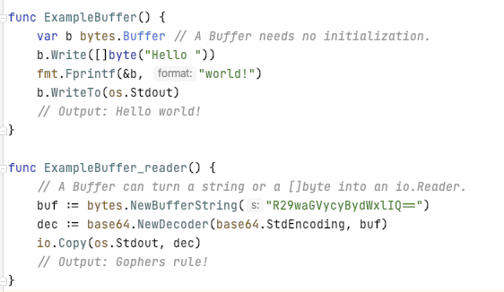
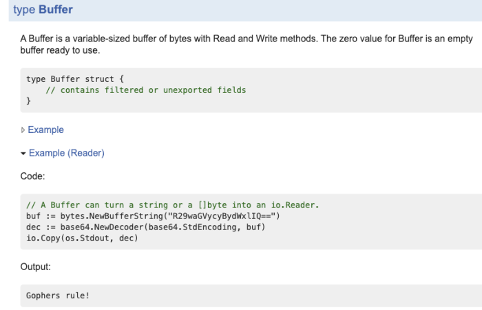

# 贡献代码管理规范及流程


## ChainMaker 注释规范

### 需要注释的内容

所有导出的变量、类型、函数都需要加注释，其他的看具体情况，自行决定，所有注释都使用英文

### 包注释规则

- 注释必连续，如果有段落，段落之间的空行也需要注释，否则会被godoc忽略

- 包注释以Package packagename开头，应尽量简短，如果比较长，放在包的doc.go文件中

### 代码注释规则

- type, const, function, var注释以名称开头，紧临代码来写，函数注释描述函数的功能、参数和返回值，调用注意事项等

- 特殊开头的关键字：

BUG(who) ：描述函数未解决的bug

TODO: 描述待处理事项，godoc命令生成时需要指定--note关键字

Deprecated：已废弃，只为了保持兼容，写明代替方式

- 段落用空行注释表示

- 预格式化（缩进）可以被识别为代码块，

示例：


展示效果


### Example文件规则

- Example文件和代码放在同一个文件夹下，文件名以example_开头，以_test结尾，如example_xxx_test.go，example的包名也是以example_开头，以_test结尾，如package example_xxx_test.

- Example函数名以Example开头，格式是Example[function name]_[tag]，如果没有函数名，Example会被展示在OverView，如果有function name，会被展示在函数说明里。

- Example 输出用关键字写在函数结尾处

示例：



展示效果：



参考资料：

<a href="https://blog.golang.org/godoc" taget="_blank">https://blog.golang.org/godoc</a>


## ChainMaker Git库代码管理规范

### 提交规范

格式： [option] [(fileName or moduleName)] :   [msg]

示例：fix(main.go): line 25 ,  return value of `txContext.Get` is not checked

	feat: 新特性
	fix: bug修复
	docs: 文档修改
	style: 格式、缺少分号、换行等；无生产代码更改
	refactor: 重构代码，例如重命名变量、结构
	test: 添加缺失的测试，重构测试；无生产代码更改
	chore: 其他杂项

### Git仓库的目录结构

在Git仓库中，除了存放源码外，还需要将自动化测试代码、脚本和配置文件也放在该库中，同源管理。

```sh
Project
|----conf
|----test
|----....
|----....
```

**1.conf目录下存放配置项**

**配置项可分为：**

1) 环境配置项
与所运行的环境有关，例如：域名、其他系统的地址和端口等。

2) 应用配置项
信息安全控制和应用程序自身有关，例如：账号密码、初始分配内存大小、数据库连接池大小等。

3) 业务配置项
与应用程序执行的业务行为相关，每个设置有个默认值。例如，功能特性开关。

根据使用时机不同，可将这些配置项分为：构建时、部署时和运行时配置。 构建时和部署时配置相当于静态配置，通常和环境相关。

**conf目录下的推荐结构**：

```sh
config
|-----dev
|-----test
|-----prod
```

**2.test目录下存放自动化测试代码。**

**3.Git的大文件管理**

代码库中超过100MB的二进制文件推荐进行大文件管理。超过500MB的二进制文件必须进行大文件管理。

**4.Git的忽略列表**

根据项目类型设置Git的忽略文件列表，可参考：<a href="https://github.com/github/gitignore" target="_blank">各类语言模版</a>


## ChainMaker 贡献代码流程

<a href="https://git.chainmaker.org.cn/" target="_blank">长安链官方仓库</a>： <a href="https://git.chainmaker.org.cn/" target="_blank">https://git.chainmaker.org.cn/</a>

1. 注册/登录
2. fork需要贡献的chainmaker项目
3. 提交代码到自己空间的项目
4. 创建合并请求到chainmaker空间项目
5. 等待反馈，合并完成


