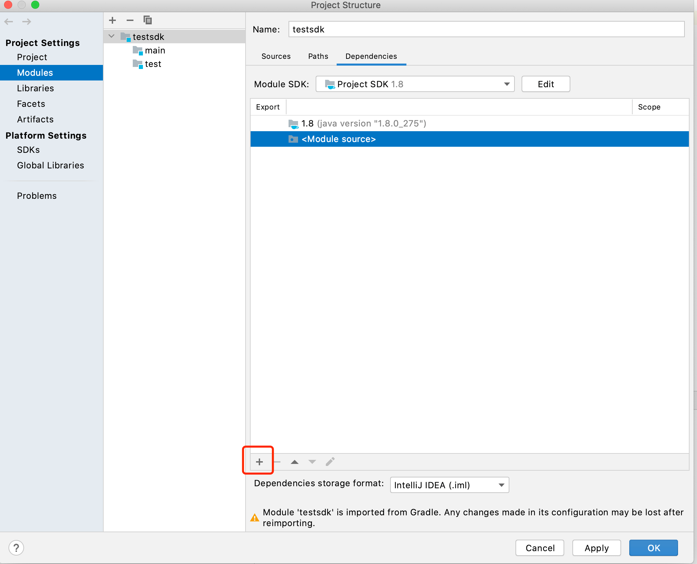

# ChainMaker Java SDK README

## 基本概念定义

Java SDK定义了User、Node、ChainClient和ChainManager和SdkConfig几个类，分别介绍如下：

- User: 表示链的一个用户信息，主要包括证书和private key，用来给要发送的交易payload签名或者给多签的payload签名。
- Node：表示链的一个节点信息，它定义了节点的各种属性，如节点连接的RPC地址，连接所用的密钥信息等，一个ChainClient对象需要包含一个或多个Node，这样才能对过节点实现各种功能。
- ChainClient：客户端开发最重要也是使用最多的类，代表逻辑上的一条链，所有客户端对链的操作接口都来自ChainClient。
- ChainManager：负责管理所有创建过的链，是一个链管理类，避免用户同一条链创建多个ChainClient。用户可以使用ChainManager来检查某条链是否已经创建，或者直接创建某条链，如果这条链已经创建，ChainManager会直接返回之前已经创建过的
- SdkConfig: 创建ChainClient所需的配置类。

ChainClient对象给用户使用。数据结构定义如下：

```java
public class User {
    // the organization id of the user
    private String orgId;
    // user's private key used to sign transaction
    private PrivateKey privateKey;
    // user's certificate
    private Certificate certificate;
    // user's private key used to sign transaction
    private PrivateKey tlsPrivateKey;
    // user's certificate
    private Certificate tlsCertificate;
    // the bytes of user's certificate
    private byte[] certBytes;
    // the hash of the cert
    private byte[] certHash;

    private CryptoSuite cryptoSuite;
}

public class Node {
    // node grpc address
    private String grpcUrl;
    // the organization's ca cert bytes
    private byte[][] tlsCertBytes;
    // the hostname in client certificate
    private String hostname;
    // TLS or PLAINTEXT
    private String negotiationType;
    // OPENSSL or JDK
    private String sslProvider;
    // node connect count
    private int connectCount;
}

public class ChainClient {
    // chainId is the identity of the chain
        private String chainId;
        // rpc connection Pool
        private ConnectionPool connectionPool;
        // archive config
        private ArchiveConfig archiveConfig;
        // the user used to sign transactions
        private User clientUser;
}

public class ChainManager {
    // chains' map
    private final Map<String, ChainClient> chains = new HashMap<>();
    // for singleton mode
    private static final ChainManager chainManager = new ChainManager();
}

```

## ChainClient类接口定义

### 1 用户合约接口
#### 1.1 生成用于创建合约的待签名payload
**参数说明**

  - contractName: 合约名
  - version: 版本号
  - runtimeType: 合约运行环境
  - params: 合约初始化参数
  - byteCodes: 合约字节数组

```java
   public Request.Payload createContractCreatePayload(String contractName, String version, byte[] byteCode,
                                                          ContractOuterClass.RuntimeType runtime, Map<String, byte[]> params)
```
    
#### 1.2 生成用于升级合约的待签名payload
 **参数说明**

  - contractName: 合约名
  - version: 版本号
  - runtimeType: 合约运行环境
  - params: 合约初始化参数
  - byteCodes: 合约字节数组


```java
public Request.Payload createContractUpgradePayload(String contractName, String version, byte[] byteCode,
                                                       ContractOuterClass.RuntimeType runtime, Map<String, byte[]> params)
```

#### 1.3 生成用于冻结合约的待签名payload
 **参数说明**

  - contractName: 合约名
```java
public Request.Payload createContractFreezePayload(String contractName) {}
```
#### 1.4 生成用于解冻合约的待签名payload
 **参数说明**

  - contractName: 合约名
```java
public Request.Payload createContractUnFreezePayload(String contractName) {}
```

#### 1.5 生成用于吊销合约的待签名payload
 **参数说明**

  - contractName: 合约名
```java
public Request.Payload createContractRevokePayload(String contractName) {}
```

#### 1.6 发送合约操作请求
**参数说明**
  - payload: 合约内容
  - endorsementEntries: 带签名的合约内容
  - rpcCallTimeout: 调用rcp接口超时时间, 单位：毫秒
  - syncResultTimeout: 同步获取执行结果超时时间，小于等于0代表不等待执行结果，直接返回（返回信息里包含交易ID），单位：毫秒
```java
    public ResultOuterClass.TxResponse sendContractManageRequest(Request.Payload payload, Request.EndorsementEntry[] endorsementEntries,
                                                                     long rpcCallTimeout, long syncResultTimeout)
```

#### 1.7 执行合约
**参数说明**
  - contractName: 合约名
  - method: 方法名
  - params: 执行参数
  - rpcCallTimeout: 调用rcp接口超时时间, 单位：毫秒
  - syncResultTimeout: 同步获取执行结果超时时间，小于等于0代表不等待执行结果，直接返回（返回信息里包含交易ID），单位：毫秒
```java
    public ResultOuterClass.TxResponse invokeContract(String contractName, String method, String txId,  Map<String, byte[]> params,
                                                          long rpcCallTimeout, long syncResultTimeout)
```

#### 1.8 查询合约接口
**参数说明**
  - contractName: 合约名
  - method: 方法名
  - txId: 交易id
  - params: 执行参数
  - rpcCallTimeout: 执行超时时间，单位毫秒
```java
    public ResultOuterClass.TxResponse queryContract(String contractName, String method, String txId,
                                                         Map<String, byte[]> params, long rpcCallTimeout)
```

### 2 系统合约接口
#### 2.1 根据交易Id查询交易
**参数说明**
  - txId: 交易ID
  - rpcCallTimeout：超时时间，单位毫秒
```java
    ChainmakerTransaction.TransactionInfo getTxByTxId(String txId, long rpcCallTimeout)
```

#### 2.2 根据区块高度查询区块
**参数说明**
  - blockHeight: 区块高度
  - withRWSet: 是否返回读写集
  - rpcCallTimeout：超时时间，单位毫秒
```java
    public ChainmakerBlock.BlockInfo getBlockByHeight(long blockHeight, boolean withRWSet, long rpcCallTimeout)
```
    
#### 2.3 根据区块哈希查询区块
**参数说明**
  - blockHash: 区块高度
  - withRWSet: 是否返回读写集
  - rpcCallTimeout：超时时间，单位毫秒
```java
    public ChainmakerBlock.BlockInfo getBlockByHash(String blockHash, boolean withRWSet, long rpcCallTimeout)
```
    
#### 2.4 根据交易Id查询区块
**参数说明**
  - txId: 交易Id
  - withRWSet: 是否返回读写集
  - rpcCallTimeout：超时时间，单位毫秒
```java
    public ChainmakerBlock.BlockInfo getBlockByTxId(String txId, boolean withRWSet, long rpcCallTimeout)
``` 

#### 2.5 查询上一个配置块
**参数说明**
  - withRWSet: 是否返回读写集
  - rpcCallTimeout：超时时间，单位毫秒
```java
    ChainmakerBlock.BlockInfo getLastConfigBlock(boolean withRWSet, long rpcCallTimeout)
```

#### 2.6 查询节点加入的链信息
**参数说明**
   - timeout：超时时间，单位毫秒
```java
    public Discovery.ChainList getNodeChainList(long rpcCallTimeout)
```

#### 2.7 查询链信息
**参数说明**
  - rpcCallTimeout：超时时间，单位毫秒
```java
     public Discovery.ChainInfo getChainInfo(long rpcCallTimeout)
```

#### 2.8 根据txId查询区块高度

**参数说明**
  - txId: 交易id
  - rpcCallTimeout：超时时间，单位毫秒
```java
    public long getBlockHeightByTxId(String txId, long rpcCallTimeout) 
```    

#### 2.9 根据blockHash查询区块高度

**参数说明**
  - blockHash: 区块哈希
  - rpcCallTimeout：超时时间，单位毫秒
```java
    public long getBlockHeightByBlockHash(String blockHash, long rpcCallTimeout)
```

#### 2.10 根据区块高度查询完整区块

**参数说明**
  - blockHeight : 区块高度 
  - rpcCallTimeout：超时时间，单位毫秒
```java
    public Store.BlockWithRWSet getFullBlockByHeight(long blockHeight, long rpcCallTimeout)
```

#### 2.11 查询最新区块信息

**参数说明**

  - withRWSet: 是否返回读写集
  - timeout：超时时间，单位毫秒
```java
    public ChainmakerBlock.BlockInfo getLastBlock(boolean withRWSet, long rpcCallTimeout)
```   
    

#### 2.12 查询最新区块高度

**参数说明**

  - timeout：超时时间，单位毫秒
```java
    public long getCurrentBlockHeight(long timeout) 
```

#### 2.13 根据区块高度查询区块头

**参数说明**
  - 区块高度: blockHeight
  - rpcCallTimeout：超时时间，单位毫秒
```java
    public ChainmakerBlock.BlockHeader getBlockHeaderByHeight(long blockHeight, long timeout) 
```

#### 2.14 系统合约调用

**参数说明**
   - method: 方法名
   - txId: 交易id
   - params: 执行参数
   - rpcCallTimeout: 调用rcp接口超时时间, 单位：毫秒
   - syncResultTimeout: 同步获取执行结果超时时间，小于等于0代表不等待执行结果，直接返回（返回信息里包含交易ID），单位：毫秒
```java
    ResultOuterClass.TxResponse invokeSystemContract(String contractName, String method, String txId,  Map<String, byte[]> params,
                                                          long rpcCallTimeout, long syncResultTimeout)
```

#### 2.15 系统合约查询

**参数说明**
   - method: 方法名
   - txId: 交易id
   - params: 执行参数
   - rpcCallTimeout: 调用rcp接口超时时间, 单位：毫秒
```java
    public ResultOuterClass.TxResponse (String contractName, String method, String txId,
                                                         Map<String, byte[]> params, long rpcCallTimeout)
```

#### 2.16 根据交易Id获取Merkle路径

**参数说明**
    - txId: 交易ID
    
```java
public byte[] getMerklePathByTxId(String txId, long rpcCallTimeout)
```

#### 2.17 开放系统合约
**参数说明**
   - grantContractList: 需要开放的系统合约字符串数组
```java
    public Request.Payload createNativeContractAccessGrantPayload(String[] grantContractList)
```

#### 2.18 弃用系统合约
**参数说明**
   - revokeContractList: 需要弃用的系统合约字符串数组
```java
    public Request.Payload createNativeContractAccessRevokePayload(String[] revokeContractList)
```

#### 2.19 查询弃用的系统合约名单
```java
public Request.Payload createGetDisabledNativeContractListPayload() 
```

#### 2.20 查询指定合约的信息，包括系统合约和用户合约
**参数说明**
   - contractName: 指定查询的合约名字，包括系统合约和用户合约
   - rpcCallTimeout: 调用rcp接口超时时间, 单位：毫秒
    
```java
public String getContractInfo(String contractName, long rpcCallTimeout)
```

#### 2.21 查询所有的合约名单，包括系统合约和用户合约
```java
public String getContractList(long rpcCallTimeout)
```

#### 2.22 查询已禁用的系统合约名单
```java
public String getDisabledNativeContractList(long rpcCallTimeout) 
```


### 3 链配置接口
#### 3.1 查询最新链配置
```java
    ChainConfigOuterClass.ChainConfig getChainConfig(long rpcCallTimeout)
```

#### 3.2 根据指定区块高度查询最近链配置
**参数说明**
   - blockHeight: 区块高度
```java
    public ChainConfigOuterClass.ChainConfig getChainConfigByBlockHeight(long blockHeight, long rpcCallTimeout)
```

#### 3.3 查询最新链配置序号Sequence
  - 用于链配置更新
```java
    public long getChainConfigSequence(long rpcCallTimeout)
```

#### 3.4 更新Core模块待签名payload生成
**参数说明**
  - txSchedulerTimeout: 交易调度器从交易池拿到交易后, 进行调度的时间，其值范围为[0, 60]，若无需修改，请置为-1
  - txSchedulerValidateTimeout: 交易调度器从区块中拿到交易后, 进行验证的超时时间，其值范围为[0, 60]，
    若无需修改，请置为-1
```java
    public Request.Payload createPayloadOfChainConfigCoreUpdate(int txSchedulerTimeout, int txSchedulerValidateTimeout, long rpcCallTimeout)
```

#### 3.5 更新Core模块待签名payload生成
**参数说明**

  - txTimestampVerify: 是否需要开启交易时间戳校验
  - (以下参数，若无需修改，请置为-1)
  - txTimeout: 交易时间戳的过期时间(秒)，其值范围为[600, +∞)
  - blockTxCapacity: 区块中最大交易数，其值范围为(0, +∞]
  - blockSize: 区块最大限制，单位MB，其值范围为(0, +∞]
  - blockInterval: 出块间隔，单位:ms，其值范围为[10, +∞]
```java
     public Request.Payload createPayloadOfChainConfigBlockUpdate(boolean txTimestampVerify, int txTimeout, int blockTxCapacity,
                                                            int blockSize, int blockInterval, long rpcCallTimeout)
```

#### 3.6 添加信任组织根证书待签名payload生成
**参数说明**
  - trustRootOrgId: 组织Id
  - trustRootCrt: 根证书
```java
    public Request.Payload createPayloadOfChainConfigTrustRootAdd(String trustRootOrgId, String[] trustRootCrt, long rpcCallTimeout)
```

#### 3.7 更新信任组织根证书待签名payload生成
**参数说明**
  - trustRootOrgId: 组织Id
  - trustRootCrt: 根证书
```java
    public Request.Payload createPayloadOfChainConfigTrustRootUpdate(String trustRootOrgId, String[] trustRootCrt, long rpcCallTimeout)
```

#### 3.8 删除信任组织根证书待签名payload生成
**参数说明**
  - trustRootOrgId: 组织Id
```java
    public Request.Payload createPayloadOfChainConfigTrustRootDelete(String trustRootOrgId, long rpcCallTimeout)
```

#### 3.9 添加权限配置待签名payload生成
**参数说明**
  - permissionResourceName: 权限名
  - principle: 权限规则
```java
    public Request.Payload createPayloadOfChainConfigPermissionAdd(String permissionResourceName,
                                                              PolicyOuterClass.Policy principal, long rpcCallTimeout)
```

#### 3.10 更新权限配置待签名payload生成
**参数说明**
  - permissionResourceName: 权限名
  - principle: 权限规则
```java
    public Request.Payload createPayloadOfChainConfigPermissionUpdate(String permissionResourceName,
                                                                 PolicyOuterClass.Policy principal, long rpcCallTimeout)
```

#### 3.11 删除权限配置待签名payload生成
**参数说明**
  - permissionResourceName: 权限名
```java
    public Request.Payload createPayloadOfChainConfigPermissionDelete(String permissionResourceName, long rpcCallTimeout)
```

#### 3.12 添加共识节点地址待签名payload生成
**参数说明**
  - nodeOrgId: 节点组织Id
  - nodeAddresses: 节点地址
```java
    public Request.Payload createPayloadOfChainConfigConsensusNodeAddrAdd(String nodeOrgId, String[] nodeAddresses, long rpcCallTimeout)
```

#### 3.13 更新共识节点地址待签名payload生成
**参数说明**
  - nodeOrgId: 节点组织Id
  - nodeOldAddress: 节点原地址
  - nodeNewAddress: 节点新地址
```java
    public Request.Payload createPayloadOfChainConfigConsensusNodeAddrUpdate(String nodeOrgId, String nodeOldAddress,
                                                                        String nodeNewAddress, long rpcCallTimeout)
```

#### 3.14 删除共识节点地址待签名payload生成
**参数说明**
  - nodeOrgId: 节点组织Id
  - nodeAddress: 节点地址
```java
    public Request.Payload createPayloadOfChainConfigConsensusNodeAddrDelete(String nodeOrgId, String nodeAddress, long rpcCallTimeout)
```

#### 3.15 添加共识节点待签名payload生成
**参数说明**
  - nodeOrgId: 节点组织Id
  - nodeAddresses: 节点地址
```java
    public Request.Payload createPayloadOfChainConfigConsensusNodeOrgAdd(String nodeOrgId, String[] nodeAddresses, long rpcCallTimeout)
```

#### 3.16 更新共识节点待签名payload生成
**参数说明**

  - nodeOrgId: 节点组织Id
  - nodeAddresses: 节点地址
```java
    public Request.Payload createPayloadOfChainConfigConsensusNodeOrgUpdate(String nodeOrgId, String[] nodeAddresses, long rpcCallTimeout)
```

#### 3.17 删除共识节点待签名payload生成
**参数说明**
  - nodeOrgId: 节点组织Id
```java
    public Request.Payload createPayloadOfChainConfigConsensusNodeOrgDelete(String nodeOrgId, long rpcCallTimeout)
```

#### 3.18 添加共识扩展字段待签名payload生成
**参数说明**
  - params: Map<String, String>
```java
    public Request.Payload createPayloadOfChainConfigConsensusExtAdd(Map<String, byte[]> params, long rpcCallTimeout)
```

#### 3.19 添加共识扩展字段待签名payload生成
**参数说明**
  - params: Map<String, String>
```java
    public Request.Payload createPayloadOfChainConfigConsensusExtUpdate(Map<String, byte[]> params, long rpcCallTimeout)
```

#### 3.20 添加共识扩展字段待签名payload生成
**参数说明**
  - keys: 待删除字段
```java
    public Request.Payload createPayloadOfChainConfigConsensusExtDelete(String[] keys, long rpcCallTimeout)
```

#### 3.21 添加信任成员证书待签名payload生成
**参数说明**
   - trustMemberOrgId: 组织Id
   - trustMemberNodeId: 节点Id
   - trustMemberRole: 成员角色
   - trustMemberInfo: 成员信息内容
```java
    public Request.Payload createChainConfigTrustMemberAddPayload(String trustMemberOrgId, String trustMemberNodeId, String trustMemberRole,
                                                                      String trustMemberInfo, long rpcCallTimeout)
```

#### 3.22 删除信任成员证书待签名payload生成
**参数说明**
   - trustMemberInfo: 成员信息内容
```java
     public Request.Payload createChainConfigTrustMemberAddPayload(String trustMemberInfo, long rpcCallTimeout)
```
    
#### 3.23 发送链配置更新请求
```java
    public ResultOuterClass.TxResponse updateChainConfig(Request.Payload payload, Request.EndorsementEntry[] endorsementEntries,
                                              long rpcCallTimeout, long syncResultTimeout)
```

### 4 证书管理接口
#### 4.1 用户证书添加
**参数说明**
  - rpcCallTimeout: 发送rpc请求的超时时间
```java
    public ResultOuterClass.TxResponse addCert(long rpcCallTimeout) 
```

#### 4.2 用户证书删除
**参数说明**
  - payload: 合约内容
  - endorsementEntries: 带签名的合约内容
```java
    public ResultOuterClass.TxResponse deleteCert(Request.Payload payload, Request.EndorsementEntry[] endorsementEntries,
                                                      long rpcCallTimeout, long syncResultTimeout)
```
   
#### 4.3 用户证书冻结
**参数说明**
  - payload: 证书冻结的payload
  - endorsementEntries: 多签信息
```java
   ResultOuterClass.TxResponse freezeCerts(Request.Payload payload, Request.EndorsementEntry[] endorsementEntries,
                                                      long rpcCallTimeout, long syncResultTimeout)
```

#### 4.4 用户证书解冻
**参数说明**
  - payload: 证书冻结的payload
  - endorsementEntries: 多签信息
```java
   public ResultOuterClass.TxResponse unfreezeCerts(Request.Payload payload, Request.EndorsementEntry[] endorsementEntries,
                                                      long rpcCallTimeout, long syncResultTimeout)
```

#### 4.5 用户证书吊销
**参数说明**
  - payload: 证书冻结的payload
  - endorsementEntries: 多签信息
```java
 public ResultOuterClass.TxResponse revokeCerts(Request.Payload payload, Request.EndorsementEntry[] endorsementEntries,
                                                     long rpcCallTimeout, long syncResultTimeout)
```

#### 4.6 冻结证书payload
**参数说明**
  - certHashes: 冻结证书列表
```java
    public Request.Payload createCertFreezePayload(String[] certHashes)
```
#### 4.7 解冻证书payload
**参数说明**
  - certHashes: 冻结证书列表
```java
    public Request.Payload createPayloadOfUnfreezeCerts(String[] certHashes)
```
#### 4.8 吊销证书
**参数说明**
  - certCrl: 证书吊销crl
```java
    public Request.Payload createPayloadOfRevokeCerts(String certCrl)
```
#### 4.9 用户证书查询
**参数说明**
  - certHashes: 证书Hash列表
```java
    public ResultOuterClass.CertInfos queryCert(String[] certHashes, long rpcCallTimeout)
```


### 5 消息订阅接口
#### 5.1 区块订阅
**参数说明**
  - startBlock: 订阅起始区块高度，若为-1，表示订阅实时最新区块
  - endBlock: 订阅结束区块高度，若为-1，表示订阅实时最新区块
  - withRwSet: 是否返回读写集
  - onlyHeader: 是否只返回区块头
```java
    public void subscribeBlock(long startBlock, long endBlock, boolean withRwSet, boolean onlyHeader,
                                   StreamObserver<ResultOuterClass.SubscribeResult> blockStreamObserver)
```

#### 5.2 交易订阅
**参数说明**
  - startBlock: 订阅起始区块高度，若为-1，表示订阅实时最新区块
  - endBlock: 订阅结束区块高度，若为-1，表示订阅实时最新区块
  - txType: 订阅交易类型,若为pb.TxType(-1)，表示订阅所有交易类型
  - txIds: 订阅txId列表，若为空，表示订阅所有txId
```java
    public void subscribeTx(long startBlock, long endBlock, String contractName, String[] txIds,
                                StreamObserver<ResultOuterClass.SubscribeResult> txStreamObserver)
```

#### 5.3 事件订阅
**参数说明**
  - topic: 订阅话题
  - contractName: 订阅合约名
```java
    public void subscribeContractEvent(String topic, String contractName,
                                          StreamObserver<ResultOuterClass.SubscribeResult> contractEventStreamObserver)
```

### 6 归档类接口
#### 6.1 数据归档payload生成
**参数说明**
  - targetBlockHeight: 归档区块高度
```java
    public Request.Payload createArchiveBlockPayload(long targetBlockHeight)
```

#### 6.2 归档恢复payload生成
**参数说明**
  - payload: 归档恢复payload
```java
    public ResultOuterClass.TxResponse sendRestoreBlockRequest(Request.Payload payload, long timeout)
```

#### 6.3 发送数据归档请求
**参数说明**
  - payload: 数据归档payload
```java
    public ResultOuterClass.TxResponse sendArchiveBlockRequest(Request.Payload payload, long timeout)
```

#### 6.4 发送归档恢复请求
**参数说明**
  - payloadBytes: 归档恢复payload
```java
    public ResponseInfo sendRestoreBlockRequest(byte[] payloadBytes, long timeout) 
            throws ChainMakerCryptoSuiteException, ChainClientException {
    }
```

#### 6.5 获取归档数据
**参数说明**
  - targetBlockHeight: 归档区块高度
```java
    public Store.BlockWithRWSet getArchivedFullBlockByHeight(long blockHeight) 
            throws InvalidProtocolBufferException, SQLException, ClassNotFoundException {
    }
```

#### 6.6 获取归档区块信息
**参数说明**
  - targetBlockHeight: 归档区块高度
  - withRWSet: 是否获取读写集
```java
    public ChainmakerBlock.BlockInfo getArchivedBlockByHeight(long blockHeight, boolean withRWSet) 
            throws InvalidProtocolBufferException, SQLException, ClassNotFoundException {
    }
```

### 7 公钥身份类接口
#### 7.1 构造添加公钥身份请求
**参数说明**
  - pubkey: 公钥信息
  - orgId: 组织id
  - role:   角色，支持client,light,common
```java  
    public Request.Payload createPubkeyAddPayload(String pubkey, String orgId, String role) 
```

#### 7.2 构造删除公钥身份请求
**参数说明**
  - pubkey: 公钥信息
  - orgId: 组织id
```java  
    public Request.Payload createPubkeyDelPayload(String pubkey, String orgId)
``` 

#### 7.3 构造查询公钥身份请求
**参数说明**
  - pubkey: 公钥信息
```java 
    public Request.Payload createPubkeyQueryPayload(String pubkey) 
```

#### 7.4 发送公钥身份管理请求（添加、删除）
**参数说明**
  - payload: 合约内容
  - endorsementEntries: 带签名的合约内容
  - rpcCallTimeout: 调用rcp接口超时时间, 单位：毫秒
  - syncResultTimeout: 同步获取执行结果超时时间，小于等于0代表不等待执行结果，直接返回（返回信息里包含交易ID），单位：毫秒
```java
    public ResultOuterClass.TxResponse sendPubkeyManageRequest(Request.Payload payload, Request.EndorsementEntry[] endorsementEntries,
                                                               long rpcCallTimeout, long syncResultTimeout)
```

### 8 多签类接口
#### 8.1 发起多签请求
**参数说明**
  - payload: 多签payload
```java
    public ResultOuterClass.TxResponse multiSignContractReq(Request.Payload payload, long rpcCallTimeout)
```
#### 8.2 发起多签投票
**参数说明**
  - payload: 多签payload
  - endorsementEntry: 多签信息
```java
    public ResultOuterClass.TxResponse multiSignContractVote(Request.Payload payload, Request.EndorsementEntry endorsementEntry, long rpcCallTimeout)
```
#### 8.3 多签查询
**参数说明**
  - txId: 交易id
```java
    public ResultOuterClass.TxResponse multiSignContractQuery(String txId, long rpcCallTimeout) 
```

#### 8.4 创建多签请求payload
**参数说明**
  - params: 多签参数
```java
    public Request.Payload createMultiSignReqPayload(Map<String, byte[]> params)
```

#### 8.5 创建多签投票payload
**参数说明**
  - params: 多签参数
```java
    public Request.Payload createMultiSignVotePayload(Map<String, byte[]> params)
```

#### 8.6 创建多签查询payload
**参数说明**
  - params: 多签参数
```java
    public Request.Payload createMultiSignQueryPayload(Map<String, byte[]> params) 
```


### 9 管理类接口
#### 9.1 SDK停止接口：关闭连接池连接，释放资源
```java
public void stop()
```

### 10 gas管理相关接口
#### 10.1 构造设置gas管理员payload
**参数说明**
  - address: gas管理员的地址
```java
public Request.Payload createSetGasAdminPayload(String address)
```

#### 10.2 查询gas管理员
**参数说明**
  - rpcCallTimeout: 调用rpc接口超时时间, 单位：毫秒
```java
public String getGasAdmin(long rpcCallTimeout)
```

#### 10.3 构造充值gas账户payload
**参数说明**
  - rechargeGasList: 一个gas账户充值指定gas数量
```java
public Request.Payload createRechargeGasPayload(AccountManager.RechargeGas[] rechargeGasList)
```

#### 10.4 查询gas账户余额（根据公钥）
**参数说明**
  - address: 查询gas余额的账户地址
  - rpcCallTimeout: 调用rpc接口超时时间, 单位：毫秒
```java
public long getGasBalance(String address, long rpcCallTimeout)
```

#### 10.5 构造 退还gas账户的gas payload
**参数说明**
  - address: 退还gas的账户地址
  - amount: 退还gas的数量
```java
public Request.Payload createRechargeGasPayload(AccountManager.RechargeGas[] rechargeGasList)
```

#### 10.6 构造 冻结指定gas账户 payload
**参数说明**
  - address: 冻结指定gas账户的账户地址
```java
public Request.Payload createFrozenGasAccountPayload(String address)
```

#### 10.7 构造 退还gas账户的gas payload
**参数说明**
  - address: 解冻指定gas账户的账户地址
```java
public Request.Payload createUnfrozenGasAccountPayload(String address)
```

#### 10.8 查询gas账户的状态
**参数说明**
  - address: 指定gas账户的账户地址
   - rpcCallTimeout: 调用rpc接口超时时间, 单位：毫秒
```java
public boolean getGasAccountStatus(String address, long rpcCallTimeout)
```

#### 10.9 发送gas管理类请求
**参数说明**
  - payload: 交易payload
  - endorsementEntries: 背书签名信息列表
  - rpcCallTimeout: 超时时间，单位：s，若传入-1，将使用默认超时时间：10s
  - syncResultTimeout: 是否同步获取交易执行结果
```java
public ResultOuterClass.TxResponse sendGasManageRequest(Request.Payload payload, Request.EndorsementEntry[] endorsementEntries, long rpcCallTimeout, long syncResultTimeout)
```

#### 10.10 为payload添加gas limit
**参数说明**
  - payload: 交易payload
  - limit: gas limit
```java
public Request.Payload attachGasLimit(Request.Payload payload, Request.Limit limit)
```

#### 10.11 启用或停用Gas计费开关payload生成
**参数说明**
  - rpcCallTimeout: 超时时间，单位：s，若传入-1，将使用默认超时时间：10s
```java
public Request.Payload createChainConfigEnableOrDisableGasPayload(long rpcCallTimeout)
```

### 11 别名管理相关接口
#### 11.1 添加别名
**参数说明**
  - rpcCallTimeout: 超时时间，单位：s，若传入-1，将使用默认超时时间：10s
```java
public ResultOuterClass.TxResponse addAlias(long rpcCallTimeout)
```

#### 11.2 构造更新别名payload
**参数说明**
  - alias: 要更新的别名
  - certPEM: 对应的证书
```java
public Request.Payload createUpdateAliasPayload(String alias, String certPem)
```

#### 11.3 发起更新别名交易
**参数说明**
  - payload: 待签名的payload
  - endorsementEntries: 背书签名信息列表
  - rpcCallTimeout: 超时时间，单位：s，若传入-1，将使用默认超时时间：10s
```java
public Request.Payload createUpdateAliasPayload(String alias, String certPem)
```

#### 11.4 查询别名详情交易
**参数说明**
  - aliasList: 要查询的别名列表
   - rpcCallTimeout: 超时时间，单位：s，若传入-1，将使用默认超时时间：10s
```java
public ResultOuterClass.AliasInfos queryAlias(String[] aliasList, long rpcCallTimeout)
```

#### 11.5 生成删除别名payload
**参数说明**
  - aliasList: 要查询的别名列表
  - rpcCallTimeout: 超时时间，单位：s，若传入-1，将使用默认超时时间：10s
```java
public Request.Payload createAliasDeletePayload(String[] aliasList)
```

#### 11.6 发起更新别名交易
**参数说明**
  - payload: 待签名的payload
  - endorsementEntries: 背书签名信息列表
  - rpcCallTimeout: 超时时间，单位：s，若传入-1，将使用默认超时时间：10s
  - syncResultTimeout: 是否同步获取交易执行结果
```java
public ResultOuterClass.TxResponse deleteAlias(Request.Payload payload, Request.EndorsementEntry[] endorsementEntries,
            long rpcCallTimeout, long syncResultTimeout)
```

## 使用过程

客户端使用SDK的过程如下：

1. 创建SdkConfig对象
2. 获取ChainManager对象
3. 使用ChainManager获取或创建链对象，创建ChainClient时需要将SdkConfig对象作为参数传入
4. 调用ChainClient对象的接口进行操作

## 使用示例

1. 初始化，创建ChainClient

```java
   public void init() {
       Yaml yaml = new Yaml();
       InputStream in = TestBase.class.getClassLoader().getResourceAsStream(SDK_CONFIG);

       SdkConfig sdkConfig;
       sdkConfig = yaml.loadAs(in, SdkConfig.class);
       assert in != null;
       in.close();

       for (NodeConfig nodeConfig : sdkConfig.getChain_client().getNodes()) {
           List<byte[]> tlsCaCertList = new ArrayList<>();
           for (String rootPath : nodeConfig.getTrustRootPaths()){
               List<String> filePathList = FileUtils.getFilesByPath(rootPath);
               for (String filePath : filePathList) {
                   tlsCaCertList.add(FileUtils.getFileBytes(filePath));
               }
           }
           byte[][] tlsCaCerts = new byte[tlsCaCertList.size()][];
           tlsCaCertList.toArray(tlsCaCerts);
           nodeConfig.setTrustRootBytes(tlsCaCerts);
       }

       chainManager = ChainManager.getInstance();
       chainClient = chainManager.getChainClient(sdkConfig.getChain_client().getChainId());

       if (chainClient == null) {
           chainClient = chainManager.createChainClient(sdkConfig);
       }
   }
```

2. 创建合约

```java
   public void testCreateContract() throws IOException, InterruptedException, ExecutionException, TimeoutException {
       ResultOuterClass.TxResponse responseInfo = null;
       try {
           byte[] byteCode = FileUtils.getResourceFileBytes(CONTRACT_FILE_PATH);

           // 1. create payload
           Request.Payload payload = chainClient.createContractCreatePayload(CONTRACT_NAME, "1", byteCode,
                   ContractOuterClass.RuntimeType.WASMER, null);

           //2. create payloads with endorsement
           Request.EndorsementEntry[] endorsementEntries = SdkUtils.getEndorsers(payload, new User[]{adminUser1, adminUser2, adminUser3});

           // 3. send request
           responseInfo = chainClient.sendContractManageRequest(payload, endorsementEntries, rpcCallTimeout, syncResultTimeout);
       } catch (SdkException e) {
           e.printStackTrace();
           Assert.fail(e.getMessage());
       }
       Assert.assertNotNull(responseInfo);
   }
```

3. 调用合约

```java
   public void testInvokeContract() throws Exception {
       ResultOuterClass.TxResponse responseInfo = null;
       try {
           responseInfo = chainClient.invokeContract(CONTRACT_NAME, INVOKE_CONTRACT_METHOD,
                   null, null, rpcCallTimeout, syncResultTimeout);
       } catch (Exception e) {
           e.printStackTrace();
           Assert.fail(e.getMessage());
       }
       Assert.assertNotNull(responseInfo);
   }
```

## SDK Jar包引用方式

### 编译

```
git clone -b v2.2.0 https://git.chainmaker.org.cn/chainmaker/sdk-java.git
// 说明：需要使用openjdk 1.8.151+并提前安装gradle，也可以使用intelliJ IDEA打开项目进行编译
cd chainamker-sdk-java
./gradlew build
```

### 使用

#### 导入`jar`包
导入`jar`包，这里使用`IntelliJ`为示例引用`jar`包，将编译好的`jar`包拷贝到需要使用sdk的项目下（一般可以在项目下建一个`libs`目录），然后打开`IntelliJ IDEA->File->Project Structures`，如下图点击`“+”`号，选择`JARs or Directories`，选中`jar`包点击`open`即可。



#### 依赖库
导入依赖`jar`包，需将`sdk`中依赖的`jar`包导入本地工程中，同时，需将`sdk`中`lib`目录下的`netty-tcnative-openssl-static-2.0.39.Final.jar`包导入工程中，以便适配国密`tls`通信。
`tcnative`的`jar`包及动态库地址：<a href="https://git.chainmaker.org.cn/chainmaker/chainmaker-tools/-/tree/master/tls-netty"  target="_blank"> tcnative </a>

#### 引用

   在要使用sdk的源文件里使用import引用sdk包，如下：

   ```
   import org.chainmaker.sdk.*;
   ```
#### 应用demo

java sdk应用示例，请参考<a href="https://git.chainmaker.org.cn/chainmaker/sdk-java-demo/-/tree/v2.2.0"  target="_blank"> sdk-java-demo </a>

<br><br>


