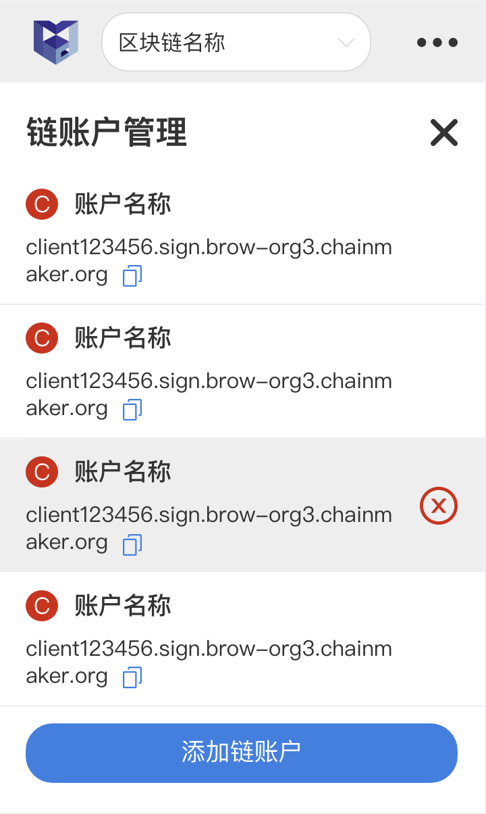

# 长安链WEB插件-SmartPlugin

## 产品背景及意义
开发者在开发Dapp应用时，需要Web插件直接与链进行交互，此外用户在使用Dapp应用时，也需要Web插件对交易进行签名。因而核心团队推出长安链SmartPlugin工具。


## 产品安装说明
目前只支持Chrome浏览器，其他浏览器的支持还在规划中。


### 通过长安链官方下载并安装插件

#### 下载教程
请通过此处下载插件：<a href="https://git.chainmaker.org.cn/chainmaker/chainmaker-smartplugin/-/releases" target="_blank">chainmaker-smartplugin.zip</a>

如未登录长安链gitlab，请先登录后再下载

#### 安装教程

1、下载后，先请解压Zip压缩包文件。

2、打开Chrome浏览器，进⼊插件⻚⾯ `chrome://extensions/` 。


3、打开浏览器开发者模式，并重启浏览器。


4、加载已解压到本地的dist文件夹，完成添加插件，插件的使用教程，请见产品使用说明章节。


## 产品使用说明

写在最前，本产品完全去中心化，无任何中心化平台存储用户数据，故涉及到如账户密码，证书等信息时，请妥善保存，丢失后将无法找回。

### 初始化 - 设置密码


* 下载安装完后，可在谷歌浏览器的插件位置，找到长安链SmartPlugin。
* 首次打开SmartPlugin时，需要先进行初始化设定。
* 其中登录密码用于解锁插件，以及对上链交易进行二次确认，插件完全去中心化，平台不保存任何用户信息，故请妥善保存密码，若密码遗忘了，无法找回，只能重置插件。

### 初始化 - 添加网络


- 可在添加网络界面，添加区块链网络，目前支持添加长安链V2.1.0及以上版本的链。
- 目前支持的链的账户类型为证书模式（PermissionedWithCert），对公钥模式的支持，将放在后续版本。
- 请确保所填写的节点信息正确，且网络链接通畅。
- 请确保所填写的用户所在组织ID正确，且后续上传的证书是属于该组织底下的。
- 如果您所要订阅的链开启TLS，则需要上传相关证书，若未开启可不填。
  
### 首页


- 通过顶部的下拉选择，可以切换不同的区块链。
- 通过右上角的更多按钮，可以切换到其他功能页面。
- 支持通过其他Dapp唤起插件，并进行上链操作。Dapp如何和插件进行对接，请参照插件接口文档。
- 目前通过官方提供的合约IDE平台，可直接唤起插件，进行合约部署及调用。
- 上链时，可根据情况选择用于发送交易的链账户，初始化时，默认已添加一个账户，如还需添加其他账户，可到链账户管理处操作。
- 上链时，需要输入交易密码进行二次确认，目前交易密码与登录密码为同一个。由于是去中心化应用，请妥善保存您的密码，丢失后将无法找回。


### 区块链网络管理


- 您可以在区块链网络管理页面，查看并管理已添加的链，也可以继续添加别的区块链。

### 链账号管理



- 你可以在链账户管理界面，查看并管理已添加的链账户，也可以继续添加别的链账户。


- 平台完全去中心化，并无中心化服务器，保存用户所上传到链账户信息。


### 上链记录


- 上链后可到上链记录里，查看上链的交易信息。
- 本版本暂不支持直接在插件内查看交易详情，如需查看交易详情，可复制交易哈希到区块链浏览器内查询。后续版本会考虑支持。


### 系统设置


- 长安链v2.1版本的链需要由代理将HTTP请求转化为gRPC请求，默认由长安链官方提供公网代理服务，代码开源，开发者也可选择自行部署代理。
- 如开发者是想订阅内网的测试链，则需要自行部署自己内网里的代理服务。
- 长安链V2.2版本之后的链将可以直接通过HTTP请求和链进行交互，无需代理。
- 您可在设置里设置多久免输密码，以简化操作。
- 如果遗忘了密码，或者需要还原插件，您可以重置插件，重置后，插件内的数据将清空，需要重新初始化才能使用。


## 产品接入说明

### 判断是否安装插件

> 根据hasExtension来确定是否安装插件

```shell
var hasExtension = false;
const extensionId='bmkmhpkgcbigmdepppdpdhlifcgoibph';
chrome.runtime.sendMessage(extensionId, { operation: "installCheck" },
    function (reply) {
        if (reply&&reply.data.version) {
          hasExtension = true;
        }
        else {
          hasExtension = false;
        }
    });
```

### 发送消息到插件

与判断插件是否安装方式一致，当前`支持安装合约/调用合约`，具体参数见`src/event-page.ts`

```shell
chrome.runtime.sendMessage(extensionId, { operation: "createUserContract", body:{}  },
    function (reply) {
     
    });
```

### 接收插件发送消息

> 具体logic可根据message消息体进行判断处理。message类型定义，查看`src/event-page.ts/ExtensionResponse`

```javascript
window.addEventListener("message", function (event) {
  if (event.source != window)
    return;
  console.log("Page script received: " + event.data)
  console.log(event.data)
}, false);
```


## 其他补充
### 代理服务

长安链v2.1版本的链需要由代理将HTTP请求转化为gRPC请求，默认由长安链官方提供公网代理服务，代码开源，开发者也可选择自行部署代理。

代理服务部署如下

```shell
# 拉取代码
$ git clone https://git.chainmaker.org.cn/chainmaker/chainmaker-smartplugin.git
$ cd chainmaker-smartplugin

# 启动代理服务，Nginx推荐最新版本，最低版本要求1.14.0
$ docker run --name "smartplugin-proxy" -p 9080:9080 -p 9081:9081 -d -v $(pwd)/deploy/nginx/conf.d/default.conf:/etc/nginx/nginx.conf:ro -v $(pwd)/deploy/nginx/log:/var/log/nginx -v $(pwd)/deploy/nginx/ssl:/var/www/ssl -v $(pwd)/deploy/nginx/njs:/etc/nginx/njs -v $(pwd)/deploy/nginx/cert:/etc/nginx/cert nginx
$ docker rm -f smartplugin-proxy

# 挂载目录权限设置
$ chmod -R 777 nginx/
```
