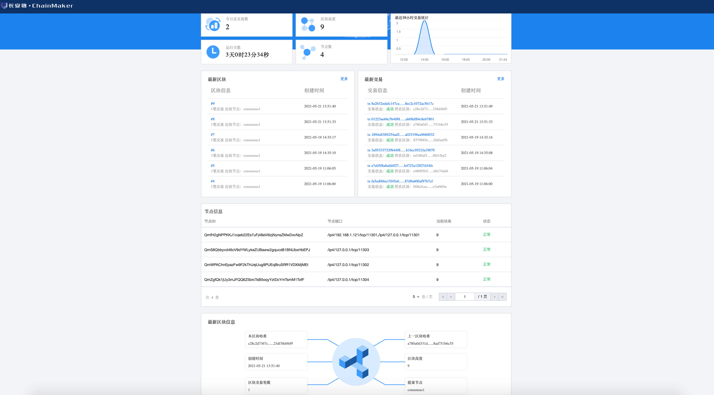
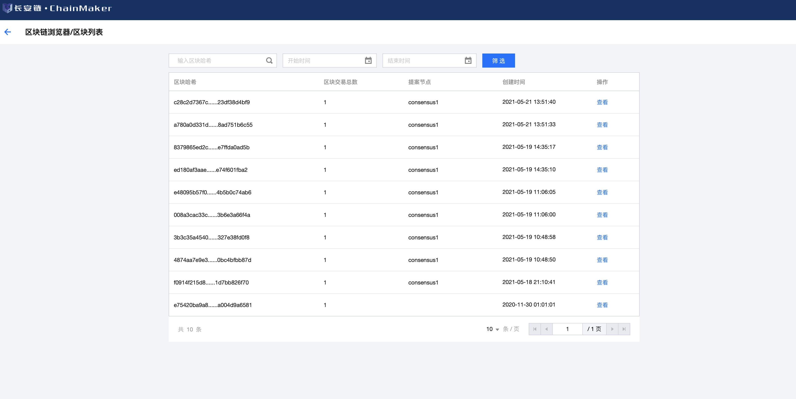
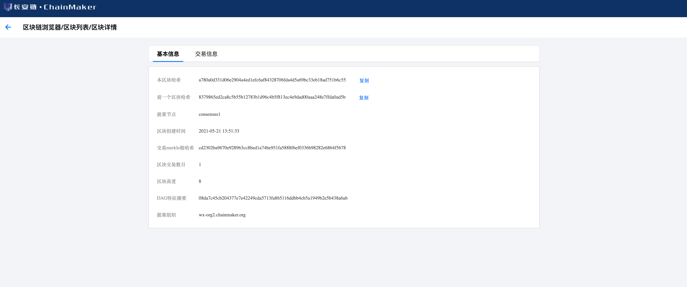
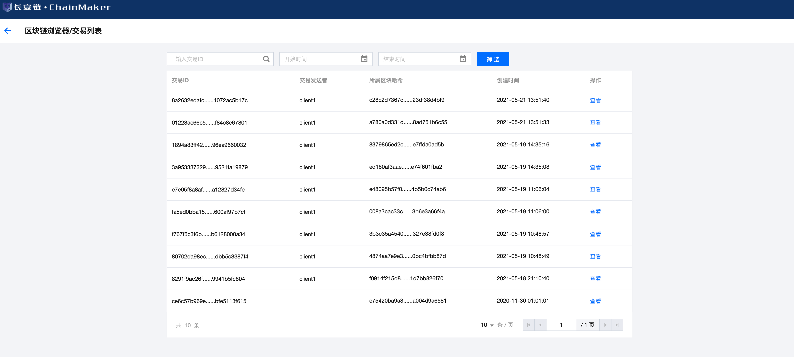
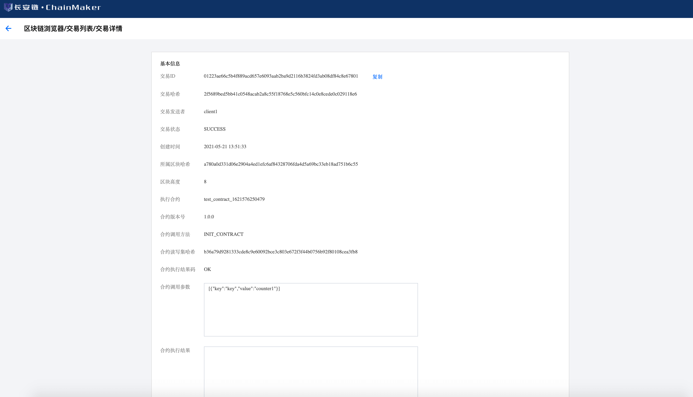

# 区块链浏览器

## 概述

区块链浏览器提供了实时浏览、查询区块链信息和统计信息的功能。主要由前端（`Web`展示）、后端及数据库三部分组成。数据库采用的是`MySQL`，后端采用go语言开发，前端使用的是`react`框架。

## 安装指南

### 环境依赖
**golang**

版本为`1.16`或以上

下载地址：https://golang.org/dl/

若已安装，请通过命令查看版本：

```bash
$ go version
```
**mysql**

版本为`5.6`或以上

下载地址：https://dev.mysql.com/downloads/installer/

若已安装，请通过命令查看版本：

```bash
$ mysql -V
```

**npm**

`npm`版本为`6.14.13`或以上
`node`版本为`v14.17.0`或以上

下载地址：https://nodejs.org/en/

若已安装，请通过命令查看版本：

```bash
$ npm -v
$ node -v
```

**nginx**

版本为`1.18.0`或以上

下载地址：http://nginx.org/en/download.html

若已安装，请通过命令查看版本：

```bash
$ nginx -v
```
安装完成后，启动nginx，命令如下：
```bash
$ service nginx start
```

### 后端模块部署

#### 前置环境

浏览器部署需要依赖一个`ChainMaker`运行环境。具体的`ChainMaker`环境安装部署请参考对应的文档[《快速入门》](../tutorial/快速入门.md)。

#### 代码下载

下载地址： https://git.chainmaker.org.cn/chainmaker/chainmaker-explorer

下载代码：

```bash
$ git clone https://git.chainmaker.org.cn/chainmaker/chainmaker-explorer.git
```

将指定版本代码(包括子模块`chainmaker-sdk-go`)下载到本地，切换子项目`chainmaker-sdk-go`的版本为`chainmaker`的对应版本

#### 数据库初始化

数据库`sql`文件保存在`docs`目录中（`chainmaker-browser-db.sql`）,请执行`sql`文件，在数据库中创建表（数据库名自行指定，不限制）。


#### 配置调整

浏览器配置文件：`configs/config.yml`，它的配置内容包括四部分，以下是详细说明：

```plain
web:
  address:       0.0.0.0    # Web监听网卡地址
  port:          9999       # Web监听端口
  cross_domain:  true       # 是否开启跨域

node:
  update_time: 300          # 链和节点更新时间
  sync_time:   60           # 节点断开连接时间和新增链时间
  chain_id:    chain1       # chainId，所在链ID（链ID是链的唯一标识）
  org_id:      wx-org1.chainmaker.org   # 所在组织
  tls:         true         # 是否开启TLS
  tls_host:    chainmaker.org    # TLS域名
  ca_paths:    configs/crypto-config/wx-org1.chainmaker.org/ca  # CA证书所在路径（即文件夹，建议绝对路径）
  remotes:     127.0.0.1:12301   # 节点地址，格式：IP:PORT
  user:
    priv_key_file: configs/crypto-config/wx-org1.chainmaker.org/user/admin1/admin1.tls.key      # 管理员私钥（具体位置，建议绝对路径）
    cert_file: configs/crypto-config/wx-org1.chainmaker.org/user/admin1/admin1.tls.crt          # 管理员证书（具体位置，建议绝对路径）

db:
  host: 192.168.1.200           # 数据库ip
  port: 3306                    # 数据库端口
  database: browser_db          # 数据库名称
  user:   chainmaker            # 数据库登录用户
  passwd: Baec&chainmaker       # 数据库登录密码

log:
  log_level_default: INFO       # 默认日志级别
  log_levels:
    core: INFO
    net: INFO
  file_path: ../log/web.log     # 日志路径
  max_age: 365                  # 日志最长保存时间，单位：天
  max_size: 100                 # 日志最大保存大小，单位mb
  rotation_time: 1              # 日志滚动时间，单位：小时
  log_in_console: false         # 是否展示日志到终端，仅限于调试使用
  show_color: true              # 是否打印颜色日志

```

#### 启动运行

##### 脚本启动
可通过`scripts/startup.sh`自拉起后台，执行完脚本后，可以通过查看`output`检查后台是否启动，如未启动，也可查看原因。脚本中需要配置对应的配置文件所在路径及启动文件，请按照实际情况进行设置，如下：

```shell
BROWSER_BIN="chainmaker-browser.bin"

go build -o ${BROWSER_BIN} ../src
echo "Success build chainmaker-browser.bin"
CONFIG_PATH="../configs/"
nohup ./${BROWSER_BIN} -config ${CONFIG_PATH} >output 2>&1 &
```

可通过`scripts/shutdown.sh`将该服务停掉，对应的，如果启动文件有变化，也需要在脚本中进行调整，如下：

```shell
BROWSER_BIN="chainmaker-browser.bin"
```

##### docker启动
修改完`config.yml`文件后，启动容器，命令如下执行
```shell
docker-compose up
```

### 前端模块部署

#### 代码下载

下载地址： https://git.chainmaker.org.cn/chainmaker/chainmaker-explorer-web

#### 配置调整

进入代码`public`目录，修改`config.js`中的前端请求地址，可根据后端地址自行配置，如下所示：

```js
window.oURL = 'http://192.168.1.131:9999/chainmaker';
```

#### 启动运行

进入前端代码最外层目录执行以下命令：

```bash
$ npm install
```

打包构建前端代码：

```bash
$ npm run build
```

将打包构建好的build包里`index.html`页面的路径配置到`nginx`中，打开`nginx`的配置（默认路径为：`/etc/nginx/nginx.conf`），修改以下标注的配置：

```html
listen       8080;       #监听端口
server_name  localhost;  #ServerName
  
location / {
            root /data/cmb-front/dist;              #index.html所在路径
            index index.html;                       #index.html文件
            try_files $uri $uri/ /index.html;       #跳转需要
        }

location ^~/chainmaker/ {                 #后端跳转过滤字段
    proxy_pass http://127.0.0.1:9999;     #跳转到后端的请求
}
```

其中，若前端访问地址直接请求后端，则可不配置后端跳转的`location`部分。

配置完成后重启`nginx`即可生效，重启命令如下

```bash
$ service nginx restart
```


## 使用手册

### 浏览器首页

#### 首页检索

首页提供了链检索功能，在检索框输入`chainId`，点击查询后会跳转到检索后的链列表页。如图所示：


#### 统计数据

首页可以查看交易统计、合约列表、链数量统计、最新链列表和最新区块信息等内容，如图所示：


### 链列表页

链列表页可以查看所有链的基本信息，点击对应查看按钮，可以查看每条链的详细信息，如图所示：


### 链详情页

#### 链详情页检索

链详情页提供了区块和交易的检索功能，输入`区块Hash`或者`交易ID`，点击查询可以跳转对应的区块或者交易详情页，如图所示：


#### 链详情页统计数据

链详情页可以查看该链的交易统计、最新区块列表、最新交易列表、节点统计、和最新区块信息等内容，如图所示：



### 区块列表页

区块列表页可以查看该链的所有区块的列表的基本信息，如图所示：



### 区块详情页

区块详情页可以查看该区块的全部信息，如图所示：



区块详情页页可以查看该区块内的交易列表，详细信息可以参考`交易列表页`

### 交易列表页

交易列表页可以查看该链的所有交易的列表的基本信息，如图所示：



### 交易详情页

交易详情页可以查看该交易的全部信息，如图所示：



## 设计方案

### 区块链数据存储

区块链浏览器的所有数据，都是从链上同步到数据库之后，再提供给前端浏览和检索。

### 链和节点信息同步

区块链浏览器后台可以通过`config.yml`中配置的的节点信息，同步链和节点信息到数据库中，可以通过`config.yml`中的`update_time`配置来调整同步时间间隔。

### 区块和交易信息同步

区块链浏览器后台在和节点建立连接后，可以实时监听区块和交易信息，同步入库。