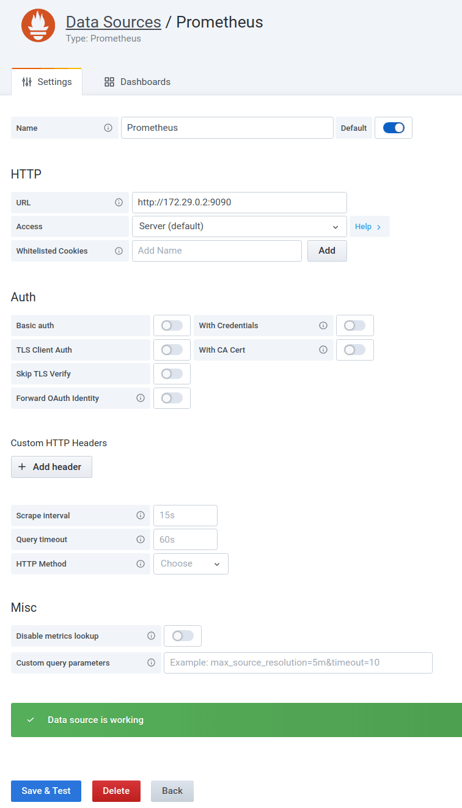
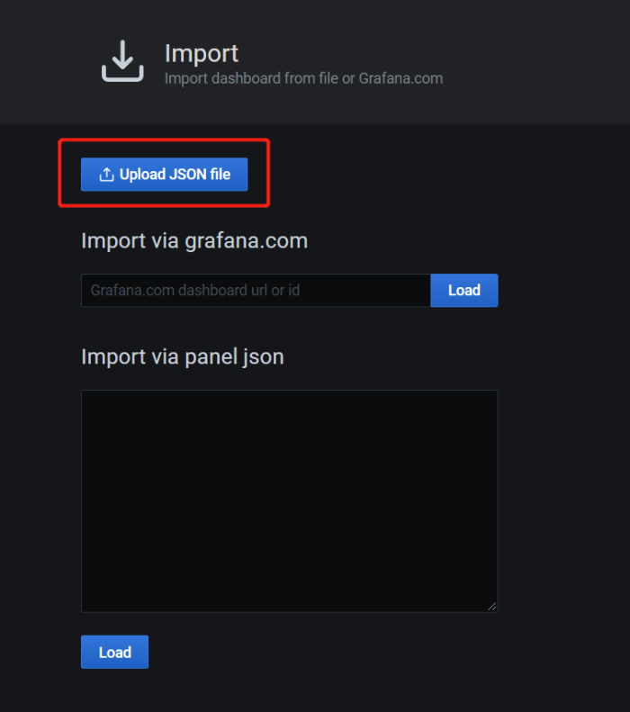
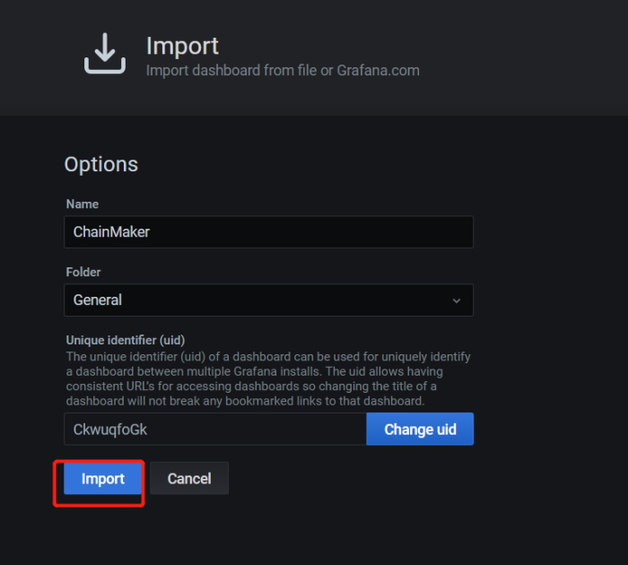
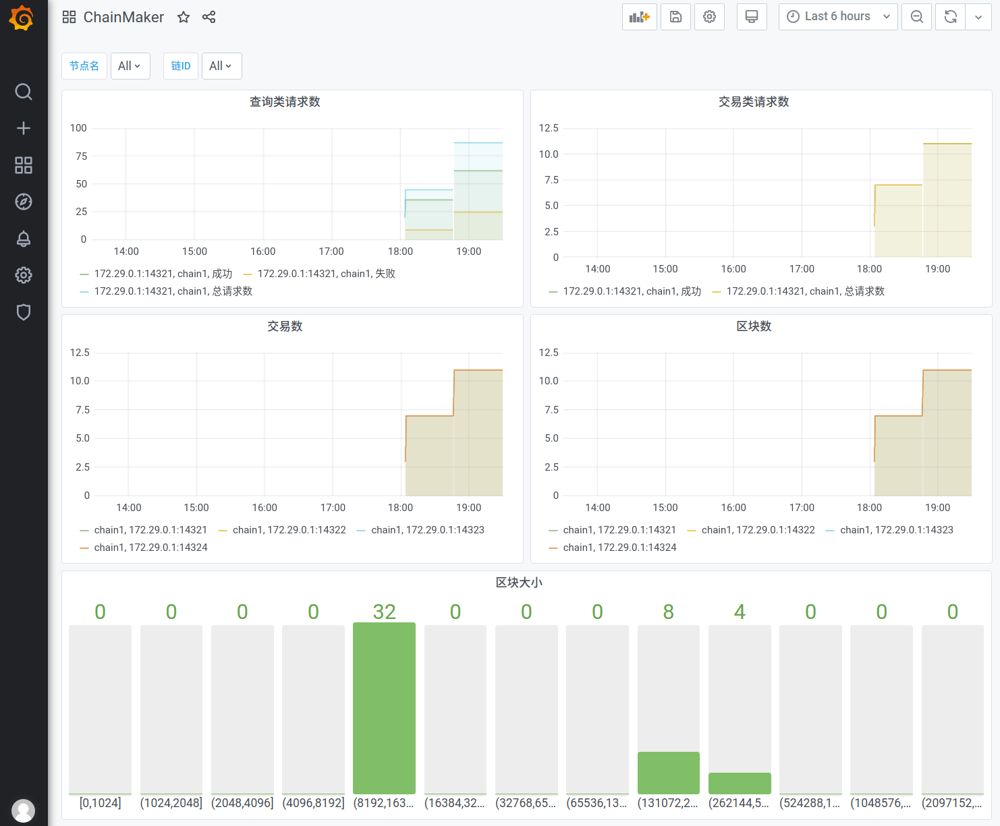

# 运维监控

## 概述

长安链采用了普罗米修斯（`Prometheus`）的监控体系，提供了脚本文件，帮助用户快速搭建基于`Docker`的普罗米修斯可视化监控环境，并基于该环境进行长安链节点的可视化监控。

## 环境依赖

> 注意：下述所有步骤需在同一台机器上进行

### 安装docker

- **macOS**
> 去docker官网 https://www.docker.com/ 下载安装 Docker Desktop

- **centos系统**

> 参考官方文档：https://docs.docker.com/engine/install/centos/

- **ubuntu系统**

> 参考官方文档：https://docs.docker.com/engine/install/ubuntu/

### 安装docker-compose

> 注意：如果已经安装了 Docker Desktop 则不需要进一步安装docker-compose
> 
> 参考官方文档：https://docs.docker.com/compose/install/

## 操作步骤

### 链启动

> 详细说明，请见【快速入门】，这里描述下关键步骤
>
> 注：配置文件`chainmaker/config/config_tpl/chainmaker.yml`的`monitor`开关需要开启，默认是开启状态
>
> ```bash
> monitor:
>   enabled: true
> ```

```bash
# 进入脚本目录
$ cd chainmaker-go/scripts

# 创建单链4节点集群配置文件及证书
$ ./prepare.sh 4 1

# 生成安装包
$ ./build_release.sh

# 启动链
$ ./cluster_quick_start.sh normal

# 查看节点启动情况，确保节点都已正常启动
$ ps -ef|grep chainmaker
```

### docker编排启动

修改prometheus的监控目标
> 配置文件路径：`chainmaker-go/monitor/prometheus.yml`
>
> 修改以下配置：
>
> - 如果是macOS系统，则`targets`中的IP需要修改为 `host.docker.internal` 端口保持不变。如果是Linux系统则不需要任何修改。

```yaml
  - job_name: 'wx-org1.chainmaker.org'
    scrape_interval: 1s
    static_configs:
      - targets: ['172.29.0.1:14321']
  - job_name: 'wx-org2.chainmaker.org'
    scrape_interval: 1s
    static_configs:
      - targets: ['172.29.0.1:14322']
  - job_name: 'wx-org3.chainmaker.org'
    scrape_interval: 1s
    static_configs:
      - targets: ['172.29.0.1:14323']
  - job_name: 'wx-org4.chainmaker.org'
    scrape_interval: 1s
    static_configs:
      - targets: ['172.29.0.1:14324']
```

启动
```bash
$ cd chainmaker-go/monitor
$ docker-compose -f docker-compose.yml up -d
```

### 登录prometheus

登录prometheus控制台，确保目标服务连接已经UP
> http://localhost:9090/targets

### 配置grafana

登录grafana控制台
> http://localhost:3000/login
>
> 用户名：`admin`
>
> 密码：`chainmaker`

为grafana添加数据源
> http://localhost:3000/datasources

选择`Prometheus`数据源，填入`URL`后，点击`Save & Test`按钮进行测试，测试通过会显示`Data source is working`的提示。



为grafana导入仪表盘
> http://localhost:3000/dashboard/import
>
> 仪表盘模板存放路径：`chainmaker-go/monitor/dashboard.json`




## 监控效果展示

> 导入仪表盘后，便可查看到监控效果




<br><br>