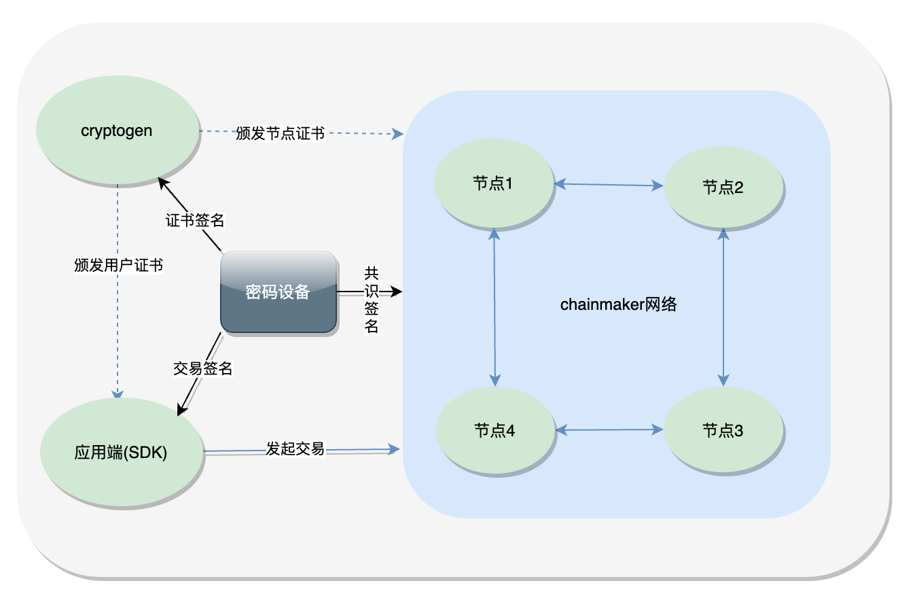
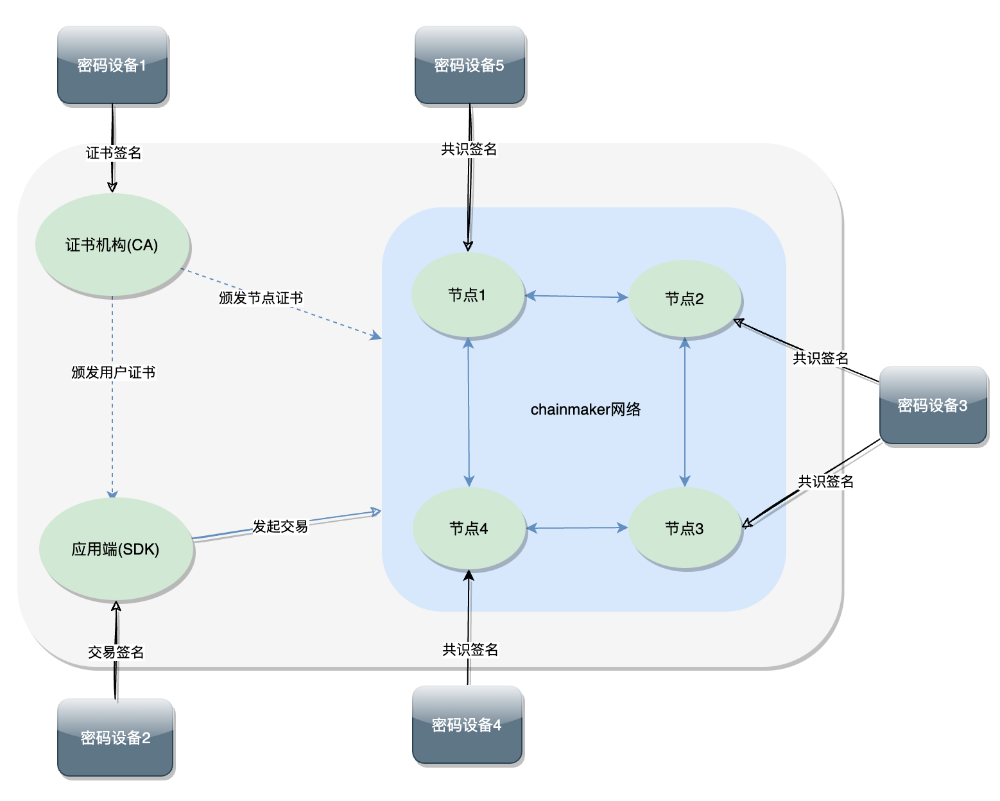

# 硬件加密

硬件加密设计链接：

[硬件加密设计](../tech/硬件加密.md)

## 功能介绍
1. CA服务根私钥硬件保护
2. 共识签名私钥硬件保护
3. SDK用户签名私钥硬件保护
4. 加密数据库对称密钥硬件保护
5. 支持国际标准算法：RSA、AES和ECDSA
6. 支持国密标准算法：SM2、SM4

## 启用硬件加密
### 配置项

```yaml
pkcs11:
  enabled: true                                       # set true if enable pkcs11
  library: /usr/local/lib64/libpkcs11.so              # path to the so file of pkcs11 interface
  label: HSM                                          # label for the slot to be used
  password: 11111111                                  # password to logon the HSM
  session_cache_size: 10                              # size of HSM session cache, default 10
  hash: "SHA256"                                      # hash algorithm used to compute SKI
```

## 测试网络

### 测试网络部署架构


1. 首先在密码设备创建CA根私钥、sdk用户私钥以及节点共识私钥。
2. 通过chainmaker-cryptogen工具（以下统称cryptogen）的generate命令一键生成测试网络证书。
3. 使用密码机节点私钥和cryptogen生成的节点证书启动chainmaker区块链网络
4. sdk使用密码机用户私钥进行签名，并将交易发送给chainmaker网络
5. chainmaker网络节点使用用户证书对交易进行验签名，并执行交易

### cryptogen启用硬件加密
修改配置文件chainmaker-cryptogen/config/crypto_config_template.yml，增加或修改pkcs11相关配置：
```yaml
crypto_config:
  - domain: chainmaker.org
    host_name: wx-org
    count: 4                # 如果为1，直接使用host_name，否则添加递增编号
    pk_algo: ecc_p256
    ski_hash: sha256
    #pkcs11配置, 
    pkcs11:
      enabled: true                             #启用硬件加密(此处设置为true)
      library: /usr/local/lib64/libpkcs11.so    #密码机pkcs11连接库
      label: HSM                                #密码机slot对应label
      password: 11111111                        #密码机登陆密码
      session_cache_size: 10
      hash: "SHA256" 
    specs: &specs_ref
      expire_year:  10
      sans:
        - chainmaker.org
        - localhost
        - 127.0.0.1
    location: &location_ref
      country:            CN
      locality:           Beijing
      province:           Beijing
    # CA证书配置
    # 其他配置（略）
```
新增/修改配置文件chainmaker-cryptogen/config/pkcs11_keys.yml，配置测试网各组织CA根、用户以及节点私钥KeyID，配置如下（以4组织，每个组织1个共识节点为例）：
```yaml
pkcs11_keys:
  - wx-org1.chainmaker.org: #组织1相关密钥KeyId
      ca:
        - SM2SignKey1
      node:
        consensus:
          - SM2SignKey2
        common:
          - SM2SignKey3
      user:
        admin:
          - SM2SignKey4
        client:
          - SM2SignKey5
        light:
          - SM2SignKey6
  - wx-org2.chainmaker.org:
      ca:
        - SM2SignKey7
      node:
        consensus:
          - SM2SignKey8
        common:
          - SM2SignKey9
      user:
        admin:
          - SM2SignKey10
        client:
          - SM2SignKey11
        light:
          - SM2SignKey12
  - wx-org3.chainmaker.org:
      ca:
        - SM2SignKey13
      node:
        consensus:
          - SM2SignKey14
        common:
          - SM2SignKey15
      user:
        admin:
          - SM2SignKey16
        client:
          - SM2SignKey17
        light:
          - SM2SignKey18
  - wx-org4.chainmaker.org:
      ca:
        - SM2SignKey19
      node:
        consensus:
          - SM2SignKey20
        common:
          - SM2SignKey21
      user:
        admin:
          - SM2SignKey22
        client:
          - SM2SignKey23
        light:
          - SM2SignKey24
```

### 节点启用硬件加密
修改chainmaker节点配置模版chainmaker-go/config/config_tql/chainmaker.tpl，新增/修改pkcs11相关配置：
```yml
node:
  type:              full
  org_id:            {org_id}
  priv_key_file:     ../config/{org_path}/certs/{node_cert_path}.key
  cert_file:         ../config/{org_path}/certs/{node_cert_path}.crt
  signer_cache_size: 1000
  cert_cache_size:   1000
  #pkcs11配置（配置项说明参考cryptogen）
  pkcs11: 
    enabled: true
    library: /usr/local/lib64/libupkcs11.so     
    label: HSM                                       
    password: 11111111                               
    session_cache_size: 10                     
    hash: "SHA256"                                 
```

### 本地启动chainmaker网络
参考 [自拉起服务](./自拉起服务.md)  
参考 [多机部署](./多机部署.md)

### sdk启用硬件加密
修改sdk配置文件sdk_config.yaml, 新增/修改pkcs11相关配置如下：
```yml
  nodes:
    - # 节点地址，格式为：IP:端口:连接数
      node_addr: "127.0.0.1:12301"
      conn_cnt: 10
      enable_tls: true
      trust_root_paths:
        - "./testdata/crypto-config/wx-org1.chainmaker.org/ca"
        - "./testdata/crypto-config/wx-org2.chainmaker.org/ca"
      # TLS hostname
      tls_host_name: "chainmaker.org"
  #pkcs11配置（配置说明参考cryptogen）
  pkcs11:
    enabled: true
    library: /usr/local/lib64/libupkcs11.so
    label: HSM
    password: 11111111 
    session_cache_size: 10
    hash: "SHA256"
```
sdk测试  
参考 [命令行工具](../dev/命令行工具.md)  
参考 [SDK](../dev/SDK.md)


## 推荐部署架构
### 部署架构图


说明：
1. CA使用单独密码设备
2. 客户端SDK使用单独密码设备
3. 节点使用一台或多台密码设别（根据组织结构和节点部署情况而定）

### 密码设备部署
密码设备服务商提供（详情略）


