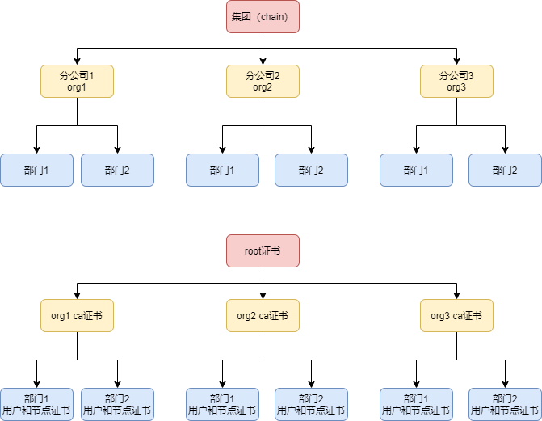
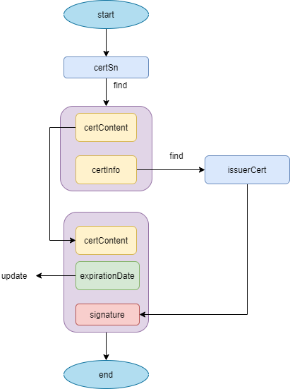
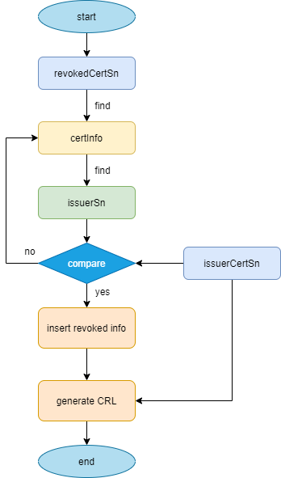
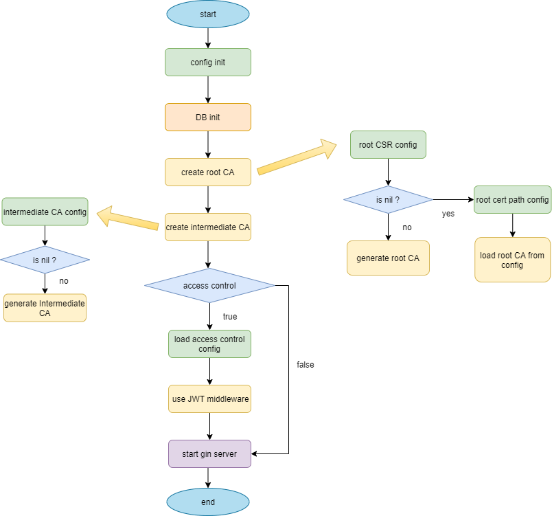

# CA证书服务

## 概述

长安链证书签发服务，可用于多种场景部署，提供证书签发，管理，更新，吊销等服务。

CA证书服务的使用手册链接：

[CA证书服务的使用手册](../operation/CA证书服务.md)

## 表设计

### cert_content

证书的内容表，存储写到X509证书里的证书详情。

|        字段         |     类型     |          含义          |           备注           |
| :-----------------: | :----------: | :--------------------: | :----------------------: |
|    serial_number    |    bigint    |          SN码          | 证书字段，证书的唯一标识 |
|       content       |   longtext   |       证书的内容       |         pem编码          |
|      signature      |   longtext   |       证书的签名       |         hex编码          |
|       country       | varchar(255) |          国家          |       X509证书字段       |
|      locality       | varchar(255) |          地区          |       X509证书字段       |
|      province       | varchar(255) |          省份          |       X509证书字段       |
|    organization     | varchar(255) |          组织          |       X509证书字段       |
| organizational_unit | varchar(255) |          单位          |       X509证书字段       |
|     common_name     | varchar(255) |         常用名         |       X509证书字段       |
|     csr_content     |   longtext   |       证书的csr        |         pem编码          |
|        is_ca        |     bool     |  证书是否具有签发能力  |       X509证书字段       |
|         ski         | varchar(255) |     证书密钥的ski      |       X509证书字段       |
|         aki         | varchar(255) |     证书密钥的aki      |       X509证书字段       |
|      key_usage      |     int      |   证书密钥的使用方式   |       X509证书字段       |
|    ext_key_usage    | varchar(255) | 证书密钥的扩展使用方式 |       X509证书字段       |
|     issue_date      |    bigint    |        签发日期        |        unix时间戳        |
|   expiration_date   |    bigint    |        到期时间        |        unix时间戳        |

### cert_info

证书的相关信息表，存储与证书相关的，包括密钥，用户信息等。

|      字段      |     类型     |     含义     |          备注          |
| :------------: | :----------: | :----------: | :--------------------: |
| serial_number  |    bigint    |    证书sn    |    证书的唯一标识sn    |
| private_key_id | varchar(255) |   私钥标识   |    一般为私钥的ski     |
|   issuer_sn    |    bigint    |   签发者sn   |   该证书的颁发者的sn   |
|  p2p_node_id   | varchar(255) |  p2p网络Id   |  长安链P2P网络节点ID   |
|     org_id     | varchar(255) | 组织唯一标识 |      长安链组织ID      |
|   user_type    |     int      | 证书用户类型 |     长安链证书角色     |
|   cert_usage   |     int      |   证书用途   |   长安链证书使用方式   |
|    user_id     | varchar(255) | 用户唯一标识 | 长安链用户（节点）标识 |

* user_type: 1.root , 2.ca , 3.admin , 4.client , 5.consensus , 6.common

* cert_usage: 1.sign , 2.tls , 3.tls-sign , 4.tls-enc

### keypair

公私钥对表，存储密钥的具体信息。

|      字段       |     类型     |            含义            |          备注          |
| :-------------: | :----------: | :------------------------: | :--------------------: |
|       ski       | varchar(255) |         密钥的ski          | 密钥在证书里的唯一标识 |
|   private_key   |   longtext   |         私钥的内容         |        pem编码         |
|   public_key    |   longtext   |         公钥的内容         |        pem编码         |
| private_key_pwd | varchar(255) | 私钥密码的哈希（用户部分） |        hex编码         |
|    key_type     |     int      |          公钥算法          |                        |
|    hash_type    |     int      |          哈希算法          |                        |

### revoked_cert

撤销的证书表，存储撤销信息。

|        字段        |     类型     |     含义     |
| :----------------: | :----------: | :----------: |
|  revoked_cert_sn   |    bigint    | 撤销证书的SN |
|       reason       |   longtext   |   撤销原因   |
| revoked_start_time |    bigint    | 撤销开始时间 |
|  revoked_end_time  |    bigint    | 撤销结束时间 |
|     revoke_by      |    bigint    |    撤销者    |
|       org_id       | varchar(255) |   所属组织   |

### app_info

访问控制应用信息表，存储配置的应用id和key还有角色。

|   字段   |     类型     |   含义   |
| :------: | :----------: | :------: |
|  app_id  | varchar(255) |  应用id  |
| app_key  | varchar(255) | 应用口令 |
| app_role |     int      | 应用角色 |

app_role : 1.admin , 2.user

* admin : 所有权限

* user ：不能进行吊销、延期证书。只能申请，查询证书。

## 证书详解

### 证书使用方式

* sign ：签名证书。
* tls ：tls 证书
* tls-enc ：tls加密证书（符合国密tls双证书标准）
* tls-sign ：tls签名证书（符合国密tls双证书标准）

### 证书分类

* **CA证书**

  CA证书是指具有签发能力的证书，即使用该证书可以继续签发下级证书。通常为root或者ca两种证书角色。

* **用户证书**

  用户证书是指不具备签发能力的、给用户使用的tls或sign证书。通常为admin或client两种角色。

* **节点证书**

  节点证书是指不具备签发能力的、给节点使用的tls或sign证书。通常为consensus或common两种角色。

### 证书角色分类

* **root**

  root为根证书。即初始证书，是由自签形成的第一个证书。

* **ca**

  ca为中间CA证书。该类证书是由根证书直接或间接签发，本身也具有继续向下签发的能力。在ChainMaker中，通常表现为组织证书。

* **admin**

  admin为用户证书的一种。通常称为管理员证书。该证书拥有参与投票等更多的参与权限。（想要了解具体权限设计详情，请查看长安链开源文档，用户手册的权限管理模块。）

* **client**

  client为用户证书的一种。通常称为普通用户证书。该证书拥有发起交易，查询信息等基本的链上操作权限。但缺乏参与投票等一些重大决策权限。（想要了解具体权限设计详情，请查看长安链开源文档，用户手册的权限管理模块。）

* **consensus**

  consensus为节点证书的一种。通常称为共识节点证书。该证书通常颁发给ChainMaker的共识节点，共识节点用共识节点证书参与链上的共识投票、签名、校验、通信等操作。

* **common**

  common为节点证书的一种。通常称为同步节点证书。该证书通常颁发给ChainMaker的同步节点，同步节点的校验，签名、通信的操作需要同步节点的tls和sign证书。

### 场景模拟

该场景下，以集团为基础，以多个分公司为参与方构建一条区块链。

分公司在链上是组织的身份。分公司下的部门，在链上是用户和节点的身份。

在这种场景下，集团以root证书的身份给所有分公司颁发中间ca证书（组织证书）。

分公司用各自的中间ca证书给自己的部门颁发用户和节点证书。

### X.509证书字段规范

在ChainMaker证书体系里，X.509证书格式的以下字段做出了具体的规范：

#### 常用字段

|       字段       | 证书类型 |        全称        |    填写内容     |              含义              |
| :--------------: | :------: | :----------------: | :-------------: | :----------------------------: |
|        O         |   统一   |    Organization    |      OrgId      | 组织ID （组织的唯一标识） |
|        OU        |   统一   | OrganizationalUnit |  证书角色类型*  |              角色              |
|        CN        |  CA证书  |     CommonName     |     root/ca     |                                |
|        CN        | 用户证书 |     CommonName     |     UserId      |  用户ID （用户唯一标识）  |
|        CN        | 节点证书 |     CommonName     | xxx.xxx.xxx.com |    节点真实域名（链上唯一）    |
| DNSNames（SANS） | 节点证书 |      DNSNames      | xxx.xxx.xxx.com |          节点真实域名          |

***证书角色类型**：root/ca/admin/client/consensus/common 共六种选择。

* O字段，即X.509证书的Organization字段，我们要求所有证书必须填写组织的唯一标识，需要与ChainMaker启动时配置的OrgId统一。
* OU字段，即X.509证书的OrganizationalUnit字段，我们要求所有证书必须填写ChainMaker证书6种角色的其中一种。
* CN字段，即X.509证书的CommonName字段，CA证书根据实际的证书角色填写root或者ca。用户证书填写用户的唯一标识，UserId。节点证书填写节点的真实域名信息。同一节点（用户）的tls和sign证书，CN字段应该相同。
* DNSNames字段，节点证书填写节点的真实域名信息，其余不作要求。

#### KeyUsage

X.509的KeyUsage字段，具体用法介绍请参照RFC 5280标准

根据证书角色和证书的使用方式，我们对字段KeyUsage进行了具体设定：

* **admin/client/consensus/common :**

  * **tls-sign :** x509.KeyUsageDigitalSignature  | x509.KeyUsageContentCommitment

  * **tls-enc :** x509.KeyUsageKeyEncipherment | x509.KeyUsageDataEncipherment | x509.KeyUsageKeyAgreement

  * **tls:** x509.KeyUsageKeyEncipherment | x509.KeyUsageDataEncipherment | x509.KeyUsageKeyAgreement |x509.KeyUsageDigitalSignature | x509.KeyUsageContentCommitment

  * **sign :** x509.KeyUsageDigitalSignature | x509.KeyUsageContentCommitment

* **ca/root :** 

  * **tls :**  x509.KeyUsageCertSign | x509.KeyUsageCRLSign

  * **sign :** x509.KeyUsageCertSign | x509.KeyUsageCRLSign

#### ExtKeyUsage

X.509的ExtKeyUsage字段，具体用法介绍请参照RFC 5280标准

根据证书角色和证书的使用方式，我们对字段KeyUsage进行了具体设定：

* **consensus/common :**

  * **tls:** {ExtKeyUsageServerAuth, ExtKeyUsageClientAuth}

  * **tls-enc:** {ExtKeyUsageServerAuth, ExtKeyUsageClientAuth}

  * **tls-sign:** {ExtKeyUsageServerAuth, ExtKeyUsageClientAuth}

* **admin/client：**

  * **tls:** {ExtKeyUsageClientAuth}

  * **tls-sign:** {ExtKeyUsageClientAuth}

  * **tls-enc:** {ExtKeyUsageClientAuth}

## 证书延期

通过提供的证书SN，找到旧证书，在旧证书的基础上，以旧证书的信息为基础，包括SN字段，在旧证书的有效期基础上，用该证书的签发者，重新签名签发延期证书。

流程：

## 证书撤销

首先判断签发者SN是否是要撤销证书的上级，如果是，将撤销信息插入数据库保存。撤销日期以撤销动作起，到证书的失效期结束（永久吊销）。然后，生成该签发者证书下所有撤销的证书列表（CRL）并返回。

流程：

## 服务启动

流程：

