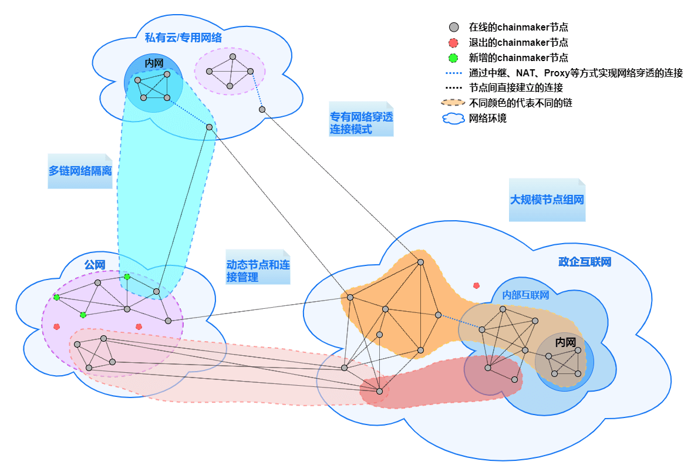
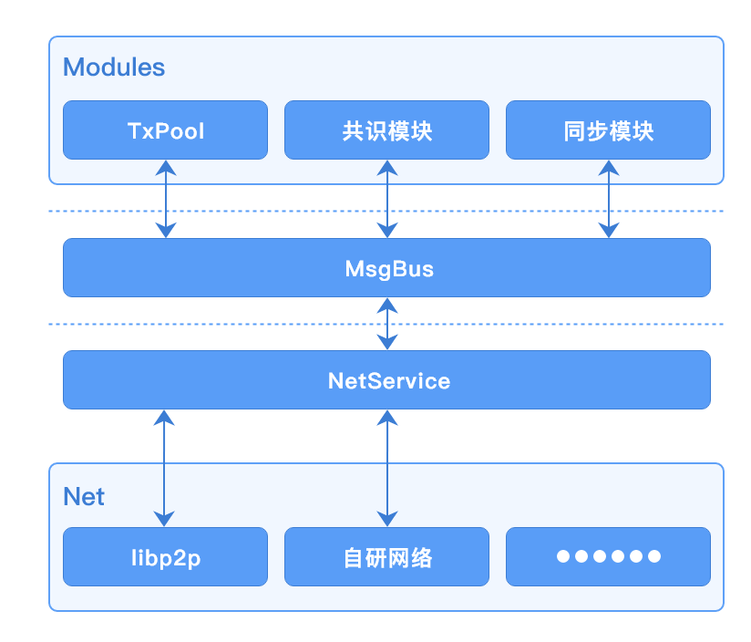
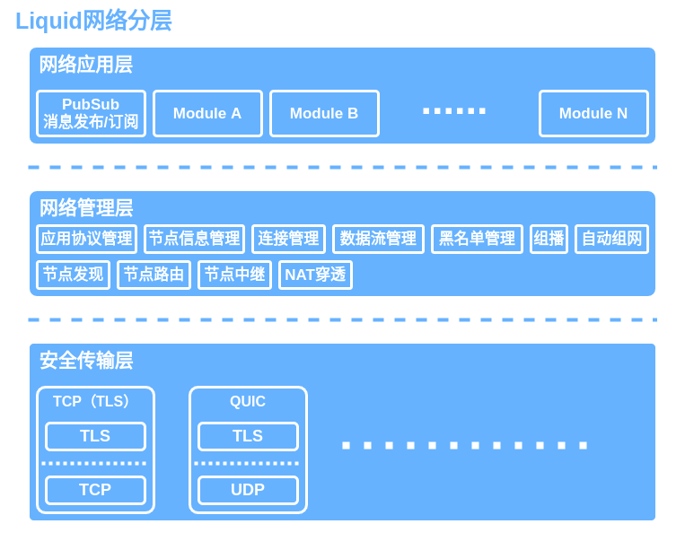
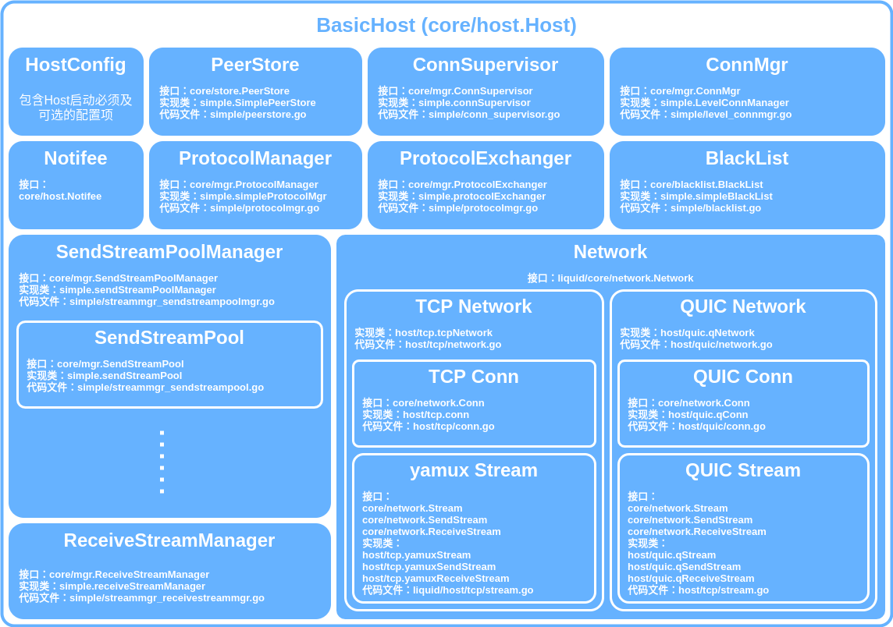

# P2P网络

## Libp2p

###  概述

网络模块主要负责如下功能实现：

- 节点组网
- 具有安全保障的节点间数据通讯
- 节点网络身份认证
- 消息广播及订阅（Pubsub）
- 扩展支持节点自动发现、自动组网
- 多链间网络消息数据隔离
- 复杂网络环境场景解决方案的支持

长安链2.0版本的网络模块是基于[libp2p](https://libp2p.io)的v0.6.4版本实现并改进的。节点的网络地址遵循libp2p地址格式协议；为了满足长安链网络消息在多链场景下的数据隔离需求，我们修改了libp2p-gossip-pubsub模块源码，加入节点白名单机制，精确控制路由表，并让节点上的每条链都独享一个独立的Pubsub服务，保证了广播数据只会在链内的节点传播的确定性；为了满足国密加密算法的支持，我们还修改了libp2p-core核心包，增加了对国密TLS证书的支持。

了解网络模块的使用示例，请点击如下链接：  
[P2P使用文档](../operation/P2P网络管理.md)

**基于libp2p的改进:**
- 核心包增加对国密SM算法的支持；
- libp2p-gossip-pubsub功能模块增加白名单功能，实现对Gossip路由表的控制，达到广播消息隔离效果；
- 引入StreamPool，实现stream复用提高性能、网络吞吐能力自动扩容等特性。


P2P网络相关特性，可用下图一图汇总，包括：
- 大规模节点组网；
- 动态节点和连接管理；
- 专有网络穿透连接；
- 多链网络隔离。



### 组网方式

长安链支持自动发现、自动连接的组网方式，默认在线的每个节点都可以作为种子节点为其他节点提供网络发现服务，每个种子节点都会记录网内节点地址信息。当有新节点连接到某个种子节点时，新节点会向该种子节点查询网内其他可连接节点的地址，拿到其他节点地址后，新节点会主动尝试与这些节点建立连接；另外，种子节点在接受了新节点链接后，会通过网络发现服务将该新节点的地址通知给其他在线的种子节点，其他节点在获得该新节点地址后，也会主动尝试与该新节点建立连接。


长安链理论上可实现上万甚至更多节点同时在线组网。

#### 复杂网络环境场景支持

长安链可以针对复杂网络环境场景提供组网通讯解决方案，包括但不限于NAT穿透、代理节点转发等。

### 节点身份验证
- 节点身份是由组织CA签发的TLS证书确定，在节点入网时，会通过TLS握手协议校验TLS证书的合法性。
- 每个节点使用的TLS证书的必须保证唯一性，不可多节点共用一个TLS证书。
- 每个TLS证书都可对应生成一个NodeId唯一标识，该标识是节点网络地址的组成部分，是网络通讯环节重要的标识。

### 与其他模块交互

当前版本网络模块与其他模块交互都是异步的，都是通过MsgBus来进行数据互传，交互图如下：



###  接口说明
```go
package protocol

type ChainNodeInfo struct {
	NodeUid     string
	NodeAddress []string
	NodeTlsCert []byte
}

type MsgHandler func(from string, msg []byte, msgType net.NetMsg_MsgType) error

// ChainNodesInfoProvider provide base node info list of chain.
type ChainNodesInfoProvider interface {
	// GetChainNodesInfo return base node info list of chain.
	GetChainNodesInfo() ([]*ChainNodeInfo, error)
}

//  NetService
type NetService interface {
	// BroadcastMsg broadcast a msg to the net.
	BroadcastMsg(msg []byte, msgType net.NetMsg_MsgType) error
	// Subscribe register a MsgHandler for subscribe.
	Subscribe(msgType net.NetMsg_MsgType, handler MsgHandler) error
	// CancelSubscribe cancel subscribe.
	CancelSubscribe(msgType net.NetMsg_MsgType) error
	// ConsensusBroadcastMsg broadcast a msg to the consensus nodes.
	ConsensusBroadcastMsg(msg []byte, msgType net.NetMsg_MsgType) error
	// ConsensusSubscribe register a MsgHandler handle the msg from consensus nodes for subscribe.
	ConsensusSubscribe(msgType net.NetMsg_MsgType, handler MsgHandler) error
	// CancelConsensusSubscribe cancel subscribe.
	CancelConsensusSubscribe(msgType net.NetMsg_MsgType) error
	// SendMsg send msg to any nodes.
	SendMsg(msg []byte, msgType net.NetMsg_MsgType, to ...string) error
	// ReceiveMsg register a MsgHandler to handle the msg received from other node.
	ReceiveMsg(msgType net.NetMsg_MsgType, handler MsgHandler) error

	// Start the net service.
	Start() error

	// Stop the net service.
	Stop() error

	// GetNodeUidByCertId return node uid which mapped to the given cert id. If unmapped return error.
	GetNodeUidByCertId(certId string) (string, error)

	// GetChainNodesInfoProvider return a implementation of ChainNodesInfoProvider.
	GetChainNodesInfoProvider() ChainNodesInfoProvider
}
```

- `ChainNodeInfo` 是链上节点信息结构体，主要存储某个链上与本地节点建立连接的节点NodeID、网络地址、TLS证书等信息。
- `MsgHandler`    是网络消息处理器，当网络模块收到来自其他节点或订阅的消息时，会根据消息类型回调给不同的消息处理器去处理接收到的消息。
- `ChainNodesInfoProvider` 是链上节点信息Provider接口定义，主要用于给rpcServer或VM提供查询当前链已连接节点信息功能。
- `NetService` 是网络服务接口定义，主要用于为其他模块提供网络服务支持。
- `BroadcastMsg`方法，向链内广播一条消息，需要指定消息类型。
- `Subscribe`方法，注册一个用于处理指定消息类型的订阅消息处理器，与`BroadcastMsg`配合使用。
- `CancelSubscribe`方法，注销一个用于处理指定消息类型的订阅消息处理器。
- `ConsensusBroadcastMsg`方法，向链内共识节点广播一条消息，需要指定消息类型。该方法只会把消息发给共识节点，非共识节点收不到该方法广播的消息。
- `ConsensusSubscribe`方法，注册一个用于处理指定消息类型的只发给共识节点的订阅消息处理器，与`ConsensusBroadcastMsg`配合使用。
- `CancelConsensusSubscribe`方法，注销一个用于处理指定消息类型的只发给共识节点的订阅消息处理器。
- `SendMsg`方法，向指定节点直接发送网络消息。
- `ReceiveMsg`方法，注册一个用于处理其他节点直接发送过来的消息处理器。
- `Start`方法，启动网络服务。
- `Stop`方法，停止网络服务。
- `GetNodeUidByCertId`方法，根据证书ID查询使用该证书ID对应的TLS证书节点的NodeID。
- `GetChainNodesInfoProvider`方法，返回`ChainNodesInfoProvider`接口实现。

###  节点地址格式说明
长安链节点地址遵循libp2p网络地址格式协定，使用multaddr组件解析地址，例如：
```text
/ip4/127.0.0.1/tcp/6666/p2p/QmQZn3pZCcuEf34FSvucqkvVJEvfzpNjQTk17HS6CYMR35
```

或者

```text
/dns4/chainmaker.org/tcp/6666/p2p/QmQZn3pZCcuEf34FSvucqkvVJEvfzpNjQTk17HS6CYMR35
```
地址以"/"开始，并以"/"分段，大多数情况下，各段说明如下：
- 第一段：IP协议版本或DNS解析协议版本。ip4代表IPv4，ip6代表IPv6；dns4对应IPv4版本DNS服务，dns6对应IPv6版本DNS服务
- 第二段：IP地址或域名，需要与第一段对应
- 第三段：通讯网络协议，默认使用tcp
- 第四段：监听端口
- 第五段：固定协议，请勿改动，固定为"p2p"
- 第六段：节点NodeId，与TLS证书配套，根据TLS证书通过特定算法计算而来

以上只是最普通常用场景下节点地址举例，在复杂网络场景下（比如需要使用节点中继、NAT穿透等）地址格式会稍有不同。

###  网络消息数据格式说明（加密前）
加密前的消息数据是由 `8位byte表示数据长度 + 1位byte数据压缩标识 + 实际数据` 来组成。

为了方便说明，我们使用如下例子：
```text
[0 0 0 0 0 0 0 78 0 10 57 10 5 ...... 80 85 83 72]
```
假设这是一条待发送的网络消息数据，其中：
- 前8位，[0 0 0 0 0 0 0 78] 表示要发送数据的长度，在接收方接收数据时，若接收到的数据长度不足该值，则会尝试继续读取数据，直至接收全部长度的数据或接收失败。
- 第9位，[0] 或 [1] 是数据压缩标记位，若是1，接收方在接收到完整数据后，会将接收到的数据进行解压缩，得到最终的数据结果。
- 剩余位，[10 57 10 5 ...... 80 85 83 72] 为要发送的原始数据或被压缩后的原始数据，是否压缩要与第9位压缩标识相对应。压缩/解压缩使用GZip工具包完成。


## Liquid

### 概述

长安链v1.x版本的P2P网络是基于libp2p来实现的，但是libp2p在设计上有很多地方并不完全符合chainmaker的网络应用需求，在这样的情境下，自研网络计划诞生了。在了解自研网络之前，我们先来说下chainmaker对网络模块提出的需求。

网络模块要具备如下功能及特性：

- 节点网络身份认证
- 具有安全保障的节点间数据通讯
- 节点组网
- 基于链层的消息发布及订阅（PubSub)
- 多链共用网络且链间网络消息数据隔离
- 国密加密算法支持
- 扩展支持节点自动发现、自动组网
- 复杂网络环境场景的解决方案支持

在自研网络代码架构设计阶段，我们着重考虑了以上需求，确保新网络实现可最大限度贴合chainmaker的设计理念。

在自研网络开发阶段，我们总结了使用libp2p作为网络实现时遇到的一些问题并对应的给出解决方案，在开发自研网络时，会直接将解决方案应用在新代码中。我们也对libp2p网络实现的代码做了部分调整，让整个网络模块代码结构更合理高效，同时也解决了一些历史遗留问题。

我们给自研P2P网络赋予了一个新名字——Liquid。在下文中我们会使用Liquid来代表自研网络。

了解网络模块的使用示例，请点击如下链接：  
[P2P使用文档](../operation/P2P网络管理.md)

### 架构设计

#### Liquid整体架构

Liquid架构在功能层面由上至下总共划分为三个层级，分别是：网络应用层、网络管理层、安全传输层。

功能架构图如下：



- 网络应用层：是指使用Liquid来实现网络通讯的上层应用集合，Liquid是使用应用协议（protocol.ID)来区分标识上层应用的，每个应用模块都应该有一个全局唯一的应用协议。应用协议描述详见4.1。消息发布及订阅模块（PubSub）是Liquid内置的一个应用。
- 网络管理层：负责Liquid网络节点间连接状态管理，由多个管理组件组成，它们包括但不限于：应用协议管理（包含应用协议交换机）、节点信息管理（PeerStore）、连接管理（ConnMgr）、数据流管理（SendStreamPool/SendStreamMgr/ReceiveStreamMgr）、黑名单管理、组播组件、连接状态维护组件（ConnSupervisor）、节点发现（Discovery）、节点路由（PeerRouting）、节点中继、NAT穿透等。其中应用协议交换、节点发现也是基于应用协议支持实现的，它们属于管理层内置的应用模块。
- 安全传输层：负责底层网络协议支持及传输加密，目前已实现TCP/TLS、QUIC两种协议支持，未来会有更多（比如WebSocket、SCTP等）协议支持。

#### Liquid核心包

Liquid网络核心包里包含了框架核心接口定义、通用类型定义及概念抽象定义。

核心包内每个子包说明如下：

- core/basic  基础接口包，包含Starter、Stopper以及两者组合封装接口Switcher。
- core/blacklist 黑名单接口定义。
- core/broadcast PubSub消息发布/订阅功能接口定义。
- core/discovery 节点发现相关接口定义，包含Announcer、Discoverer以及两者组合封装接口Discovery。
- core/groupmulticast 组播组件接口定义。
- core/handler 用于回调的处理器函数类型定义。
- core/host 网络Host接口定义、网络活动事件通知接口定义。
- core/mgr 管理组件接口定义，包含连接管理（ConnMgr）、连接状态维护（ConnSupervisor）、应用协议管理器（ProtocolManager）、应用协议交换机（ProtocolExchanger）、发送流池（SendStreamPool）、发送流池管理（SendStreamPoolManager）、接收流管理（ReceiveStreamManager）等接口定义。
- core/network 传输层网络状态机相关接口定义，包含发送流（SendStream）、接收流（ReceiveStream）、双向流（Stream）、连接（Conn）、状态（Stat）、拨号器（Dialer）、监听器（Listener）、网络状态机（network）等以及相关的其他的接口或类型定义。
- core/peer 节点相关概念接口定义，主要包括节点ID（peer.ID）类型定义。
- core/protocol 协议相关定义，主要包括应用协议（protocol.ID）类型定义及网络数据包结构体定义。
- core/reuse 端口复用相关。
- core/routing 节点路由相关接口定义。
- core/store 节点信息存储相关概念接口定义，主要包括节点地址簿（AddrBook）、节点协议簿（ProtocolBook）以及两者组合封装接口（PeerStore）定义。
- core/types 通用类型或结构体，包括先进先出缓存（FIFOCache）、固定大小超时控制缓存（FixedCapDurationCache）、连续数字记录集（IntervalSet）、通用集（Set）等。
- core/util 通用工具集合。

#### Liquid实现代码结构

在Liquid开发时，我们尽可能的保证了它的通用性。Liquid虽然是为了chainmaker而生，但我们并不限于它只能被chainmaker集成使用。我们也尽可能将不需要使用者关心的组件及配置进行了隐藏（非导出处理），为了能让开发者更容易读懂我们的代码结构，所以Liquid实现代码并没有严格按照2.1中描述的框架设计。以下内容都是描述Liquid内部默认实现，开发者可以根据核心包定义接口自行编写实现来替换Liquid内置默认实现。

BasicHost（在net/liquid/host/host.go中）是Liquid内置默认Host实现，也是网络初始化的总入口。我们基于BasicHost整理了一张Liquid默认实现的代码结构图：



具体各组件间的联系及调用关系会在我们发布正式稳定版之后补充在功能逻辑流程图中，敬请期待。

##### Liquid Host基本使用

以下代码只是用于举例展示，并非实际可运行程序：

```go
import (
	"chainmaker.org/chainmaker/chainmaker-net-liquid/core/handler"
	coreHost "chainmaker.org/chainmaker/chainmaker-net-liquid/core/host"
	"chainmaker.org/chainmaker/chainmaker-net-liquid/core/peer"
	"chainmaker.org/chainmaker/chainmaker-net-liquid/core/protocol"
	"chainmaker.org/chainmaker/chainmaker-net-liquid/discovery/protocoldiscovery"
	"chainmaker.org/chainmaker/chainmaker-net-liquid/host"
	"chainmaker.org/chainmaker/chainmaker-net-liquid/logger"
	"chainmaker.org/chainmaker/chainmaker-net-liquid/pubsub"
	"chainmaker.org/chainmaker/chainmaker-net-liquid/tlssupport"
	"chainmaker.org/chainmaker/common/crypto"
	"chainmaker.org/chainmaker/common/crypto/asym"
	"context"
	"fmt"
	ma "github.com/multiformats/go-multiaddr"
)

func main() {
	ctx := context.Background()
	// 1. 如何初始化一个Liquid Host实例
	// 首先创建一个HostConfig
	hostCfg := &host.HostConfig{}
	// 准备加密密钥(非国密)
	sk, err := asym.GenerateKeyPair(crypto.ECC_NISTP256)
	if err != nil {
		// do something
		panic(err)
	}
	hostCfg.PrivateKey = sk
	// 使用密钥创建TLS config及LoadPidFunc
	tlsCfg, pidFunc, err := tlssupport.MakeTlsConfigAndLoadPeerIdFuncWithPrivateKey(sk)
	if err != nil {
		// do something
		panic(err)
	}
	hostCfg.TlsCfg, hostCfg.LoadPidFunc = tlsCfg, pidFunc
	// 设置发送流池大小，可选，默认100
	hostCfg.SendStreamPoolCap = 100
	// 设置与每个节点建立的最大连接数，可选，该参数直接影响并发发送数据性能，默认是1，若为1时，则不会启用并发
	hostCfg.MaxConnCountEachPeerAllowed = 5
	// 设置与每个节点间接收流最大数量
	hostCfg.PeerReceiveStreamMaxCount = hostCfg.SendStreamPoolCap * int32(hostCfg.MaxConnCountEachPeerAllowed)
	// 设置可建立连接节点数量，可选，默认为20
	hostCfg.MaxPeerCountAllowed = 20
	// 设置本地监听地址
	lAddr := ma.StringCast("/ip4/0.0.0.0/tcp/8001")
	hostCfg.ListenAddresses = []ma.Multiaddr{lAddr}
	// 设置要连接的其他节点地址，可选
    hostCfg.AddDirectPeer("/ip4/127.0.0.1/tcp/8002/p2p/QmeyNRs2DwWjcHTpcVHoUSaDAAif4VQZ2wQDQAUNDP33gH")
    hostCfg.AddDirectPeer("/ip4/127.0.0.1/tcp/8003/p2p/QmXf6mnQDBR9aHauRmViKzSuZgpumkn7x6rNxw1oqqRr45")
	// 新建一个Host实例
	log := logger.NewLogPrinter("TEST")
	h, err := hostCfg.NewHost(host.TcpNetwork, ctx, log)
	if err != nil {
		// do something
		panic(err)
	}
	// 2. 向Host注册一个Notifee，方便我们感知到哪些节点已连接或断开连接，以及哪些节点新支持了哪些应用协议
	notifyBundle := &coreHost.NotifieeBundle{
		PeerConnectedFunc: func(id peer.ID) {
			fmt.Printf("节点已连接，节点ID：%s\n", id)
		},
		PeerDisconnectedFunc: func(id peer.ID) {
			fmt.Printf("节点已断开，节点ID：%s\n", id)
		},
		PeerProtocolSupportedFunc: func(protocolID protocol.ID, pid peer.ID) {
			fmt.Printf("节点%s新支持协议%s\n", pid, protocolID)
		},
		PeerProtocolUnsupportedFunc: func(protocolID protocol.ID, pid peer.ID) {
			fmt.Printf("节点%s取消支持协议%s\n", pid, protocolID)
		},
	}
	h.Notify(notifyBundle)

	// 3. 向Host注册一个消息处理器
	testProtocol := protocol.ID("TEST")
	var msgHandler handler.MsgPayloadHandler = func(senderPID peer.ID, msgPayload []byte) {
		fmt.Printf("收到来自节点%s的消息：%s\n", senderPID, string(msgPayload))
	}
	err = h.RegisterMsgPayloadHandler(testProtocol, msgHandler)
	if err != nil {
		// do something
		panic(err)
	}

	// 4. 启动Host实例
	err = h.Start()
	if err != nil {
		// do something
		panic(err)
	}

	// 5. 使用Host尝试与其他节点建立连接
	remoteAddr := ma.StringCast("/ip4/127.0.0.1/tcp/8002/p2p/QmeyNRs2DwWjcHTpcVHoUSaDAAif4VQZ2wQDQAUNDP33gH")
	_, err = h.Dial(remoteAddr)
	if err != nil {
		// do something
        panic(err)
	}

	// 6. 使用Host向其他已连接节点发送数据
	data := []byte("Hello!")
	receiverPid := peer.ID("QmeyNRs2DwWjcHTpcVHoUSaDAAif4VQZ2wQDQAUNDP33gH")
	err = h.SendMsg(testProtocol, receiverPid, data)
	if err != nil {
		// do something
		panic(err)
	}

	// 消息发布及订阅
	// 7. 初始化ChainPubSub服务
	ps := pubsub.NewChainPubSub("test_chain", log)
	err = ps.AttachHost(h)
	if err != nil {
		// do something
        panic(err)
	}

	// 8. 向ChainPubSub注册订阅消息处理器
	testTopic := "test_topic"
	var subHandler handler.SubMsgHandler = func(publisher peer.ID, topic string, msg []byte) {
		fmt.Printf("收到节点%s向频道%s发布的消息：%s\n", publisher, topic, string(msg))
	}
	ps.Subscribe(testTopic, subHandler)

	// 9. 使用ChainPubSub发布消息
	ps.Publish(testTopic, data)

	// 节点发现服务
	// 10. 开启节点发现服务
	discoveryService, err := protocoldiscovery.NewProtocolBasedDiscovery(h, protocoldiscovery.WithLogger(log))
	if err != nil {
		// do something
        panic(err)
	}

	// 11. 宣布自己支持的服务
	err = discoveryService.Announce(ctx, "test_chain")
	if err != nil {
		// do something
        panic(err)
	}

	// 12. 搜寻其他节点
	findC, err := discoveryService.FindPeers(ctx, "test_chain")
	if err != nil {
		// do something
        panic(err)
	}
	newPeerAddr := <- findC
	fmt.Printf("发现新节点，地址：%s\n", newPeerAddr.String())
}

```

### 安全传输层

#### TCP（TLS）传输

TCP传输是以TCP作为底层传输协议的一种传输层实现，默认实现在liquid/host/tcp包内。底层使用golang官方net库实现。

TCP传输支持明文、TLS加密、GMTLS（国密算法支持）加密传输三种模式。

由于官方net库的tcp连接没有流的概念，所以TCP传输的数据流（Stream）目前是基于yamux开源组件实现，按照数据流向可分为接收流、发送流、双向流三种。

#### QUIC传输

QUIC传输是以Quic作为底层传输协议的一种传输层实现，默认实现在liquid/host/quic包内。底层使用我们修改过的quic-go开源库实现。我们在quic-go的实现基础上加入了对国密算法GMTLS的支持。

QUIC传输不支持明文传输，要求使用TLS加密传输。我们修改后同时支持国密TLS。

Quic协议本身就有数据流的概念定义，所以QUIC传输的数据流直接使用quic-go的Stream封装实现。

**注：经过我们测试，目前在Linux系统下，UDP报文接收效率会比较低下（Linux内核长期没有对UDP优化），使用QUIC无法将网络带宽充分利用（千兆及以上）。若使用千兆/万兆网络，建议当前阶段使用TCP。**

#### 未来计划

未来我们会考虑实现使用WebSocket、SCTP等其他底层传输协议的传输层，当然开发者也可自己实现传输层，只需要实现liquid/core/network中接口定义的方法即可接入Liquid。

### 网络管理层

#### 应用协议

应用协议ID即Protocol.ID，是将Liquid节点间相同应用关联起来的重要依据，只有应用协议ID相同的Liquid应用才能够互相通讯。上层应用在发送消息时，会将该应用的协议ID封装在网络数据包中，接收方会根据接收的数据包中的协议ID来将收到的数据告知拥有相同协议ID的上层应用。

每个上层应用必须拥有全局唯一的应用协议ID，Liquid会拒绝多次的相同应用协议ID注册请求。

由于Liquid内置部分组件也是基于应用协议实现，开发者在定义上层应用协议ID时，应避免与内置组件应用协议冲突。

#### 管理组件

##### 连接管理

连接管理器负责管理与其他节点间建立的链接，接口定义在core/mgr/connmgr.go中mgr.ConnMgr interface。

###### 内置连接管理器实现

Liquid内置了一种基于优先级的连接管理器——simple.LevelConnManager，实现代码在simple/level_connmgr.go文件中。

LevelConnManager允许针对每个节点添加一定数量的连接，若节点连接数量达到设置上限，则IsAllowed方法返回false。

LevelConnManager将节点连接分为两种优先级：高优先级、低优先级。共识节点、种子节点将被设置为高优先级，其他节点将被设置为低优先级。

优先级与节点ID绑定，高优先级节点数量与低优先级节点数量之和作为总节点连接数量。

当总节点连接数达到设置上线时，若添加新节点连接，则根据设置的淘汰规则淘汰一个节点（关闭该节点所有连接）。

我们提供了三种淘汰策略：Random、FIFO、LIFO。

1）Random策略：

如果新节点优先级为高，优先随机淘汰一个低优先级节点，若没有低优先级节点，则随机淘汰一个高优先级节点。

如果新节点优先级为低，随机淘汰一个低优先级节点，若没有低优先级节点，则淘汰该新节点。

2）FIFO 先进先出策略：

如果新节点优先级为高，优先淘汰一个最早添加的低优先级节点，若没有低优先级节点，则淘汰一个最早添加的高优先级节点。

如果新节点优先级为低，淘汰一个低优先级节点，若没有低优先级节点，则淘汰该新节点。

3） LIFO 后进先出策略：

如果新节点优先级为高，优先淘汰一个最晚添加的低优先级节点，若没有低优先级节点，则淘汰该新节点。

如果新节点优先级为低，淘汰该新节点。

##### 连接状态维护

链接状态维护组件负责监督必要节点（共识节点、种子节点）与本节点链接状态，若必要节点未与本节点建立连接，则会尝试与之建立新连接。接口定义在core/mgr/connmgr.go中mgr.ConnSupervisor interface。

###### 内置连接状态维护

Liquid内置了一种连接状态维护实现——simple.connSupervisor，实现代码在simple/conn_supervisor.go文件中。

simple.connSupervisor保存了必要节点ID及其网络地址列表，每隔5秒会自动检查必要节点与本节点连接状态，若必要节点未与本节点连接，则会启动一个尝试连接任务，每隔一段时间（间隔时间按照斐波那契队列规则递增）尝试与之建立连接。如果有必要节点断开连接，则会立即启动一个尝试连接任务。

##### 应用协议管理＆应用协议交换机

应用协议管理组件记录着本节点所支持的应用协议列表及应用协议对应的消息处理器，应用协议管理组件还记录着与本节点建立连接的节点所支持的应用协议列表。接口定义在core/mgr/protocolmgr.go中mgr.ProtocolManager interface。

应用协议交换机组件负责将本节点支持的协议列表与其他正在连接的节点的协议列表交换，当有新应用协议注册或注销时，将会重新把本节点支持的协议列表推送给已连接的其他节点。应用协议管理组件与应用协议交换机配合使用来同步节点间支持应用协议列表。当收到来自其他节点新注册应用协议或新注销应用协议推送时，会通过回调机制通知已注册的上层应用。

当发送数据时，会先检查对方是否支持相应应用协议，若不支持，则返回错误。这样的机制可以减少无效消息在网络上传播次数。

###### 内置应用协议管理

Liquid内置了一种连接应用协议管理实现——simple.simpleProtocolMgr，实现代码在simple/protocolmgr.go文件中。

###### 内置应用协议交换机

Liquid内置了一种连接应用协议交换机实现——simple.protocolExchanger，实现代码在simple/protocolmgr.go文件中。

simple.protocolExchanger会向Host注册如下protocol.ID，开发者开发上层应用时应避免与之冲突。

> /protocol-exchanger/v0.0.1

##### 流管理

流管理组件主要有三个部分组成：发送流池（SendStreamPool）、发送流池管理（SendStreamPoolManager）、接收流管理（ReceiveStreamManager）。

1）发送流池（SendStreamPool）：

发送流池负责管理连接所创建的所有发送流，每个连接对应创建一个发送流池，在创建时可初始化一定数量的发送流，当池中空闲发送流数量低于阈值且总发送流数量低于允许的最大值时，发送流池会自动创建一定数量新的发送流。如果发送流在发送过程中发生错误，则通过DropStream方法弃用该发送流。如果连接关闭，则会弃用所有发送流并关闭发送流池。

发送流池接口定义在core/mgr/streammgr.go中mgr.SendStreamPool interface。

2）发送流池管理（SendStreamPoolManager）：

发送流池管理组件负责管理与其他所有节点建立的所有连接的发送流池。在向某节点发送数据时，会从发送流池管理组件获取负载最低的连接对应的发送流池借一个发送流发送数据。

发送流池管理组件接口定义在core/mgr/streammgr.go中mgr.SendStreamPoolManager interface。

3）接收流管理（ReceiveStreamManager）

接收流管理组件负责管理与其他所有节点建立的所有连接上接受的所有接收流。如果某个连接关闭，则会关闭该连接的所有接收流。

接收流管理组件接口定义在core/mgr/streammgr.go中mgr.ReceiveStreamManager interface.

###### 内置流管理

Liquid内置流管理实现：

发送流池——simple.sendSteamPool，实现代码在simple/streammgr_sendstreampool.go中。

发送流池管理——simple.sendStreamPoolManager，实现代码在simple/streammgr_sendstreampoolmgr.go中。

接收流管理——simple.receiveStreamManager，实现代码在simple/streammgr_receivestreammgr.go中。

##### 黑名单

黑名单组件用于控制拒绝某些连接创建请求，黑名单里可以是节点ID或IP地址或IP地址+端口。

黑名单接口定义在core/blacklist/blacklist.go中blacklist.BlackList interface。

Liquid内置黑名单实现——simple.simpleBlackList，实现代码在simple/blacklist.go中。

##### 节点信息管理

节点信息管理（PeerStore）主要负责记录所有节点的网络地址列表及支持的应用协议列表。

节点信息管理接口定义在core/store/store.go中store.PeerStore interface。

Liquid内置节点信息管理实现——simple.SimplePeerStore，实现代码在simple/peerstore.go中。

### 应用层

#### 内置PubSub

Liquid核心包有为PubSub定义接口，在core/broadcast/pubsub.go中broadcast.PubSub interface。

Liquid内置了一个该接口的实现——pubsub.ChainPubSub。ChainPubSub是基于应用协议实现的链级数据隔离消息发布及订阅服务。ChainPubSub代码在pubsub包中。

ChainPubSub参考了libp2p-pubsub的大量设计思路，比如将节点间连接关系划分为FullMsg、MetaDataOnly、FanOut三种状态；发布消息在FullMsg连接上的快速传播；使用类Gossip进行辅助传播等。

为了满足chainmaker多链数据隔离需求，ChainPubSub巧妙的基于应用协议原生支持多链数据隔离。

ChainPubSub会向Host注册如下格式的protocol.ID，开发者开发上层应用时应避免与之冲突。

> /chain-pubsub/v0.0.1/chain-%s

#### 内置节点发现服务

节点发现服务是用于在网络上查找发现可提供指定服务的其他节点网络地址的服务。接口定义在core/discovery/discovery.go中discovery.Discovery interface。

Liquid内置了一个该接口的实现——protocoldiscovery.ProtocolBasedDiscovery。ProtocolBasedDiscovery是基于应用协议注册迭代查询实现的节点发现服务。ProtocolBasedDiscovery源代码在discovery/protocoldiscovery包中。

ProtocolBasedDiscovery会向Host注册如下格式的protocol.ID，开发者开发上层应用时应避免与之冲突。

> /chain-discovery/v0.0.1/%s

### 与chainmaker集成

#### LiquidNet

LiquidNet是chainmaker的 Net interface的实现，代码在liquid_net.go中。

LiquidNet已被集成在chainmaker-go中，具体详见chainmaker-go/module/net/net_factory.go。


<br><br>

