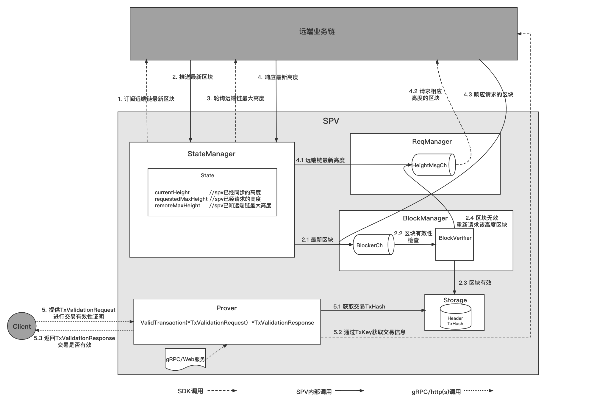

# SPV轻节点

## 概述
### SPV轻节点
SPV是ChainMaker的轻节点，主要有两种模式，一种是`spv`模式，**该模式支持`ChainMaker(v2.0.0+)`和`Fabric(v1.4.0+)`两种链类型**，该模式下将同步区块头及部分其他数据并通过同步的数据实现交易有效性的验证；
另一种是`light`模式，**该模式仅支持`ChainMaker(v2.0.0+)`**，该模式下将同步区块头以及同组织内的交易信息，并支持用户注册回调，在区块被提交至本地数据库后执行。

`spv`模式下具有如下功能：
- 实现对多链的区块头及部分其他数据（如交易Hash）的同步，且可对外提供交易存在性及有效性证明。
- 可独立部署获取业务链的数据，并提供交易存在性及有效性证明服务。
- 可作为组件集成进其他模块，调用启动以获取业务链的数据，并提供交易存在性及有效性证明。

`light`模式下具有如下功能：
- 实现对多链的区块同步功能，且同步的区块中只包含了同组织内的相关信息（如交易以及交易读写集的信息）
- 可独立部署获取业务链的数据，并对外提供区块以及交易信息的Web查询功能
- 可作为组件集成进其他模块，并支持用户注册回调，在区块被提交至本地数据库后执行。

快速部署和使用示例，请按如下链接内容进行：  
[部署使用文档](../operation/轻节点SPV使用.md)

## 节点类型

| 节点类型    | 同步数据类型    | 是否参与共识 |  是否验证区块 | 是否执行交易 | 是否可接收执行类交易 | 是否可接收查询类交易 |
| :---------| :----------    | :--------  |  :--------  | :--------  | :---------------  | :--------------  |
| 共识节点    | 区块           | 是         | 是           | 是        | 是                 | 是               |
| 同步节点    | 区块           | 否         | 是           | 是        | 是                 | 是               |
| SPV        | 区块头         | 否         | 是           | 否        | 是                 | 是               |
| Light      | 区块、同组织交易 | 否         | 是           | 否        | 是                 | 是               |

## 设计思路
### SPV轻节点模块设计
在SPV轻节点中，主要包含StateManager、ReqManager、BlockManager、Prover、Storage模块，各模块作用主要如下：
- StateManager模块：状态管理模块，主要作用是订阅远端链最新区块、轮询远端链的最新区块高度。
- ReqManager模块：请求管理模块，主要作用是请求spv本地已请求的区块高度(requestedMaxHeight)至远端链最新高度(remoteHeight)之间的区块、请求BlockManager模块验证不合法的区块。
- BlockManager模块：区块管理模块，主要作用是验证区块有效性、并持久化有效区块的区块头和交易信息（若有）。
- Prover模块：证明器模块，主要作用是对Client提供交易存在性和有效性证明服务（light模式下，只能验证同组织内的交易）。
- Storage模块：存储模块，主要作用是存储同步的区块中的区块头及交易信息（若有）。

### 主要流程
#### SPV轻节点主要流程
SPV轻节点主要功能为同步区块头及同组织内的交易信息，并提供交易存在性和有效性证明，下图描述了主要功能的流程：



区块同步流程：
1. StateManager订阅远端业务链最新区块；
2. StateManager获取远端业务链最新区块；  
   2.1 若最新区块高度大于spv已经请求的区块高度(requestedMaxHeight)，则BlockManager处理该区块，否则丢弃;  
   2.2 BlockManager检验区块的有效性；  
   2.3 区块有效，存储区块头和区块中同组织内的交易信息（若有）；  
   2.4 区块无效，通过ReqManager重新请求该高度区块；

3. StateManager轮询远端链最新高度；
4. StateManager获取远端链最新高度；  
   4.1 若最新高度大于spv已经请求的区块高度(requestedMaxHeight)，则ReqManager处理该高度信息，否则丢弃；  
   4.2 ReqManager请求相应高度的区块；  
   4.3 ReqManager获取到相应高度的区块，并交给BlockManager处理；

交易存在性和有效性验证流程:
5. Client提供TxValidationInfo，调用Prover中的ValidTransaction接口进行交易有效性证明；   
   5.1 Prover从本地通过交易ID获得交易Hash；  
   5.2 Prover调用SDK通过交易Hash获得交易实体；  
   5.3 Prover比对TxValidationInfo中的交易信息和交易实体中的信息，判断交易存在性和有效性；
   

## 参数配置
### SPV轻节点配置参数
- spv_config.yml 配置文件如下：
> **注意：SPV轻节点配置文件中的路径是基于spv二进制文件的相对路径，也可以使用绝对路径。**  

```yaml
# 链配置
chains:
   # 类型  仅支持（chainmaker_light，chainmaker_spv，fabric_spv）
   - chain_type: "chainmaker_light"
      # 链ID
     chain_id: "chain1"
      # 同步配置，同步链中节点区块最新高度信息的时间间隔，单位：毫秒
     sync_chainInfo_interval: 10000
      # sdk配置文件路径
     sdk_config_path: "../config/chainmaker_config/chainmaker_sdk_config_chain1.yml"

# - chain_type: "chainmaker_spv"
#   # 链ID
#   chain_id: "chain2"
#   # 同步配置，同步链中节点区块最新高度信息的时间间隔，单位：毫秒
#   sync_chainInfo_interval: 10000
#   # sdk配置文件路径
#   sdk_config_path: "../config/chainmaker_config/chainmaker_sdk_config_chain2.yml"

# - chain_type: "fabric_spv"
#   chain_id: "mychannel"
#   sync_chainInfo_interval: 10000
#   sdk_config_path: "../config/fabric_config/fabric_sdk_config_org1.yaml"
#   fabric_extra_config:    # fabric特有的配置项，其他类型的链不需要配置
#     user: "User1"    # 用户名
#     peers:           # 节点列表
#       - peer: "peer0.org1.example.com"
#       - peer: "peer1.org1.example.com"
#       - peer: "peer0.org2.example.com"
#       - peer: "peer1.org2.example.com"

# grpc配置
grpc:
   # grpc监听网卡地址
   address: 127.0.0.1
   # grpc监听端口
   port: 12308

# web配置
web:
   # web服务监听网卡地址
   address: 127.0.0.1
   # web监听端口
   port: 8080

# 存储配置，用于配置当前SPV对区块头和交易哈希的存储记录
storage:
   # 存储采用的类型，当前仅支持leveldb类型
   provider: "leveldb"
   # 存储采用leveldb的情况下，对应leveldb的详细配置
   leveldb:
      # leveldb的存储路径
      store_path: "../data/spv_db"
      # leveldb的写入Buffer大小，单位：M
      write_buffer_size: 4
      # leveldb的布隆过滤器的bit长度
      bloom_filter_bits: 10

# 日志配置，用于配置日志的打印
log:
   system:
      # 日志打印级别
      log_level: "INFO"
      # 日志文件路径
      file_path: "../log/spv.log"
      # 日志最长保存时间，单位：天
      max_age: 365
      # 日志滚动时间，单位：小时
      rotation_time: 1
      # 是否展示日志到终端，仅限于调试使用
      log_in_console: false
      # 是否打印颜色日志
      show_color: true
```

### ChainMaker SDK配置文件
- chainmaker_sdk_config_chain1.yml 配置文件如下：
> **注意：SDK配置文件中的路径是基于spv二进制文件的相对路径，也可以使用绝对路径。节点地址中的端口是ChainMaker的RPC端口。私钥和证书配置请按照`spv`或`light`模式的不同选择对应的私钥和证书路径。**  

```yaml
chain_client:
  # 链ID
  chain_id: "chain1"
  # 组织ID
  org_id: "wx-org1.chainmaker.org"
  # 客户端用户私钥路径（如果配置为chainmaker_spv，此处请配置为client私钥，如果配置为chainmaker_light，此处请配置为light私钥，下面另外三项配置同理）
  user_key_file_path: "../config/crypto-config/wx-org1.chainmaker.org/user/client1/client1.tls.key"
  # 客户端用户证书路径
  user_crt_file_path: "../config/crypto-config/wx-org1.chainmaker.org/user/client1/client1.tls.crt"
  # 客户端用户交易签名私钥路径
  user_sign_key_file_path: "../config/crypto-config/wx-org1.chainmaker.org/user/client1/client1.sign.key"
  # 客户端用户交易签名证书路径
  user_sign_crt_file_path: "../config/crypto-config/wx-org1.chainmaker.org/user/client1/client1.sign.crt"

  nodes:
    - # 节点地址，格式为：IP:端口，端口是ChainMaker中的RPC端口
      node_addr: "127.0.0.1:12301"
      # 节点连接数
      conn_cnt: 10
      # RPC连接是否启用双向TLS认证
      enable_tls: true
      # 信任证书池路径
      trust_root_paths:
        - "../config/crypto-config/wx-org1.chainmaker.org/ca"
        - "../config/crypto-config/wx-org2.chainmaker.org/ca"
      # TLS hostname
      tls_host_name: "chainmaker.org"
    - # 节点地址，格式为：IP:端口，端口是ChainMaker中的RPC端口
      node_addr: "127.0.0.1:12302"
      # 节点连接数
      conn_cnt: 10
      # RPC连接是否启用双向TLS认证
      enable_tls: true
      # 信任证书池路径
      trust_root_paths:
        - "../config/crypto-config/wx-org1.chainmaker.org/ca"
        - "../config/crypto-config/wx-org2.chainmaker.org/ca"
      # TLS hostname
      tls_host_name: "chainmaker.org"
```

## 接口说明
### gRPC接口
- 独立部署时，提供交易存在性和有效性证明服务的grpc接口

```go
type RpcProverServer interface {
    ValidTransaction(context.Context, *TxValidationInfo) (*TxValidationResponse, error)
}
```
其中`*api.TxValidationInfo`结构如下：
```go
type TxValidationInfo struct {
	ChainId      string             // 链ID
	BlockHeight  int64              // 交易所在区块高度
	Index        int32              // 交易索引
	TxKey        string             // 交易ID
	ContractData *ContractData      // 交易调用的合约数据
	Extra        []byte             // 预留扩展字段
}

type ContractData struct {
	ContractName string          // 合约名称
	Version      string          // 合约版本
	Method       string          // 合约方法名
	Params       []*KVPair       // 合约方法参数
	Extra        []byte          // 预留扩展字段
}

type KVPair struct {
	Key   string     // 参数名称
	Value string     // 参数值
}
```
其中`*api.TxValidationResponse`结构如下：

```go

type TxValidationResponse struct {
    ChainId string           // 链ID   
    TxKey   string           // 交易ID   
    Code    StatusCode       // 状态码，0表示VALID，有效的交易； 1表示INVALID，无效的交易
    Message string           // 提示信息
}
```

### 内部接口
SPV为了适配更多的链，在实现时进行了接口抽象。因此，在适配不同链时需要对内部接口进行针对性实现。
- 包装类型接口
```go
// 包装区块的接口
type Blocker interface {
	// 区块头接口
	Header

	// 返回区块头
	GetBlockHeader() Header
	
	// 返回区块中同组织内交易
	GetTransaction() []Transactioner

	// 返回区块中的扩展数据，在light模式下返回交易读写集信息
	GetExtraData() interface{}
}

type Header interface {
	// 返回该区块所在链的链ID
	GetChainId() string

	// 返回该区块的前置区块哈希值
	GetPreHash() []byte

	// 返回该区块中的交易默克尔树根哈希
	GetTxRoot() []byte

	// 返回该区块的高度值
	GetHeight() int64

	// 返回该区块的哈希值
	GetBlockHash() []byte
}

// 包装交易的接口
type Transactioner interface {
	// 返回交易状态码
	GetStatusCode() int32

	// 返回交易哈希值
	GetTransactionHash() ([]byte, error)

	// 返回该交易所调用合约的名称
	GetContractName() (string, error)

	// 返回该交易所调用合约的方法名
	GetMethod() (string, error)

	// 返回该交易所调用合约方法的参数
	GetParams() ([]interface{}, error)
	
	// 返回交易中的扩展字段，在light模式下返回该交易读写集信息
    GetExtraData() (interface{}, error)
}
```
- SDK适配器接口
```go
// 各链sdk需要实现的接口
type SDKAdapter interface {
	// 订阅最新区块
	SubscribeBlock() (chan common.Blocker, error)

	// 查询远端链高度 
	GetChainHeight() (int64, error)

	// 通过高度获取区块
	GetBlockByHeight(blockHeight int64) (common.Blocker, error)

	// 通过交易ID获取交易
	GetTransactionByTxKey(txKey string) (common.Transactioner, error)

	// 获取远端链配置信息
	GetChainConfig() (*protogo.ChainConfig, error)

	// 停止sdk的链接并释放链接资源
	Stop() error
}
```
- 编解码接口
```go
// 编解码接口
type Coder interface {
	// 将区块头序列化
	SerializeBlockHeader(header common.Header) ([]byte, error)

	// 反序列化区块头
	DeserializeBlockHeader(serializeBlockHeader []byte) (common.Header, error)

	// 根据区块中的交易生成交易数据，TransactionData中包括TxHashMap、TxBytesMap、ExtraDataMap
	GenerateTransactionData(blocker common.Blocker) (*storage.TransactionData, error)
	
	// 反序列化交易
	DeserializeTransaction(serializeTransaction []byte, serializeExtraData []byte) (common.Transactioner, error)
}
```
- 验证器接口
```go
// 验证区块有效性接口
type Verifier interface {
	// 验证同步过来的区块的有效性
	ValidBlock(blocker common.Blocker, preBlockHash []byte) error
}
```
- 证明器接口
```go
// 交易有效性证明接口
type Prover interface {
	// 验证交易存在性和有效性
	ValidTransaction(txInfo *api.TxValidationInfo, timeout time.Duration) error
}
```

