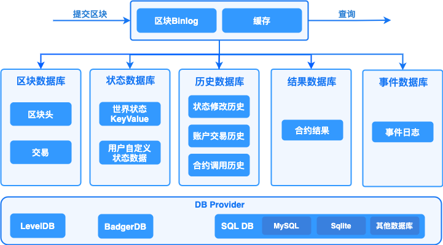

# 数据存储

##  概述

存储模块负责持久化存储链上的区块、交易、状态、历史读写集等账本数据，并对外提供上述数据的查询功能。区块链以区块为单位进行批量的数据提交，一次区块提交会涉及到多项账本数据的提交，比如：交易提交，状态数据修改等，所以存储模块需要维护账本数据的原子性。长安链支持常用的数据库来存储账本数据，如LevelDB、BadgerDB、MySQL等数据库，业务可选择其中任意一种数据库来部署区块链。

账本数据主要分为5类：

1. 区块数据，记录区块元信息和交易数据：
   - 区块元数据包括：区块头、区块DAG、区块中交易的txid列表，additionalData等；
   - 交易数据，既序列化后的交易体，为了提供对单笔交易数据的查询，所以对交易数据进行了单独存储。
2. 状态数据，记录智能合约中读写的链上状态数据，既世界状态。
3. 历史数据，长安链对每笔交易在执行过程中的状态变化历史、合约调用历史、账户发起交易历史都可以进行记录，可用于后续追溯交易、状态数据的变迁过程。
4. 合约执行结果读写集数据，长安链对每笔交易在执行过程中的所读写的状态数据集进行了单独保存，方便其他节点进行快速的数据同步。
5. 事件数据，合约执行过程中产生的事件日志
## 存储模块运行逻辑

针对上述5类账本数据，长安链分别实现了5个DB类，分别是：Block DB、State DB、History DB、Result DB和Contract Event DB。采用多个数据库之后，就需要维护数据库之间的数据一致性，避免仅有部分数据库提交后，发生程序中断而导致不同数据库间的数据不一致，因此，长安链引入了Block binary log组件来持久化存储区块的原始内容，用于重启过程中的数据恢复，类似于数据库中的预写式日志(wal)的功能。 需要注意的是，历史数据、结果数据并不是每个节点必须保存的，节点可以根据自己的业务需要在配置文件中启用或者关闭历史数据库和结果数据库。



## 区块提交流程

1.  首先将序列化后的区块、读写集数据、以及最新的区块高度写入Block binary log，用于异常中断后的数据恢复。为了提高性能，加入一层cache，新区块提交请求在更新完Block binary log之后，再将区块数据写入cache，在更新完log和cache后，提交即可返回，由后台线程异步更新Block DB、State DB、ContractEvent DB、History DB和Result DB。
2.  在Block DB中记录区块元信息与交易信息，其中交易信息以TxID作为主键存储，区块信息以BlockHeight作为主键存储，区块元信息中只记录交易ID列表，同时索引BlockHash到BlockHeight的映射关系。Block DB中额外记录了当前最新的区块高度（LastBlockHeight）作为checkpoint，用以重启后的数据恢复。
3.  在State DB中保存state数据，key为合约名与对象主键的组合：<contractName, ObjectKey>，同时记录最新的区块高度（LastBlockHeight）作为checkpoint。
4.  在History DB中记录交易产生的三种类型的索引：
    1.  状态变更历史，以<contractName, ObjectKey，TxId>为索引
    2.  合约调用历史，以<contractName, TxId>为索引
    3.  账户交易历史，以<accountId,TxId>为索引
5.  在Result DB中记录交易的读写集，读写集以TxID作为key，同时记录最新的区块高度（LastBlockHeight）作为checkpoint。
6. 在ContractEventDB中记录下交易结果的EventLog，并记录最新区块高度作为checkpoint。
## 账本恢复流程

如果区块正在提交过程中，节点因异常退出，节点在下次启动时存储模块会进入恢复流程：

1. 分别从Block binary log、Block DB、State DB、ContractEvent DB、History DB、Result DB中获取最新的区块高度，以Block binary log中的区块高度作为基准高度，判断其他DB是否落后基准高度。
2. 如果有某个DB落后基准高度，则从Block binary log中获取缺失的区块及读写集，依次提交到落后DB中。
3. 所有DB同步到基准高度后，存储模块启动完成，节点进入正常流程。

## 存储接口说明

```go
// BlockchainStore provides handle to store instances
type BlockchainStore interface {
	StateSqlOperation
	SysContractQuery
	//InitGenesis 初始化创世单元到数据库
	InitGenesis(genesisBlock *store.BlockWithRWSet) error
	// PutBlock commits the block and the corresponding rwsets in an atomic operation
	PutBlock(block *common.Block, txRWSets []*common.TxRWSet) error

	// GetBlockByHash returns a block given it's hash, or returns nil if none exists.
	GetBlockByHash(blockHash []byte) (*common.Block, error)

	// BlockExists returns true if the black hash exist, or returns false if none exists.
	BlockExists(blockHash []byte) (bool, error)

	// GetHeightByHash returns a block height given it's hash, or returns nil if none exists.
	GetHeightByHash(blockHash []byte) (uint64, error)

	// GetBlockHeaderByHeight returns a block header by given it's height, or returns nil if none exists.
	GetBlockHeaderByHeight(height uint64) (*common.BlockHeader, error)

	// GetBlock returns a block given it's block height, or returns nil if none exists.
	GetBlock(height uint64) (*common.Block, error)

	// GetLastConfigBlock returns the last config block.
	GetLastConfigBlock() (*common.Block, error)
	//GetLastChainConfig return the last chain config
	GetLastChainConfig() (*configPb.ChainConfig, error)
	// GetBlockByTx returns a block which contains a tx.
	GetBlockByTx(txId string) (*common.Block, error)

	// GetBlockWithRWSets returns a block and the corresponding rwsets given
	// it's block height, or returns nil if none exists.
	GetBlockWithRWSets(height uint64) (*store.BlockWithRWSet, error)

	// GetTx retrieves a transaction by txid, or returns nil if none exists.
	GetTx(txId string) (*common.Transaction, error)

	// TxExists returns true if the tx exist, or returns false if none exists.
	TxExists(txId string) (bool, error)

	// GetTxHeight retrieves a transaction height by txid, or returns nil if none exists.
	GetTxHeight(txId string) (uint64, error)

	// GetTxConfirmedTime returns the confirmed time for given tx
	GetTxConfirmedTime(txId string) (int64, error)

	// GetLastBlock returns the last block.
	GetLastBlock() (*common.Block, error)

	// ReadObject returns the state value for given contract name and key, or returns nil if none exists.
	ReadObject(contractName string, key []byte) ([]byte, error)

	// SelectObject returns an iterator that contains all the key-values between given key ranges.
	// startKey is included in the results and limit is excluded.
	SelectObject(contractName string, startKey []byte, limit []byte) (StateIterator, error)

	// GetTxRWSet returns an txRWSet for given txId, or returns nil if none exists.
	GetTxRWSet(txId string) (*common.TxRWSet, error)

	// GetTxRWSetsByHeight returns all the rwsets corresponding to the block,
	// or returns nil if zhe block does not exist
	GetTxRWSetsByHeight(height uint64) ([]*common.TxRWSet, error)

	// GetDBHandle returns the database handle for given dbName
	GetDBHandle(dbName string) DBHandle

	// GetArchivedPivot returns the archived pivot (include this pivot height)
	GetArchivedPivot() uint64

	// ArchiveBlock the block after backup
	ArchiveBlock(archiveHeight uint64) error

	//RestoreBlocks restore blocks from outside block data
	RestoreBlocks(serializedBlocks [][]byte) error

	// Close closes all the store db instances and releases any resources held by BlockchainStore
	Close() error
	//GetHistoryForKey 查询某合约中某个Key的变更历史
	GetHistoryForKey(contractName string, key []byte) (KeyHistoryIterator, error)
	//GetAccountTxHistory 查询一个账户的交易历史记录
	GetAccountTxHistory(accountId []byte) (TxHistoryIterator, error)
	//GetContractTxHistory 查询一个合约的调用交易历史记录
	GetContractTxHistory(contractName string) (TxHistoryIterator, error)
}
```

## 数据库

### 概述

存储模块中的Block DB、State DB、History DB等都是封装后的DB对象，其具体实现要基于特定的数据库引擎，比如LevelDB、BadgerDB、MySQL等数据库引擎。为了实现可插拔的数据库引擎，长安链在数据库引擎之上封装了一层接口，并将LevelDB、BadgerDB、MySQL等数据库封装成DB provider。用户可以根据业务需求选择合适的数据库引擎作为长安链的底层存储组件。

#### 支持的数据库类型

长安链目前支持3种数据库引擎可供选择，分别是LevelDB、BadgerDB、MySQL。

- LevelDB，默认采用的数据库引擎，LevelDB作为一款嵌入式KV数据库，默认集成在长安链节点中，无需部署，性能也相对关系型数据要更好。
- BadgerDB，作为LevelDB的增强版本，也是嵌入式KV数据库，性能比LevelDB更高，但是需要额外的编译与安装部署。
- MySQL，关系型数据库，支持schema和富查询，性能较KV数据库低，目前关系型数据库与区块链的状态数据并不能很好的结合，导致很少有区块链采用关系型数据库作为状态数据库。原因主要有两点：1.区块链需要对智能合约所读写的状态数据做严格的控制和校验，而SQL语句相对区块链来说过于灵活，难以控制；2.需要提前创建库表和索引，需要针对不同的智能合约创建不同的数据库表结构，不够灵活。目前长安链支持MySQL存储引擎，在系统数据如Block DB上支持区块元信息、交易信息的关系型语义，状态数据库支持kv的方式和智能合约编写SQL语句方式读写状态数据(world state)。

###  配置说明

节点本地配置文件chainmaker.yml中存储部分的配置说明

```yml
storage:
  store_path: ../data/ledgerData  #账本的存储路径， 包括LevelDB、BadgerDB的数据目录，Block binary log的数据目录
  write_buffer_size: 4  #LevelDB的write_buffer_size， 单位为MB，默认为4M
  bloom_filter_bits: 10  #LevelDB的布隆过滤器参数，为每个key分配的额外bit空间，默认为10，如果少于或等于0，则不开启布隆过滤。
  disable_historydb: false  #是否禁用历史读写集的存储功能， 默认为false，也就是保存历史读写集。
  blockdb_config: #BlockDB 数据库配置
    provider: leveldb #数据库类型，支持LevelDB，BadgerDB，Mysql，这里示例为LevelDB
    leveldb_config: #LevelDB的详细配置
      store_path: ../data/org1/blocks
      write_buffer_size: 4	#LevelDB的write_buffer_size， 单位为MB，默认为4M
      bloom_filter_bits: 10	#LevelDB的布隆过滤器参数，为每个key分配的额外bit空间，默认为10，如果少于或等于0，则不开启布隆过滤。
      block_write_buffer_size:
  statedb_config: #StateDB 数据库配置
    provider: sql  #数据库类型，支持LevelDB，BadgerDB，mysql，这里示例为Mysql
    sqldb_config: #SQL数据库的详细配置
      sqldb_type:  mysql #具体的RDBMS为mysql，也可以是sqlite、mssql等
      dsn:  root:password@tcp(127.0.0.1:3306)/ #MySQL的数据库连接字符串
      max_idle_conns: 10  #连接池中维持的最大的空闲连接数，默认为10
      max_open_conns: 10  #最大的可用连接数，默认为10
      conn_max_lifetime: 60  #连接维持的最长时间，单位秒，默认为60
  historydb_config: #HistoryDB数据库配置
    provider: badgerdb #数据库类型，支持LevelDB，BadgerDB，Mysql，这里示例为BadgerDB
    badgerdb_config:
      store_path: ../data/org1/history
      compression: 0 # value为0 不压缩，1 Snappy压缩，2 ZSTD压缩，默认为0
      value_threshold: 10240 # 单位为bytes，默认为10240 bytes
  resultdb_config: #ResultDB数据库配置
    provider: leveldb # 支持LevelDB，BadgerDB，SQL
    leveldb_config:
      store_path: ../data/org1/result
  disable_contract_eventdb: true  #是否禁止合约事件存储功能，默认为true，如果设置为false,需要配置mysql
  contract_eventdb_config:
    provider: sql                 #如果开启contract event db 功能，需要指定provider为sql
    sqldb_config:
      sqldb_type: mysql           #contract event db 只支持mysql
      dsn: root:password@tcp(127.0.0.1:3306)/  #mysql的连接信息，包括用户名、密码、ip、port等，示例：root:admin@tcp(127.0.0.1:3306)/
```

##### MySQL数据库表

长安链支持选用MySQL作为账本存储引擎，节点启动会自动创建数据库，使用chainId作为数据库名，同时也会自动创建相应的表：

1. 区块元信息表

   ```sql
   CREATE TABLE `block_infos` (
    `chain_id` varchar(128) COLLATE utf8mb4_general_ci DEFAULT NULL COMMENT '链标识',
    `block_height` bigint(20) NOT NULL COMMENT '区块高度',
    `pre_block_hash` varbinary(128) DEFAULT NULL COMMENT '上个区块的散列值',
    `block_hash` varbinary(128) DEFAULT NULL COMMENT '本区块的散列值',
    `pre_conf_height` bigint(20) DEFAULT '0' COMMENT '上一次修改链配置的区块高度',
    `block_version` varbinary(128) DEFAULT NULL COMMENT '区块版本',
    `dag_hash` varbinary(128) DEFAULT NULL COMMENT '当前区块Dag的散列值',
    `rw_set_root` varbinary(128) DEFAULT NULL COMMENT '区块读写集的Merkle Root',
    `tx_root` varbinary(128) DEFAULT NULL COMMENT '区块交易的Merkle Root',
    `block_timestamp` bigint(20) DEFAULT '0' COMMENT '区块时间戳',
    `proposer` blob COMMENT '区块的生产者标识',
    `consensus_args` blob COMMENT '共识参数',
    `tx_count` bigint(20) DEFAULT '0' COMMENT '交易数量',
    `signature` blob COMMENT '区块生成者的签名',
    `dag` blob COMMENT '区块内交易的执行依赖顺序',
    `tx_ids` longtext COLLATE utf8mb4_general_ci COMMENT '区块中交易ID列表',
    `additional_data` longblob COMMENT '区块产生以后附加的数据',
    PRIMARY KEY (`block_height`),
    KEY `idx_hash` (`block_hash`)
   ) ENGINE=InnoDB DEFAULT CHARSET=utf8mb4 COLLATE=utf8mb4_general_ci;
   ```

2. 交易表

   ```sql
   CREATE TABLE `tx_infos` (
    `chain_id` varchar(128) COLLATE utf8mb4_general_ci DEFAULT NULL COMMENT '链标识',
    `sender` blob COMMENT '交易发送者信息',
    `tx_id` varchar(128) COLLATE utf8mb4_general_ci NOT NULL COMMENT '交易ID',
    `tx_type` int(11) DEFAULT NULL COMMENT '交易类型',
    `block_height` bigint(20) DEFAULT NULL COMMENT '交易所在区块高度',
    `offset` int(11) DEFAULT NULL COMMENT '交易在区块链中的位置',
    `timestamp` bigint(20) DEFAULT '0' COMMENT '链标识生成交易的unix时间戳',
    `expiration_time` bigint(20) DEFAULT '0' COMMENT '交易过期的unix时间戳',
    `request_payload` longblob COMMENT '交易的载荷数据',
    `request_signature` blob COMMENT '交易发送者的签名',
    `code` int(11) DEFAULT NULL COMMENT '交易执行结果的状态',
    `contract_result` longblob COMMENT '合约执行返回结果',
    `rw_set_hash` varbinary(128) DEFAULT NULL COMMENT '交易执行结果的读写集哈希',
    PRIMARY KEY (`tx_id`),
    KEY `idx_height_offset` (`block_height`,`offset`)
   ) ENGINE=InnoDB DEFAULT CHARSET=utf8mb4 COLLATE=utf8mb4_general_ci;
   ```

3. 世界状态表

   ```sql
   CREATE TABLE `state_infos` (
    `contract_name` varchar(128) COLLATE utf8mb4_general_ci NOT NULL COMMENT '合约名',
    `object_key` varbinary(128) NOT NULL DEFAULT '' COMMENT '状态数据的key',
    `object_value` longblob COMMENT '状态数据的value',
    `block_height` bigint(20) DEFAULT NULL COMMENT '该状态数据被修改时的区块高度',
    `updated_at` datetime(3) DEFAULT NULL COMMENT '该状态数据被修改时的节点本地时间',
    PRIMARY KEY (`contract_name`,`object_key`),
    KEY `idx_height` (`block_height`)
   ) ENGINE=InnoDB DEFAULT CHARSET=utf8mb4 COLLATE=utf8mb4_general_ci;
   ```

4. 历史读写集表

   ```sql
   CREATE TABLE `history_infos` (
    `tx_id` varchar(128) COLLATE utf8mb4_general_ci NOT NULL COMMENT '交易ID',
    `rw_sets` longblob COMMENT '读写集序列化后的数据', 
    `block_height` bigint(20) DEFAULT NULL COMMENT '该交易所在的区块高度',
    PRIMARY KEY (`tx_id`),
    KEY `idx_height` (`block_height`)
   ) ENGINE=InnoDB DEFAULT CHARSET=utf8mb4 COLLATE=utf8mb4_general_ci;
   ```

   ## 链上数据归档

### 归档需求

1. 数据转移到独立存储
2. 归档数据应具备可查询
3. 归档数据还可以再恢复到区块链节点中

### 总体方案

#### 对区块链中的账本数据分类

1. 状态数据，仅存储最新的数据快照，无历史版本，数据量相对较少，而且数据是否冷热由业务决定，因此不考虑对状态数据做归档。
2. 非状态数据，如：区块、交易、历史读写集，数据量大，随交易不断膨胀，而且只读不修改，适合对某个区块高度之前的数据做归档。
3. 归档后节点对其他节点提供同步服务时，其他节点需选择已归档高度低于同步节点高度的节点

归档只对单个节点，由节点运营方发起对自己节点的归档

### 数据迁移


1. 使用[cmc](../dev/命令行工具.html#archive)依次查询节点的区块数据。
2. 将区块备份到链外存储，链外存储可以是数据库或IPFS,当前已支持mysql，其他存储形式后续进行支持。
3. 备份完成后，发起清理区块数据的系统合约调用。存储模块提供清理区块数据的接口，将交易、读写集数据删除, 索引数据保持不变，也就是说仍然可以在链上判断区块、交易是否存在。
4. leveldb/badgerdb在清理数据后，需要主动调用compaction释放空间，采用异步执行。

### 数据查询


1. 使用现有[cmc](../dev/命令行工具.html#queryOnChainData)查询区块或交易内容，也可通过使用sdk自定义开发的app(以下简称"custom app")进行查询。
2. 如果返回数据已归档，可以使用[cmc](../dev/命令行工具.html#archive)(提供了查询链外归档数据的命令)或者custom app在链外存储中查询已归档数据。

### 数据恢复


1. [cmc](../dev/命令行工具.html#archive)从链外存储获取归档数据，以区块为单位。
2. [cmc](../dev/命令行工具.html#archive)以区块为单位向链上发起区块恢复请求，链上存储模块提供恢复区块数据的接口，以区块为单位，将归档后的payload数据复原。
3. [cmc](../dev/命令行工具.html#archive)会自动更新链外存储中区块数据的状态为已恢复。
4. leveldb/badgerdb在恢复数据后，需要主动调用compaction释放空间，采用异步执行。

### 实现原理

##### 数据归档
数据归档主要针对Block DB 和 Result DB将平时不怎么需要访问的数据归档，目前也仅支持leveldb badgerdb这两种数据库归档，暂不支持mysql，归档实现方式：

1. 归档前设置不允许归档的高度(unarchive_block_height，默认300000，当设置值小于10时，自动设置成10)，能归档的最高高度即为当前链高度 - unarchive_block_height
2. 归档的内容会从链上删除，需要事先将数据转存到链外数据库
3. 归档会删除BlockDB中的tx详细内容和ResultDB中的RWSets，并记录当前归档的高度(该高度也会被归档)，并触发kvDB的compaction
4. 归档过程中会跳过Genesis Block和Config Block，如果要归档的目标高度正好为这两种区块，归档会失败，可以将目标高度修改到普通区块的高度
5. 归档后的区块依然可以从链上获取区块的原数据(MetaBlock)，只是无法获取到交易内容和RWSets(读写集)。所以无法获取完整的区块信息。但Genesis Block和Config Block任然可以获取完整区块信息
6. 归档后的节点在对其他节点提供区块同步信息时，无法提供已归档的区块信息，所以在需要同步的节点选择连接的peer节点时，会只选择已归档高度比自己高度低的节点。如果是高度为1的全新节点，则只能从未归档的节点(peer)同步区块
7. 用户可以多次归档，每次归档接着上次归档的高度继续

##### 归档数据恢复

数据恢复时会将数据写回链上，链慢慢恢复未归档前的样子

1. 数据恢复时会将交易内容和读写集(RWSets)写回节点，节点恢复到未归档前样子
2. 恢复过程中区块内容按照高度从高到低写回BlockDB和ResultDB，Genesis Block和Config Block跳过(不需要恢复)
3. 更新最新的已归档的高度，同时触发kvdb的compaction
4. 用户可以多次恢复归档数据，每次恢复接着之前恢复的高度继续


## 透明数据加密（TDE）
[透明数据加密（Transparent Data Encryption (简称TDE)）](透明数据加密.md)是指可以在文件层对数据和文件进行实时加密和解密，落盘的文件是加密后的内容，而对于上层应用系统和开发人员而言，加解密过程是无感知的，写入和读取的内容是明文内容，所以叫做透明数据加密。长安链密码模块同时提供了软件实现和硬件集成，使用以下步骤即可完成TDE的配置。
### 基于软件实现的TDE配置
#### 创建对称密钥
长安链的透明数据加密默认支持AES和国密SM4两种对称加密算法。AES算法支持128位、192位、256位这3种密钥长度，SM4算法支持128位密钥长度。密钥长度必须与对应的算法匹配，如果长度不匹配则无法正常启动长安链。我们以国密SM4算法为例，密钥推荐使用随机密码生成器生成的密码，比如“0H#y@EGXPOAScAnB”这样的形式，将有效提高数据的安全性，防止被字典破解。除了字符串形式的密钥，长安链还支持任意二进制形式的密钥，只要长度满足要求（国密SM4：128位）即可。新生成的密钥请做好安全备份，防止密钥丢失后数据无法解读。
#### 配置透明数据加密
在长安链节点的配置文件，即chainmaker.yml文件中，storage配置项下提供了对该节点TDE的配置选项，形如：
```
storage:
  encryptor: sm4    # sm4/aes
  encrypt_key: "1234567890123456" #16 bytes key
```
* encryptor是采用的对称加密算法，目前支持sm4和aes两个选项。
* encrypt_key是对称加密的密钥，支持字符串、十六进制和文件路径三种形式。
    - 字符串，支持字母大小写、数字、符号、空格等，长度必须满足加密算法要求
    - 十六进制，必须以0x开头，后面跟对应密钥的十六进制内容
    - 文件路径，将密钥保存到一个文件中，然后将文件绝对路径配置到这里，并确保长安链进程用户具有读写该文件的权限。
以下配置示例：
```
storage:
  encryptor: aes    # sm4/aes
  encrypt_key: "0x48656c6c6f20436861696e4d616b6572" #16 bytes key
```
```
storage:
  encryptor: sm4    # sm4/aes
  encrypt_key: "/usr/key/my.key" #this file content is a 16 bytes key
```
#### 启用节点
完成TED的配置后，请确保当前节点没有任何数据，如果之前已经有数据，需要完全删除。节点启动后将会从创世区块开始基于TDE的密钥对每个区块每个交易每个世界状态Value进行统一的加密存储。
在encrypt_key上使用文件路径配置密钥的情况下，长安链在启动时将读取文件内容作为密钥，同时将文件内容清空，防止硬盘数据被盗时密钥也同时被盗。所以如果下次要重新启动长安链进程，必须重新在对应的密钥文件中写入密钥才能正常启动。
### 基于硬件密码机的TDE配置
基于软件的对称加密存在占用主机计算资源，密钥容易暴露的风险，基于硬件密码机的方案可以有效提升加解密的性能和密钥的安全性。长安链支持PKCS11标准的硬件密码机接入，以下为在TDE中启用硬件密码机集成的步骤。
#### 在加密中生成对称密钥
基于硬件密码机的情况下，密钥都托管在密码机内部，外部程序无法获得密钥内容，只能通过标准接口进行密钥生成、加解密、签名、哈希等密码学操作。进入密码机自带的管理后台可以为TDE生成对应的密钥，对称加密算法可选择AES或者国密SM4。密钥生成后会有一个对应的KeyID作为该密钥在密码机中的唯一标识，在接下来配置中会用到。
#### 配置PKCS11
长安链基于PKCS11标准与密码机进行通讯，其对应的配置在chainmaker.yml配置文件的node配置节点下，配置示例如下：
```
node:
  pkcs11:
    enabled: true
    library: /usr/local/lib64/pkcs11/libupkcs11.so      # path to the so file of pkcs11 interface
    label: HSM                                          # label for the slot to be used
    password: 11111111                                  # password to logon the HSM
    session_cache_size: 10                              # size of HSM session cache, default to 10
    hash: "SHA256"                                      # hash algorithm used to compute SKI
```
具体配置因为对应的密码机不同而不同，具体参见[硬件加密](硬件加密.md)章节。
#### 配置透明数据加密
在完成了node配置节点下的pkcs11配置后，接下来需要进行storage配置节点下关于TDE加密算法和密钥的配置，对于密码机，我们并不知道对应的密钥内容，只有密钥的ID，所以我们只需要配置成对应的KeyID即可，比如：
```
storage:
  encryptor: sm4    # sm4/aes
  encrypt_key: "MasterKey1" #密码机上对应KeyID
```
#### 启用节点
在完成配置后，同样是需要保证本节点的数据库是空的，如果之前已经同步过区块或者已经写入了创世区块，都需要删除。启动节点后，长安链将会把所有写入数据库的键值对数据中的Value部分发送给密码机进行加密，将加密后的内容进行存储。
