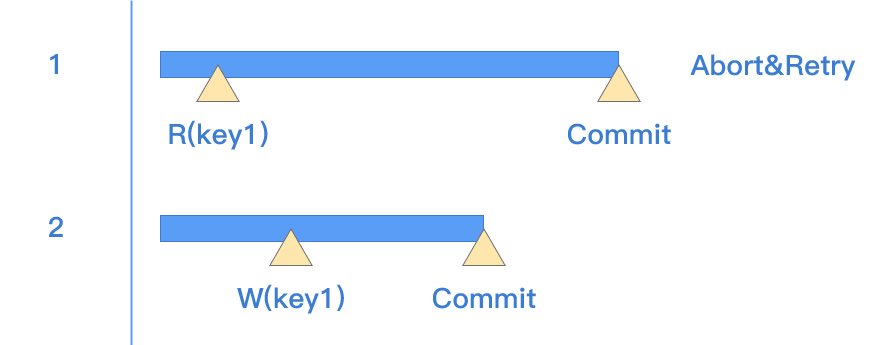
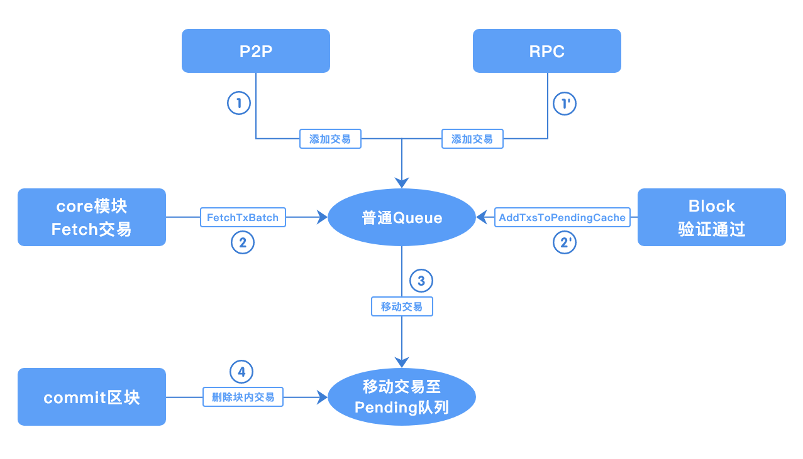
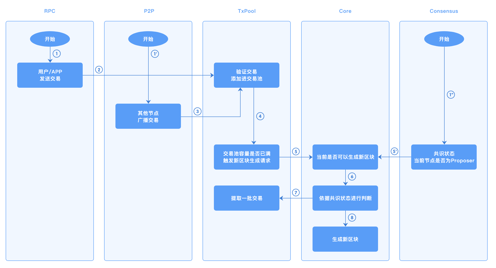

# 核心交易流程说明
## 并行调度
长安链支持块内通用交易的并行调度执行，以加速区块链整体处理性能。区块提议节点在提议过程中运行并行调度算法，产生块内交易并行执行顺序关系。执行顺序可利用有向无环图，也就是`DAG`表示，`DAG`中节点代表交易，边代表交易间`happens-before`关系。网络中其他节点在验证区块时，可根据此`DAG`并行验证块内交易，产生交易的读写集合，而后根据读写集合验证提议区块中`DAG`的有效性。

整体流程如下图所示：

### 并行调度算法分类

根据对同一批交易调度产生的`DAG`是否随机，并行调度算法可分为：

- `确定性调度算法`：即针对同一批交易调度产生的`DAG`结果是确定性的。此类算法的优点是DAG产生稳定且可复现，因此理论上讲DAG可不包含在区块内，各验证节点运行并行调度算法即可进行校验。
- `随机性调度算法`：即针对同一批交易调度产生的`DAG`结果是随机的，即使同一节点针对同一批交易连续运行两次调度算法产生的结果也可能不同。此类算法往往调度速度较快，但因存在随机性，DAG必须打包至区块中并由其他节点据此验证。

长安链自版本1.0.0起，就已经实现了一种`随机性调度算法`，以最大化交易处理能力。

### 长安链并行调度算法

长安链并行调度算法示意图如下，主要思想是交易分为执行`execute`和生效`commit`两步，若交易执行期间读集未被其他交易更改，则交易可生效；否则需要重试执行此交易。

主要步骤为：

1. 将所有交易并行执行，在执行中所有的写操作都在内存缓存中；
2. 每笔交易结束时，查看读集中所有的key是否被其他交易修改，若无则将交易写集生效（`ApplyTxSimContext`），若有则将交易重新加入待执行队列；
3. 待所有交易执行完毕后，分析所有交易的读写集，构建`DAG`。若交易间存在“读-写”、“写-读”、“写-写”冲突，根据执行时的先后顺序构建DAG中的边。

因存在冲突的两笔交易执行时间存在随机性，最终构建的`DAG`也无法预测，所以此算法为随机性调度算法。在进行冲突检测时，长安链应用了位图等数据结构进行工程优化，以提升执行效率。

  

## 交易缓存

### 概述

区块链中，交易池模块负责缓存节点从网络中接收的待处理交易，在节点生成新的区块，从交易池获取交易并打包至区块内进行上链。

### 交易种类

交易池缓存两种类型的交易：

*	配置型交易：用来修改链配置；如果区块内含有配置型交易，则该区块被限制为有且仅有一笔交易
*	非配置型交易：创建合约、调用合约、冻结合约等。

### 模块设计

交易池采用模块化设计，使用接口将具体实现与其它模块进行解耦，以便后续迭代添加不同的实现。节点从网络接收到交易时，基于当前节点的状态，验证该交易的有效性（是否超时、是否已上链、是否已在交易池中等），仅当交易有效时，才会被添加至交易池中。

`TxPool` 接口描述

方法 | 解释
----|-----
`Start() error` | 启动交易池模块
`Stop() error` | 停止交易池模块
`AddTx(tx *common.Transaction, source TxSource) error` | 添加交易至交易池
`TxExists(tx *common.Transaction) bool` | 查询交易是否存在
`GetTxByTxId(txId string) (tx *common.Transaction, inBlockHeight int64)`| 依据txId，查询交易信息
`GetTxsByTxIds(txIds []string)`  `(txsRet map[string]*common.Transaction, txsHeightRet map[string]int64)`| 批量查询交易信息
`RetryAndRemoveTxs(retryTxs []*common.Transaction, removeTxs []*common.Transaction)`| 在交易池中添加、删除传入的交易 
`FetchTxBatch(blockHeight int64) []*common.Transaction` | 获取交易池中缓存的部分待打包交易，并将这部分交易从普通队列移动至待删除队列
`AddTxsToPendingCache(txs []*common.Transaction, blockHeight int64)`| 当区块验证通过后，将块内交易添加至待删除队列，并从普通队列中删除

| 交易池类型   | 适用场景               |
| ------------ | ---------------------- |
| single交易池 | 所有的共识场景         |
| batch交易池  | 不适用于maxbft共识场景 |

### single 交易池实现

single交易池，对池内的状态更新是以单笔交易为基准的，如：添加交易、广播交易、从交易池fetch、删除交易等。

交易池内的队列分为两种：普通队列、待删除队列

*	普通队列：存储待打包的区块交易
*	待删除队列：存储已入块、待区块上链后删除的交易

添加至交易池的交易来源 TxSource，有三种类型：`RPC`、`P2P`、`INTERNAL`，不同来源的交易，对应不同的检查.

*	RPC：来自RPC的交易不验证基础的交易信息（如交易ID、时间戳是否符合规范）、不验证交易者的证书；因为RPC模块已做此类校验；成功添加至交易池的交易会广播给其它连接的节点
*	P2P：其它节点的广播的交易，进行所有的校验
*	INTERNAL：如果节点在同一高度接收到多个验证有效的区块，当其中某个区块上链后，其余的相同高度区块内的交易会被重新添加进交易池，防止这些交易被抛弃。

为兼容不同的共识算法，交易在交易池中会被记录更多信息，如区块高度信息，高度有三种状态；

*	`-1`：表示该交易池中不存在该交易
*	`0`: 表示交易存在于交易池的待打包队列中
*	`>0`: 表示交易存在于某个待提交的区块内，高度为该区块的高度

交易池的状态变动，主要有如下几种情况：

*	接收交易：将接收到验证通过后的交易，存储至待打包的队列中
*	生成区块：调用交易池的`FetchTxBatch`实现，从交易池获取部分待打包交易，并将这些交易从普通队列移动至待删除队列
*	验证区块：区块验证通过后，调用交易池的`AddTxsToPendingCache`，将块内的交易从交易池的普通的队列移动至待删除队列，如果块内不在交易池的普通队列中，则直接添加至待删除队列中
*	提交区块：调用交易池的`RetryAndRemoveTxs `实现，先将同一高度其他区块的交易添加至交易池的普通队列中，同时这些交易如果存在于待删除队列，则将其从待删除移除；再将块内交易从交易池的所有队列中移除（普通队列、待删除队列）

### batch交易池实现

batch交易池是交易池的另一种实现方式，池内状态的更新是以批次作为基准的；如：添加交易至队列、广播交易、从交易池获取等。

同时因为池内的状态更新是以批次为操作单位，来减少链上运行过程中交易池的时间消耗；所以无法支持 流水线的maxbft共识，因为该共识需要对每笔交易添加额外的状态记录（即：交易所在的待提交区块高度信息，详细解释见上）

`FetchTxBatch`: 因不支持maxbft，参数blockHeight无使用

`GetTxByTxId`: 因不支持maxbft，返回的交易高度信息无意义

`GetTxsByTxIds`: 因不支持maxbft，返回的交易高度信息无意义

`AddTxsToPendingCache`: 因不支持maxbft，该方法无实现

添加至batch交易池的交易来源与single相同：`RPC`、`P2P`、`INTERNAL`，所做检查也相同，但在添加至交易池时有区别

* RPC：来自RPC的单笔交易，在检查通过后先缓存在临时队列中，每隔一段时间，将该临时队列内的交易打包为批次，添加到交易池的普通队列内
* P2P：因为batch交易池的P2P广播是以批次为单位，当其它节点接收到广播的批次交易时，将该批次内验证通过的交易作为一个新的批次加入至普通队列内
* INTERNAL：将其它模块重新放回交易池的交易，作为一个新的批次添加至普通队列

### 模块间交互

交易池主要与RPC、MsgBus、Core、BlockChainStore模块进行交互；

*	从`RPC`模块接收客户端发送的交易
*	从`MsgBus`模块接收其它节点广播的交易
*	`BlockChainStore`来验证交易是否已存在于链上
*	节点生成、验证、提交区块时，`Core`模块调用相应的接口，修改交易池的状态

流程图如下：

### 参数配置

txpool 在节点配置中，有如下配置参数。

| 参数名称               | 类型   | 默认值    | 释义                                      |
| ---------------------- | ------ | --------- | ----------------------------------------- |
| pool_type              | string | Single    | 启动的交易池类型，有single、batch两种类型 |
| max_txpool_size        | Int    | 5120      | 交易池储存普通交易的数量上限              |
| max_config_txpool_size | Int    | 10        | 交易池储存配置交易的数量上限              |
| batch_max_size         | int    | 50000     | 批量交易池，每个批次最多包含的交易数量    |
| batch_create_timeout   | int    | 1000 微秒 | 批量交易池，定时创建批次的时间间隔        |

  
