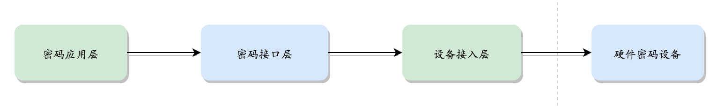

# 硬件加密
## 概述
目前大多数区块链项目，用户私钥和节点私钥通常以文件的形式存放在硬盘上，虽然文件可以通过口令进行加密存储，但仍然存在被窃取和破译风险，在某些金融和政务场景下  不符合安全、合规的要求。为了满足以上需求，长安链支持对接硬件加密设备，通过硬件设备对私钥进行安全存储；并通过硬件密码服务处理加密和签名操作。节点服务、CA证书服务以及sdk均可以选择硬件密码设备进行加密或签名。 

## 整体设计
为了保证不强制绑定特定厂商硬件密码设备，设计上采用pkcs11接口来对接硬件密码设备，提供私钥保护和加密功能。  
私钥生命周期管理依托于符合国密局要求的硬件密码设备提供，其中加密/签名操作调用栈如下：  




硬件密码设备：硬件加密机，加密卡等  
设备接入层：硬件密码设备接入方式和接入配置, 需要支持pkcs11标准   
密码接口层：屏蔽底层设备调用，为上层应用提供统一的密码服务。   
密码应用层：加密或签名应用，如交易签名，共识签名等。

### 硬件密码设备
密码设备厂商提供， 略
### 设备接入层
密码设备厂商提供，略
### 密码接口层
#### 密码接口设计

```go
// 私钥签名接口
type PrivateKey interface {

   // 私钥签名
   Sign(data []byte) ([]byte, error)

   SignWithOpts(data []byte, opts *SignOpts) ([]byte, error)

   // 返回公钥
   PublicKey() PublicKey

   // 转换为crypto包中的 PrivateKey 接口类
   ToStandardKey() crypto.PrivateKey
}
```

```go
// === 对称密钥加解密接口 ===
type SymmetricKey interface {

   // 加密接口
   Encrypt(plain []byte) ([]byte, error)
   EncryptWithOpts(plain []byte, opts *EncOpts) ([]byte, error)

   // 解密接口
   Decrypt(ciphertext []byte) ([]byte, error)
   DecryptWithOpts(ciphertext []byte, opts *EncOpts) ([]byte, error)
}
```

```go
//初始化pkcs11 handle（创建session连接池并验证登陆）
func New(lib string, label string, password string, sessionCacheSize int, hash string) (*P11Handle, error) {
   //略
}
```

#### 密码接口实例化
```go
//pkcs11对称密钥接口实例化
func NewSecretKey(p11 *P11Handle, keyId string, keyType bccrypto.KeyType) (bccrypto.SymmetricKey, error){
   //略
}

//pkcs11公钥密钥接口实例化
func NewPrivateKey(p11 *P11Handle, keyId string, keyType bccrypto.KeyType) (bccrypto.PrivateKey, error){
   //略
}
```
说明：
1. keyId：硬件密码机中，密钥id标识，对应pkcs11标准中CKA_ID或者CKA_LABEL字段
2. keyType：密钥类型，目前支持RSA，ECDSA，AES，SM2，SM4


### 密码应用层
#### 硬件加密配置
```yaml
//硬件加密配置项（以下配置项与密码设备相关）
pkcs11:
  enabled: false                                      # set true if enable pkcs11
  library: /usr/local/lib64/libpkcs11.so              # path to the so file of pkcs11 interface
  label: HSM                                          # label for the slot to be used
  password: 11111111                                  # password to logon the HSM
  session_cache_size: 10                              # size of HSM session cache, default to 10
  hash: "SHA256"                                      # hash algorithm used to compute SKI
```

#### 签名和加密示例
```go
//pkcs11 handle初始化
p11Handle, err = pkcs11.New(library, label, password, sessionCacheSize, hash)
if err != nil{
	return nil, fmt.Errorf("failed to initialize pkcs11 handle, err = %s", err)
}

//sm2密钥初始化， SM2SignKey1为keyId，表示密码机SM2密钥索引
sk, err :=  pkcs11.NewPrivateKey(p11Handle, "SM2SignKey123", bccrypto.SM2)
if err != nil{
  log.Fatalf("failed to new sm2 private key, err = %s", err)
}

//使用sm2签名/验证
// 硬件签名
sig, _ := sk.SignWithOpts(msg, &bccrypto.SignOpts{
   Hash: hashAlgo,
   UID:  bccrypto.CRYPTO_DEFAULT_UID,
})
// 软件验签（公钥来自x509证书）
der, _ := x509.MarshalPKIXPublicKey(cert.PublicKey)
pk, _ := asym.PublicKeyFromDER(der) 
ok, _ := pk.VerifyWithOpts(msg, sig, &bccrypto.SignOpts{
		Hash: hashAlgo,
		UID:  bccrypto.CRYPTO_DEFAULT_UID,
})


//sm4密钥初始化， SM4EncKey1为keyId，表示密码机SM4密钥索引
sk, err :=  pkcs11.NewSecretKey(p11Handle, "SM4EncKey1", bccrypto.SM4)
if err != nil{
   log.Fatalf("failed to new secret key, err = %s", err)
}

//使用sm4加密/解密， 默认CBC模式
ciphertext, _ := sk.Encrypt(msg)
msg _ := sk.Decrypt(ciphertext)
```
注：以上为示例代码，仅供参考。

