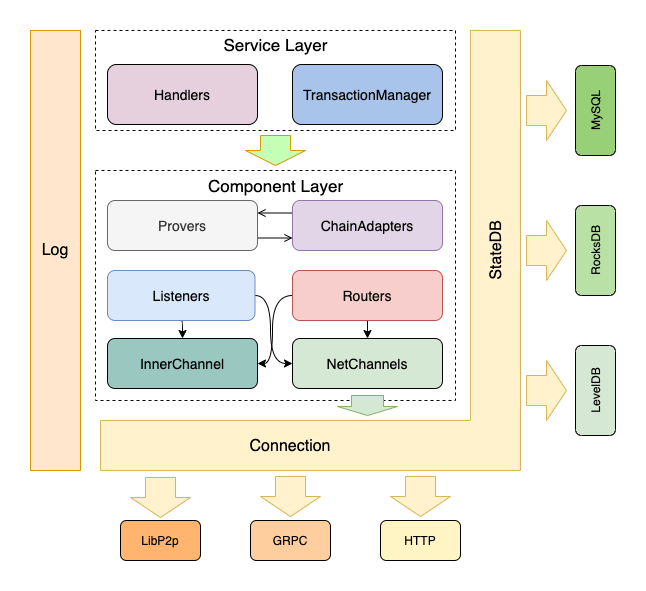
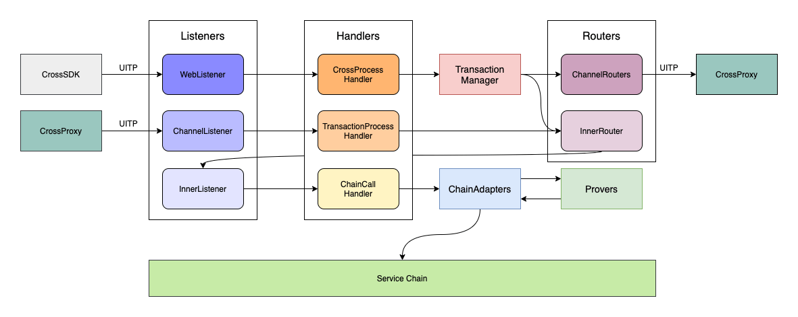
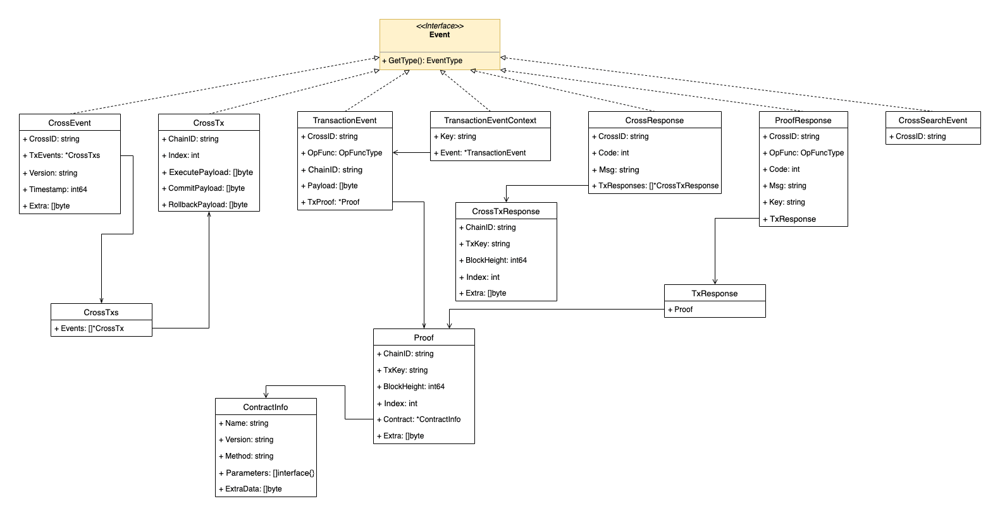
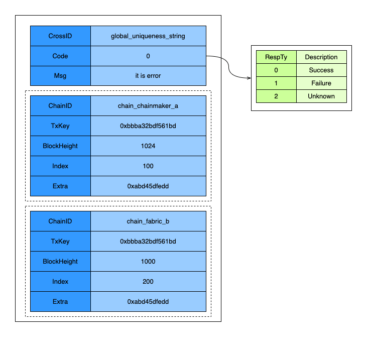

# 跨链方案

## 概述

什么是跨链？简单理解就是两条或多条链之间进行数据交换，以一个简单易懂的案例来说明，假设有两条链，其中一条链是招行（用户A在该银行中有存款），另外一条链是建行（用户B在该银行中有存款），如果用户A想将自己在招行的存款转账给用户B（建行），那么就需要进行跨链操作。

初版跨链采用网关的方案实现，该方案基于一个假设：在联盟链环境中，所有节点都是可信的，会存在异常节点，但不会存在恶意节点。为了解决可信性的问题，后续在新的版本中会采用Relay的方案。

## 主要流程

为了能够兼容多种异构链，经过多方调研，本跨链方案采用正/逆向操作的合约实现方式，即用户需要提供正向与逆向的具体业务交易。还是以银行转账为例，对于用户A而言，其在整个跨链事务中的操作中对招行链的操作需要提供两个业务交易，第一个就是正常的存款减少交易，第二个则是逆向业务交易，即出现异常时的回滚操作，通常而言对应的是存款的增加。

为了在一定程度上对跨链事务进行控制，本跨链方案中增加了事务合约的概念，用户的具体业务合约不会直接执行，而是通过事务合约进行调用，对于每一次跨链操作，系统会分配一个唯一的跨链ID，事务合约通过该ID对跨链的流程进行控制，防止重复执行的发生。

## 模块分层设计

跨链代理采用了模块化分层设计，主要分为三层：基础层、组件层和业务层。

+  基础层：为跨链代理各个组件提供基础服务，主要包括日志、数据库和网络处理等；
+ 组件层：提供业务流程调用的各种组件，包括但不限于通道、路由、监听器、证明器、适配器等；
+ 业务层：主要的业务流程控制，包括了多种Handler以及事务管理器。

## 数据流转

下面是整个数据流在跨链协议（包括内部模块）中基本的流转情况，在不同模块之间流转通过UITP协议。

## 事件详细分类

在跨链代理中，所有的数据流（包括直接传输和间接传输）都被称为Event（事件），下面是Event的详细分类。

## UITP协议

### 协议概述

UITP协议是跨链代理间数据交换的协议，它只是对主要数据结构的一种描述，不限制开发者使用何种传输方式。

### CrossEvent

CrossEvent即跨链事件，描述的是用户通过跨链SDK发送到跨链代理的数据对象。

### TransactionEvent

TransactionEvent即交易事件，描述的是两个跨链代理服务之间的消息传递。

### CrossResp

CrossResp即跨链事件应答，是跨链代理完成后（也可以是异步）对客户端的应答结果。

### TransactionEventResp

TransactionEventResp即事务事件应答，是对TransactionEvent的应答。

