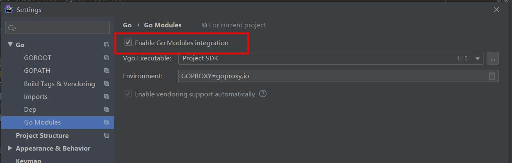
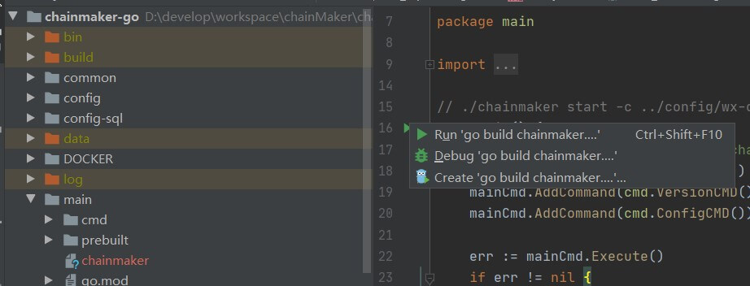
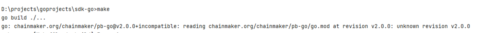
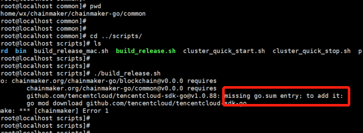
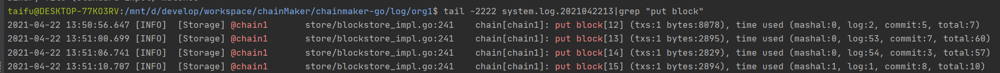
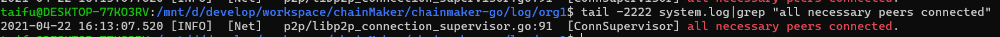
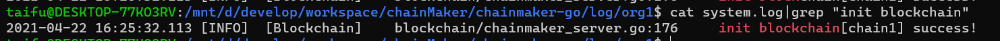

## 概述

通过本文你将可以搭建起长安链多节点集群，并使用命令行工具和SDK完成长安链功能的体验。

通过源码搭建长安链并且上链查数据需要以下步骤，本文将一一演示

- 下载长安链及证书管理工具源码
- 编译源码
- 生成节点证书
- 编译及安装包制作
- 启动节点集群
- 查看节点状态
- 使用CMC工具安装、调用、查询一个合约
- 使用GO SDK验证合约

> ！！！注：如有操作过程问题请参考[常见问题！！！](#normalError)
>
> ！！！注：如有操作过程问题请参考[常见问题！！！](#normalError)
>
> ！！！注：如有操作过程问题请参考[常见问题！！！](#normalError)


## 环境依赖

### 硬件依赖

| 配置 | 最低配置 | 推荐配置 |
| ---- | -------- | -------- |
| CPU  | 1.5GHz   | 2.4GHz   |
| 内存 | 4GB      | 8GB      |
| 核心 | 4核      | 8核      |
| 带宽 | 2Mb      | 10Mb     |

### 软件依赖

当前文档在centos7.6操作下完成，以下为本次演示所需的依赖
软件列表如下：

| 名称                                          | 版本  | 描述                                                         | 是否必须 |
| --------------------------------------------- | ----- | ------------------------------------------------------------ | -------- |
| git                                           | /     | 源码管理                                                     | 是       |
| golang                                        | 1.15+ | 编译环境                                                     | 是       |
| docker                                        | 18+   | 独立运行容器                                                 | 否       |
| docker-compose                                | /     | 容器管理组件                                                 | 否       |
| gcc                                           | 4+    | 编译环境依赖                                                 | 是       |
| glibc                                         | 2.18  | 智能合约执行环境依赖                                         | 是       |
| tmux                                          | /     | 默认快速启动命令依赖                                         | 否       |
| wasmer运行时库 **libwasmer_runtime_c_api.so** | /     | 库在`chainmaker-go/main`目录下，将该库路径添加至系统PATH环境变量下<br>启动脚本默认包含，单独启动需加上如下配置：<br>cd deployPath/lib <br>cp xxx/main/libwasmer_runtime_c_api.so libwasmer.so<br>export LD_LIBRARY_PATH=deployPath/lib:$LD_LIBRARY_PATH | 是       |

> ！！！注：如有操作过程问题请参考[常见问题！！！](#normalError)
>
> ！！！注：如有操作过程问题请参考[常见问题！！！](#normalError)
>
> ！！！注：如有操作过程问题请参考[常见问题！！！](#normalError)

#### git

下载地址：[https://git-scm.com/downloads](https://git-scm.com/downloads)

安装步骤，请参看：[https://git-scm.com/book/en/v2/Getting-Started-Installing-Git](https://git-scm.com/book/en/v2/Getting-Started-Installing-Git)

#### golang

> 版本为1.15或以上


下载地址：[https://golang.org/dl/](https://golang.org/dl/)

安装步骤，请参看：[https://golang.org/doc/install](https://golang.org/doc/install)

#### docker

> 若不使用采用`docker`方式搭建集群，可以不安装

安装步骤，请参看：[https://docs.docker.com/engine/install/](https://docs.docker.com/engine/install/)

#### docker-compose

> 若不使用采用`docker`方式搭建集群，可以不安装

安装步骤，请参看：[https://docs.docker.com/compose/install/](https://docs.docker.com/compose/install/)

## 环境搭建

> ！！！注：如有操作过程问题请参考[常见问题！！！](#normalError)
>
> ！！！注：如有操作过程问题请参考[常见问题！！！](#normalError)
>
> ！！！注：如有操作过程问题请参考[常见问题！！！](#normalError)

<span id="runUseScripts"></span>
### 使用脚本搭建

> 适用于`Linux`、`MacOS`

#### 源码下载

从[长安链官网](https://www.chainmaker.org/)下载源码：[https://git.chainmaker.org.cn/chainmaker/chainmaker-go](https://git.chainmaker.org.cn/chainmaker/chainmaker-go)

> 当前为私有仓库，需要先进行账号注册

- 下载`chainmaker`源码到本地

```bash
$ git clone https://git.chainmaker.org.cn/chainmaker/chainmaker-go.git
```

- 下载证书生成工具源码到本地

```bash
$ git clone https://git.chainmaker.org.cn/chainmaker/chainmaker-cryptogen.git
```

#### 源码编译

- 编译证书生成工具

```bash
$ cd chainmaker-cryptogen
$ make
```

#### 证书及配置文件生成

- 将编译好的`chainmaker-cryptogen`，软连接或拷贝到`chainmaker-go/tools`目录

```bash
# 进入工具目录
$ cd chainmaker-go/tools

# 软连接chainmaker-cryptogen到tools目录下
$ ln -s ../../chainmaker-cryptogen/ .
```

- 进入`chainmaker-go/scripts`目录，执行`prepare.sh`脚本生成单链4节点集群配置，存于路径`chainmaker-go/build`中

  > `prepare.sh`脚本支持生成`solo`模式节点证书和配置，以及4/7/10/13/16节点的证书和配置

```bash
# 进入脚本目录
$ cd ../scripts

# 查看脚本帮助
$ ./prepare.sh -h
Usage:  
  prepare.sh node_cnt(1/4/7/10/13/16) chain_cnt(1-4) p2p_port(default:11301) rpc_port(default:12301)
    eg1: prepare.sh 4 1
    eg2: prepare.sh 4 1 11301 12301

# 生成单链4节点集群的证书和配置
$ ./prepare.sh 4 1
begin check params...
begin generate certs, cnt: 4
input consensus type (0-SOLO,1-TBFT(default),3-HOTSTUFF,4-RAFT,5-DPOS):
input log level (DEBUG|INFO(default)|WARN|ERROR):
begin generate node1 config...
begin generate node2 config...
begin generate node3 config...
begin generate node4 config...

# 查看生成好的节点证书和配置
$ tree -L 3 ../build/
../build/
├── config
│   ├── node1
│   │   ├── certs
│   │   ├── chainconfig
│   │   ├── chainmaker.yml
│   │   └── log.yml
│   ├── node2
│   │   ├── certs
│   │   ├── chainconfig
│   │   ├── chainmaker.yml
│   │   └── log.yml
│   ├── node3
│   │   ├── certs
│   │   ├── chainconfig
│   │   ├── chainmaker.yml
│   │   └── log.yml
│   └── node4
│       ├── certs
│       ├── chainconfig
│       ├── chainmaker.yml
│       └── log.yml
├── crypto-config
│   ├── wx-org1.chainmaker.org
│   │   ├── ca
│   │   ├── node
│   │   └── user
│   ├── wx-org2.chainmaker.org
│   │   ├── ca
│   │   ├── node
│   │   └── user
│   ├── wx-org3.chainmaker.org
│   │   ├── ca
│   │   ├── node
│   │   └── user
│   └── wx-org4.chainmaker.org
│       ├── ca
│       ├── node
│       └── user
└── crypto_config.yml
```

- 关于自动生成的端口说明

通过`prepare.sh`脚本生成的配置，默认是在单台服务器上部署，故自动生成的端口号，是从一个起始端口号开始依次递增，可以通过命令行参数修改起始端口号。

主要有2个端口，`p2p`端口（用于节点互联）和`rpc`端口（用于客户端与节点通信），`p2p`起始端口为`11301`，`rpc`起始端口为`12301`。

如果生成4个节点的配置，`p2p`端口分别为：`11301、11302、11303、11304`，`rpc`端口分别为：`12301、12302、12303、12304`

如果是在多机部署，希望生成固定的端口号，请参考：[【多机部署】](../operation/多机部署)

#### 编译及安装包制作

- 执行`build_release.sh`脚本，将编译`chainmaker-go`模块，并打包生成安装，存于路径`chainmaker-go/build/release`中

```bash
$ ./build_release.sh
$ tree ../build/release/
../build/release/
├── chainmaker-v2.0.0-wx-org1.chainmaker.org-20210406194833-x86_64.tar.gz
├── chainmaker-v2.0.0-wx-org2.chainmaker.org-20210406194833-x86_64.tar.gz
├── chainmaker-v2.0.0-wx-org3.chainmaker.org-20210406194833-x86_64.tar.gz
├── chainmaker-v2.0.0-wx-org4.chainmaker.org-20210406194833-x86_64.tar.gz
└── crypto-config-20210406194833.tar.gz
```


#### 启动节点集群

- 执行`cluster_quick_start.sh`脚本，会解压各个安装包，调用`bin`目录中的`start.sh`脚本，启动`chainmaker`节点

```bash
$ ./cluster_quick_start.sh normal
```

- <span id="restartNode">启动成功</span>后，将*.gar.gz备份，以免下次启动再次解压缩时文件被覆盖

```sh
$ mkdir -p ../build/bak
$ mv ../build/release/*.tar.gz ../build/bak
```

> 若需要关闭集群，使用脚本：
>
> ```bash
> $ ./cluster_quick_stop.sh
> ```

#### 查看节点启动使用正常

- 查看进程是否存在

```bash
$ ps -ef|grep chainmaker | grep -v grep
25261  2146  4 19:55 pts/20   00:00:01 ./chainmaker start -c ../config/wx-org1.chainmaker.org/chainmaker.yml
25286  2146  4 19:55 pts/20   00:00:01 ./chainmaker start -c ../config/wx-org2.chainmaker.org/chainmaker.yml
25309  2146  4 19:55 pts/20   00:00:01 ./chainmaker start -c ../config/wx-org3.chainmaker.org/chainmaker.yml
25335  2146  4 19:55 pts/20   00:00:01 ./chainmaker start -c ../config/wx-org4.chainmaker.org/chainmaker.yml
```

- 查看端口是否监听

```bash
$ netstat -lptn | grep 1230
tcp6       0      0 :::12301                :::*                    LISTEN      25261/./chainmaker  
tcp6       0      0 :::12302                :::*                    LISTEN      25286/./chainmaker  
tcp6       0      0 :::12303                :::*                    LISTEN      25309/./chainmaker  
tcp6       0      0 :::12304                :::*                    LISTEN      25335/./chainmaker 
```

- 检查节点是否有`ERROR`日志

```bash
$ cat ../build/release/chainmaker-v2.0.0-wx-org1.chainmaker.org/bin/panic.log
$ tail -f ../build/release/chainmaker-v2.0.0-wx-org1.chainmaker.org/log/system.log
$ tail -f ../build/release/chainmaker-v2.0.0-wx-org1.chainmaker.org/log/system.log|grep "ERROR\|put block\|all necessary"
```

### 使用Docker搭建

> 适用于`Docker`

#### 编译docker镜像

```bash
$ cd chainmaker-go
# 生成镜像名称举例：chainmaker:v2.0.0，v2.0.0为版本号，如需要修改版本，请修改Makefile文件
$ make docker-build
# 查看编译完成的镜像
$ docker images
REPOSITORY                            TAG       IMAGE ID       CREATED        SIZE
chainmakerofficial/chainmaker         v1.1.1    04370b9a71ee   1 weeks ago    407MB
chainmakerofficial/chainmaker         lasest    04370b9a71ee   1 weeks ago    407MB
```

#### 启停solo节点

> 为了方便使用，使用的配置文件及证书已放置于目录：`chainmaker-go/scripts/docker/config/solo`
>
> 如镜像名称有调整，请修改`solo.docker-compose.yml`文件

```bash
$ cd chainmaker-go/scripts/docker/
# 启动solo节点
$ ./solo_up.sh 
# 关闭solo节点
$ ./solo_down.sh
```

#### 启停4节点集群

> 为了方便使用，使用的配置文件及证书已放置于目录：`chainmaker-go/scripts/docker/config/four-nodes`
>
> 如镜像名称有调整，请修改`four-nodes.docker-compose.yml`文件

```bash
$ cd chainmaker-go/scripts/docker/
# 启动4节点集群
$ ./four-nodes_up.sh 
# 关闭4节点集群
$ ./four-nodes_down.sh
```

## 功能验证

为了验证所搭建的链功能是否正常，可以通过`cmc`命令行工具或`sdk`的单元测试用例来进行验证。

### cmc命令行工具验证

请参看：[【命令行工具】](../dev/命令行工具.md)

### go sdk验证

#### 下载go sdk源码

> 在`chainmaker-go`工程同级目录，执行下面命令获取`go sdk`

```bash
$ git clone https://git.chainmaker.org.cn/chainmaker/sdk-go.git
```

#### 关联证书

> 将通过`prepare.sh`工具生成的`crypto-config`目录，软连接到`sdk-go/testdata`目录

```bash
$ cd sdk-go/testdata

# 这里我们使用新生成的用户证书，请先将testdata已有的crypto-config移除
$ /bin/rm -rf crypto-config
# 软连接使用prepare.sh脚本生成的证书目录
$ ln -s ../../chainmaker-go/build/crypto-config/ .
```

#### 配置修改

> 修改sdk单元测试使用的配置文件：`sdk-go/testdata/sdk_config.yml`

根据需要修改节点地址：

```yml
    nodes:
      - # 节点地址，格式为：IP:端口:连接数
        node_addr: "127.0.0.1:12301"
```

如果证书路径有调整，修改对应的证书路径配置：

```yml
    # 客户端用户私钥路径
    user_key_file_path: "./testdata/crypto-config/wx-org1.chainmaker.org/user/client1/client1.tls.key
    # 客户端用户证书路径
    user_crt_file_path: "./testdata/crypto-config/wx-org1.chainmaker.org/user/client1/client1.tls.crt"
    # 客户端用户交易签名私钥路径(若未设置，将使用user_key_file_path)
    user_sign_key_file_path: "./testdata/crypto-config/wx-org1.chainmaker.org/user/client1/client1.sign.key"
    # 客户端用户交易签名证书路径(若未设置，将使用user_crt_file_path)
    user_sign_crt_file_path: "./testdata/crypto-config/wx-org1.chainmaker.org/user/client1/client1.sign.crt"
```

#### 执行存证合约example

该单测会进行存证合约的部署、调用和查询。

```bash
$ cd sdk-go/examples/user_contract_claim
$ go run main.go
```

看到success或OK等类似输出，说明功能验证成功。

## 使用goland启动链

### 下载安装goland

下载地址：https://www.jetbrains.com/go/

goland使用，请参看：[https://www.jetbrains.com/go/learn/](https://www.jetbrains.com/go/learn/)


### 下载安装golang

#### 安装golang

> 版本为1.15或以上


下载地址：[https://golang.org/dl/](https://golang.org/dl/)

安装步骤，请参看：[https://golang.org/doc/install](https://golang.org/doc/install)

#### 设置代理

打开终端执行

```sh
go env -w  GOPROXY=https://goproxy.io,direct
```


### 下载源码

```sh
git clone https://git.chainmaker.org.cn/chainmaker/chainmaker-go.git
```


### 启动goland

#### 导入chainmaker-go

将从官网下载的chainmaker-go导入到goland中

#### 配置goland

Ctrl+Alt+S 或者 File->Settings...

Go-->Go Modules --> 勾上Enable Go Modules integration

Go-->GOROOT-->添加已安装的go




####  启动项目（SOLO模式）

- 修改配置文件

chainmaker-go/config/wx-org1/chainconfig/bc1.yml：

	1. 将consensus.type修改为0：启用solo共识
	2. 将consensus.nodes中其他org_id,node_id的列表注释掉，只保留第一组数据，如下：

```yml
#共识配置
consensus:
  # 共识类型(0-SOLO,1-TBFT,3-HOTSTUFF,4-RAFT,10-POW)
  type: 0
  # 共识节点列表，组织必须出现在trust_roots的org_id中，每个组织可配置多个共识节点，节点地址采用libp2p格式
  nodes:
    - org_id: "wx-org1.chainmaker.org"
      node_id:
        - "QmcQHCuAXaFkbcsPUj7e37hXXfZ9DdN7bozseo5oX4qiC4"
#    - org_id: "wx-org2.chainmaker.org"
#      node_id:
#        - "QmeyNRs2DwWjcHTpcVHoUSaDAAif4VQZ2wQDQAUNDP33gH"
#    - org_id: "wx-org3.chainmaker.org"
#      node_id:
#        - "QmXf6mnQDBR9aHauRmViKzSuZgpumkn7x6rNxw1oqqRr45"
#    - org_id: "wx-org4.chainmaker.org"
#      node_id:
#        - "QmRRWXJpAVdhFsFtd9ah5F4LDQWFFBDVKpECAF8hssqj6H"
#    - org_id: "wx-org5.chainmaker.org"
#      node_id:
#        - "QmVSCXfPweL1GRSNt8gjcw1YQ2VcCirAtTdLKGkgGKsHqi"
#    - org_id: "wx-org6.chainmaker.org"
#      node_id:
#        - "QmPpx5dTZ4A1GQ9a4nsSoMJ72AtT3VDgcX2EVKAFxJUHb1"
#    - org_id: "wx-org7.chainmaker.org"
#      node_id:
#        - "QmVGSXfz6vgXBjWiZh5rV8T5nutevvunHAfEoe6Sh5Xcyx"
```

chainmaker-go/config/wx-org1/chainmaker.yml：

	1. 将net.seeds删除仅留下与wx-org1.chainmaker.org对应的node_id，如下

```yml
net:
  provider: LibP2P
  listen_addr: /ip4/0.0.0.0/tcp/11301
  seeds:
    - "/ip4/127.0.0.1/tcp/11301/p2p/QmcQHCuAXaFkbcsPUj7e37hXXfZ9DdN7bozseo5oX4qiC4"
  tls:
    enabled: true
    priv_key_file: ../config/wx-org1/certs/node/consensus1/consensus1.tls.key
    cert_file:     ../config/wx-org1/certs/node/consensus1/consensus1.tls.crt
```

chainmaker-go/config/wx-org1/log.yml将 log_in_console修改为true：在控制台输出日志


- 启动

找到文件 chainmaker-go/main/main.go 直接运行，然后点击停止，修改启动参数为`start -c ../config/wx-org1/chainmaker.yml`再次点击运行即可；见下图：





#### 测试

找到文件`chainmaker-go/test/send_proposal_request_solo/main.go`直接运行main即可

若遇到文件未找到等错误，请将goland 的配置： working directory修改为当前目录，或者手动修改文件目录


## 视频教程


> 注：此视频教程为v1.0.0版本，长安链开源最新版本为v2.0.0，视频中遇到与版本号相关的，请更改为最新的版本。若为master分支，则已是最新2.0.0版本
>
> 如：合约镜像为：docker pull chainmakerofficial/chainmaker-go-contract:2.0.0


时间脚本:

• 01-04分钟：长安链简介及大纲介绍；

• 04-09分钟：环境安装演示；

• 09-26分钟：单机部署；

• 26-36分钟：智能合约开发（穿插常见问题）；

• 36-54分钟：部署合约（穿插常见问题）；

• 54---结束：常见问题及单机&多机部署对照表。

<a href="https://mp.weixin.qq.com/s/zGV320UDlGVVw1tTJcOsQQ" target="_blank" title="点击跳转至播放页面" ></a>

<!--

<iframe 
    width="100%" 
    height="450" 
    src="http://mpvideo.qpic.cn/0bf2zyaecaaalianjimylbqfbtwdihhaaqia.f10002.mp4?dis_k=2e34203a3e5cc39388748cf49c2b68ef&dis_t=1620901511&spec_id=Mzg4NzU2NjYwMA%3D%3D1620901511&vid=wxv_1862610372268965888&format_id=10002" 
    scrolling="no" 
    border="0" 
    frameborder="no" 
    framespacing="0" 
    allowfullscreen="true">
</iframe>
-->


<span id="normalError"></span>


## 常见问题
<span id="question">此处介绍可能遇到的常见问题</span>

### 编译时错误

<span id="">编译chainmaker-go及chainmaker-cryptogen时可能出现的错误</span>

#### unknown revision v2.0.0

**Q:**

> go: chainmaker.org/chainmaker/pb-go@v2.0.0+incompatible: reading chainmaker.org/chainmker/pb-go/go.mod at revision v2.0.0: unknown revision v2.0.0
>
> go: chainmaker.org/chainmaker/common@v2.0.0+incompatible: reading chainmaker.org/chainmker/common/go.mod at revision v2.0.0: unknown revision v2.0.0
>
> go: chainmaker.org/chainmaker/protocol@v2.0.0+incompatible: reading chainmaker.org/chainmker/protocol/go.mod at revision v2.0.0: unknown revision v2.0.0




**A:**

原因：chainmaker.org域名可能记录为其他主机地址了，删除`~/.ssh/known_hosts文件`重试即可


#### 

**Q：** 

> 如果执行 ./build_release.sh 时或者在启动时报错：misssing go.sum entry: to add it，分别在 chainmaker-go/main 或者 chainmaker-go/common  和 chainmaker-go/tools/cmc 下执行 go mod download ，执行完后再重试

  问题描述如下图：




**A：**

原因：go1.15 版本 执行go build时会自动下载依赖，会更新mod文档，在go 1.16版本这一行为被禁止了。想要安装、更新依赖只能使用go get, go mod download, go mod tidy等命令，go build和go test将不会再做这类工作。

在go1.16版本中，想要自动更新依赖可以使用 go build -mod=mod，

进入对应`go.mod`文件所在目录执行`go mod download`

```sh
# chainmaker-go项目
cd  chainmaker-go/main
go mod download

cd  chainmaker-go/common
go mod download

cd  chainmaker-go/tools/cmc
go mod download

# # chainmaker-cryptogen项目
cd  chainmaker-cryptogen/src
go mod download
```


### 启动时错误

#### not found GLIBC_2.18

**Q:**

>  若出现错误`./chainmaker: /lib64/libc.so.6: version `GLIBC_2.18' not found (required by /root/git-code/chainmaker-go/module/vm/wasmer/wasmer-go/libwasmer.so)`

**A:**

在linux下可进入chainmaker-go/scripts/3rd目录安装glibc-2.18.tar.gz依赖

```sh
# 注：此操作为安装替换GCC版本，请慎重操作。一旦出错系统将不可用。
cd scripts/3rd
sh install.sh
```


#### restart.sh 权限不足

**Q:**

>  [root@localhost scripts]# ./cluster_quick_start.sh normal ===> Staring chainmaker cluster START ==> /home/wx/chainmaker/chainmaker-go/build/release/chainmaker-v2.0.0-wx-org1.chainmaker.org ./cluster_quick_start.sh: line 51: ./restart.sh: Permission denied

**A:**

如果启动时出现restart.sh 权限不足问题，给restart.sh 增加执行权限

给项目源文件添加执行权限

```sh
cd chainmaker-go/script/bin
chmod +x *.sh
```

给部署文件添加执行权限

```sh
# 进入四个节点的bin目录下 执行下面命令(以第一个节点 org1 为例)
cd chainmaker-go/build/release/chainmaker-V2.0.0-wx-org1.chainmaker.org/bin
chmod +x *.sh
```


### 运行时错误

#### syscall/js.valueGet not exported

**Q:**

>  执行gasm合约时报错：resolve imports: syscall/js.valueGet not exported in module env

**A:** 

tinygo不支持fmt等函数

#### runtime type error |  byte code validation failed

**Q:**

>  发送交易成功，但链打印错误信息：contract invoke failed, runtime type error, expect rust:[2], but got 4。同时根据该交易id查询到交易错误信息。
>
>  failed to create vm runtime, contract: contract_test, [contract_test], byte code validation failed

**A:**

执行交易时异步的（查询类交易除外），返回的状态为链成功接收到交易的状态。执行合约是，runtimeType选择错误，需要根据自己的合约语言选择对应的runtimeType。

 byte code validation failed：可能原因：1、运行类型错误；2、wasm文件损坏；3、wasm文件非官网指定渠道编译

| 语言     | 类型                   |
| -------- | ---------------------- |
| 系统合约 | RuntimeType_NATIVE = 1 |
| rust     | RuntimeType_WASMER = 2 |
| c++      | RuntimeType_WXVM = 3   |
| tinygo   | RuntimeType_GASM = 4   |
| solidity | RuntimeType_EVM = 5    |
|          |                        |


#### 返回成功，但实际执行失败

**Q:**

>  使用sdk执行安装、调用合约时，SDK 返回message为ok，但链和交易显示执行失败

**A:**

交易的执行是异步的。SDK返回的成功信息指的是链成功接收到该交易。

获取查看交易实际结果的方式：

- 根据txId查询该交易，解析出结果。
- 使用SDK是选择同步发送交易，等待执行结果。


### 其他关键信息

#### 出块标记是什么

> 进入log目录，查看日志文件 筛选 `put block`即可
>
>  `cat system.log|grep "ERROR\|put block"`
>
> 其中一行解释如下：
>
> 2021-04-22 13:50:56.647 [INFO]  [Storage] @chain1       store/blockstore_impl.go:241    chain[chain1]: put block[12] (txs:1 bytes:8078), time used (mashal:0, log:2, commit:5, total:7)
>
> 时间 [日志级别] [模块] @链名称 文件名.go:行数 链chain[链名称]:put block\[区块高度\](txs:交易个数 bytes:区块大小), 使用时间毫秒(mashal:0, log:2, commit:5, total:7)




#### 组网成功标记是什么

组网成功后，即可发送交易。此时接收到的交易将进入到交易池当中，并且会广播给网络的每一个节点（共识、同步节点、轻节点），随后等待共识成功选举leader开始打包区块。

启动成功日志：`init blockchain[chain1] success`

多节点时，组网成日志：`all necessary peers connected`

**SOLO共识**

```sh
cat system.log|grep "init blockchain\[chain1\] success"
```

**其他多节点共识**

```sh
cat system.log|grep "init blockchain\[chain1\] success\|all necessary peers connected"
```






<br><br><br>

