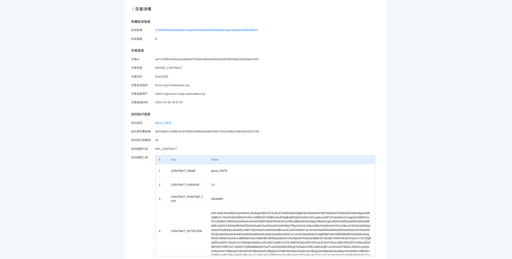
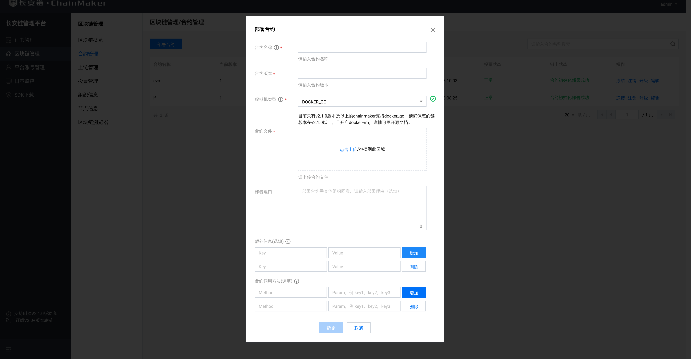
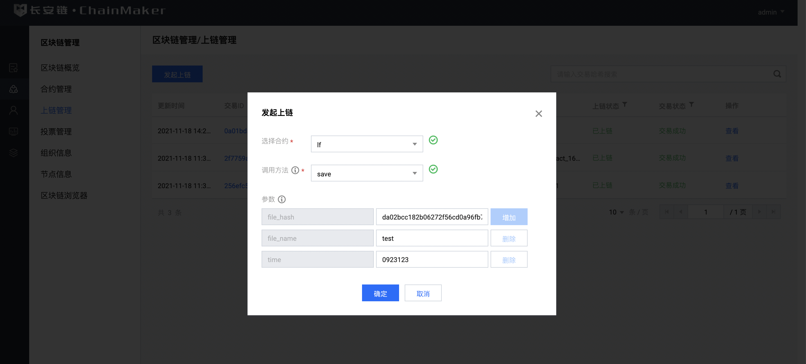
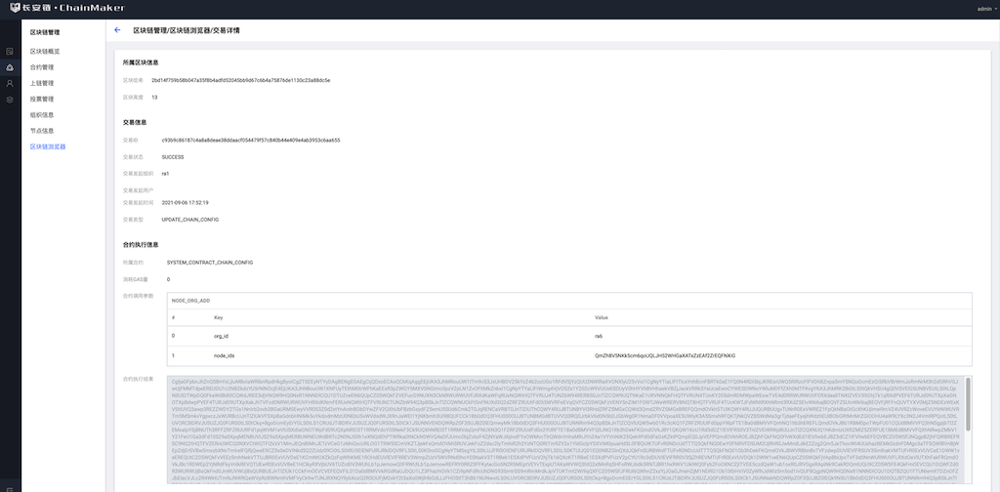

# 部署示例合约

通过本文，你将可以获得一个示例合约，并使用命令行工具cmc、或者长安链管理台完成一个简单合约的部署及调用，并在相应的区块链浏览器上查看到上链信息。

## 示例合约说明

### 合约源码展示-rust
Chainmaker 支持 DockerGo、Rust、TinyGo、 Solidity、C++ 等多种语合约，本文提供的示例合约是Rust语言合约，如需查看其他合约，或者需要自行开发合约，相关内容参考：[智能合约开发](../operation/智能合约.md)
- 本合约为存证合约，主要实现两个功能，通过文件哈希、文件名、和时间进行存证；通过文件哈希查询链上结果进行存证核验。
- rust 合约源码如下：
  
```bash
/// 
/// Copyright (C) BABEC. All rights reserved.
/// 
/// SPDX-License-Identifier: Apache-2.0
/// 

use crate::easycodec::*;
use crate::sim_context;
use sim_context::*;

// 安装合约时会执行此方法，必须
#[no_mangle]
pub extern "C" fn init_contract() {
    // 安装时的业务逻辑，内容可为空
    sim_context::log("init_contract");
}

// 升级合约时会执行此方法，必须
#[no_mangle]
pub extern "C" fn upgrade() {
    // 升级时的业务逻辑，内容可为空
    sim_context::log("upgrade");
    let ctx = &mut sim_context::get_sim_context();
    ctx.ok("upgrade success".as_bytes());
}

struct Fact {
    file_hash: String,
    file_name: String,
    time: i32,
    ec: EasyCodec,
}

impl Fact {
    fn new_fact(file_hash: String, file_name: String, time: i32) -> Fact {
        let mut ec = EasyCodec::new();
        ec.add_string("file_hash", file_hash.as_str());
        ec.add_string("file_name", file_name.as_str());
        ec.add_i32("time", time);
        Fact {
            file_hash,
            file_name,
            time,
            ec,
        }
    }

    fn get_emit_event_data(&self) -> Vec<String> {
        let mut arr: Vec<String> = Vec::new();
        arr.push(self.file_hash.clone());
        arr.push(self.file_name.clone());
        arr.push(self.time.to_string());
        arr
    }

    fn to_json(&self) -> String {
        self.ec.to_json()
    }

    fn marshal(&self) -> Vec<u8> {
        self.ec.marshal()
    }

    fn unmarshal(data: &Vec<u8>) -> Fact {
        let ec = EasyCodec::new_with_bytes(data);
        Fact {
            file_hash: ec.get_string("file_hash").unwrap(),
            file_name: ec.get_string("file_name").unwrap(),
            time: ec.get_i32("time").unwrap(),
            ec,
        }
    }
}

// save 保存存证数据
#[no_mangle]
pub extern "C" fn save() {
    // 获取上下文
    let ctx = &mut sim_context::get_sim_context();

    // 获取传入参数
    let file_hash = ctx.arg_as_utf8_str("file_hash");
    let file_name = ctx.arg_as_utf8_str("file_name");
    let time_str = ctx.arg_as_utf8_str("time");

    // 构造结构体
    let r_i32 = time_str.parse::<i32>();
    if r_i32.is_err() {
        let msg = format!("time is {:?} not int32 number.", time_str);
        ctx.log(&msg);
        ctx.error(&msg);
        return;
    }
    let time: i32 = r_i32.unwrap();
    let fact = Fact::new_fact(file_hash, file_name, time);

    // 事件
    ctx.emit_event("topic_vx", &fact.get_emit_event_data());

    // 序列化后存储
    ctx.put_state(
        "fact_ec",
        fact.file_hash.as_str(),
        fact.marshal().as_slice(),
    );
}

// find_by_file_hash 根据file_hash查询存证数据
#[no_mangle]
pub extern "C" fn find_by_file_hash() {
    // 获取上下文
    let ctx = &mut sim_context::get_sim_context();

    // 获取传入参数
    let file_hash = ctx.arg_as_utf8_str("file_hash");

    // 校验参数
    if file_hash.len() == 0 {
        ctx.log("file_hash is null");
        ctx.ok("".as_bytes());
        return;
    }

    // 查询
    let r = ctx.get_state("fact_ec", &file_hash);

    // 校验返回结果
    if r.is_err() {
        ctx.log("get_state fail");
        ctx.error("get_state fail");
        return;
    }
    let fact_vec = r.unwrap();
    if fact_vec.len() == 0 {
        ctx.log("None");
        ctx.ok("".as_bytes());
        return;
    }

    // 查询
    let r = ctx.get_state("fact_ec", &file_hash).unwrap();
    let fact = Fact::unmarshal(&r);
    let json_str = fact.to_json();

    // 返回查询结果
    ctx.ok(json_str.as_bytes());
    ctx.log(&json_str);
}
```


## 使用CMC工具部署/调用合约

### 环境准备

进行下面步骤前，请先确保已通过快速入门通过命令行工具启动链，步骤完成申请证书，启动链等过程。如未完成请先[前往完成](../tutorial/通过命令行工具启动链.md)，如已完成，请将 chainmaker-go 的父目录当成 **$WORKDIR**。'


命令解释：
- $WORKDIR 代表一个普通字符串，表示工作目录的名称，例如 test, mytest 等。
- 后面步骤中，全部的源码下载和执行，默认都是在 $WORKDIR 内执行。

### 编译 CMC 工具源码，并配置证书

#### 编译 CMC 工具

```bash
# 进入 CMC 代码目录
$ cd $WORKDIR/chainmaker-go/tools/cmc
# 编译 CMC 命令行工具
$ go build
```

命令解释：
- 命令执行成功后，会在当前目录生成可执行文件 cmc。

#### 为 CMC 工具配置证书

```bash
# 为 CMC 工具配置证书，以连接 chainmaker-go 节点
$ cp -r $WORKDIR/chainmaker-go/build/crypto-config $WORKDIR/chainmaker-go/tools/cmc/testdata/
```
命令解释：
- cmc 将读取配置文件 ./testdata/sdk_config.yml 中证书相关的配置项。
- 配置文件 ./testdata/sdk_config.yml 默认将证书放在 ./testdata/crypto-config 目录下。
- 上面执行的 cp 命令将由 $WORKDIR/chainmaker-go/scripts/prepare.sh 脚本生成的证书文件复制到默认的目录。


### 使用 CMC 工具安装一个合约

执行安装合约的 cmc 命令后，如果在终端打印出 **message:"OK"** 的输出，说明合约安装成功。

```bash
$ ./cmc client contract user create \
--contract-name=fact \
--runtime-type=WASMER \
--byte-code-path=./testdata/claim-wasm-demo/rust-fact-2.0.0.wasm \
--version=1.0 \
--sdk-conf-path=./testdata/sdk_config.yml \
--admin-key-file-paths=./testdata/crypto-config/wx-org1.chainmaker.org/user/admin1/admin1.tls.key,./testdata/crypto-config/wx-org2.chainmaker.org/user/admin1/admin1.tls.key,./testdata/crypto-config/wx-org3.chainmaker.org/user/admin1/admin1.tls.key \
--admin-crt-file-paths=./testdata/crypto-config/wx-org1.chainmaker.org/user/admin1/admin1.tls.crt,./testdata/crypto-config/wx-org2.chainmaker.org/user/admin1/admin1.tls.crt,./testdata/crypto-config/wx-org3.chainmaker.org/user/admin1/admin1.tls.crt \
--sync-result=true \
--params="{}"

response: message:"OK" contract_result:<result:"\n\006fact15\022\0031.0\030\002*<\n\026wx-org1.chainmaker.org\020\001\032 \0070#\247\260'\022\354:\032q\366\216\004\036.\316i\222u\306\313:\240<\260u\"\235\233\307@" message:"OK" > tx_id:"adb92135c6c64ebc9568c0eb21366ede1cd851d9a773400fbc13ff3b9b3601b2"

```

命令解释：
- 合约名：fact 
- 合约类型：WASMER 
- 合约文件位置：./testdata/claim-wasm-demo/rust-fact-2.0.0.wasm
- 函数参数：空


### 使用 CMC 工具调用一个合约

执行调用合约的 cmc 命令后，如果在终端打印出 **[code:0]/[msg:OK]** 的输出，说明合约调用成功。

```bash
$ ./cmc client contract user invoke \
--contract-name=fact \
--method=save \
--sdk-conf-path=./testdata/sdk_config.yml \
--params="{\"file_name\":\"name007\",\"file_hash\":\"ab3456df5799b87c77e7f88\",\"time\":\"6543234\"}" \
--sync-result=true

INVOKE contract resp, [code:0]/[msg:OK]/[contractResult:gas_used:13383607 contract_event:<topic:"topic_vx" tx_id:"e6b1b398c758410496221339b8e9a995ad4c64a9c80344ecb2e9a69d3dddde39" contract_name:"fact" contract_version:"1.0" event_data:"ab3456df5799b87c77e7f88" event_data:"name007" event_data:"6543234" > ]/[txId:e6b1b398c758410496221339b8e9a995ad4c64a9c80344ecb2e9a69d3dddde39]

```

命令解释：
- 合约名：fact
- 合约类型：WASMER
- 调用方法名：save
- 函数参数：{"file_name": "name007", "file_hash":"ab3456df5799b87c77e7f88", "time": "6543234"} 

<br>

### 使用 cmc 工具查询交易信息

```bash
$./cmc query tx [txid] \
--chain-id=chain1 \
--sdk-conf-path=./testdata/sdk_config.yml
```

命令解释：
- [txid]：交易序列号，成功执行部署合约、执行合约的命令后，返回的交易标识(tx_id字段)
- chain-id: 链号，在 chainmaker.yml 配置文件中设定

### 在区块链浏览器上查看交易信息
每次部署或者调用合约，都会产生相关都交易信息，您可以在区块链浏览器的交易详情里查看具体信息，如果您尚未部署区块链浏览器，请[前往部署](../dev/区块链浏览器.md)。




## 使用管理台部署/调用合约

### 环境准备
进行下面步骤前，请先确保已通过快速入门通过管理台启动链，完成申请证书，启动链、订阅链等过程。如未完成请先[前往完成](../tutorial/通过管理台启动链.md)。

### 合约可部署文件下载
此处提供示例合约的已编译之后的合约文件，可直接下载文件并通过管理台部署合约。
- Rust：[rust-fact-2.0.0.wasm](https://git.chainmaker.org.cn/chainmaker/chainmaker-go/-/raw/v2.2.0/test/wasm/rust-fact-2.0.0.wasm)
- Solidity：[evm-token.zip](../images/token.zip) 【zip中包含的是 1)上链的合约文件：token.bin 2)客户端使用的接口文件：token.abi，请自行解压。】
- TinyGO：[go-fact-2.0.0.wasm](https://git.chainmaker.org.cn/chainmaker/chainmaker-go/-/raw/v2.2.0/test/wasm/go-fact-2.0.0.wasm)


### 通过管理台，部署合约
- 在长安链管理台-区块链管理-合约管理模块的部署合约功能里，上传所下载的合约文件即可部署合约。
- 部署合约时，如果是Solidity合约，需要一并上传abi文件，管理台会根据abi文件自动解析出合约调用方法。
- 其他类型的合约可手动录入调用方法，以便后面引用。
- 上文示例合约的调用方法如下
  - 存证方法
    - Method：save
    - Param：file_hash, file_name, time
  - 查询方法  
    - Method：find_by_file_hash
    - Param：file_hash
  


- 通过管理平台起的长安链，如您未特殊修改，一般部署的权限为Majority，故您在合约管理模块部署完成后，还需要到区块链管理-投票管理处，进行多签投票，当满足Majority条件后，所部署的合约才生效。


### 通过管理台，调用合约
在长安链管理台-区块链管理-上链管理模块的发起上链功能里，可输入参数对已部署的合约进行调用。



### 通过管理台，查看交易信息
每次部署或者调用合约，都会产生相关都交易信息，您可以在管理台-区块链管理-区块链浏览器模块中交易详情里查看具体信息。



## 智能合约开发
- Chainmaker 支持 Docker-Go、Rust、TinyGo、 Solidity、C++ 等多种语言的合约，且提供开发Docker-Go合约的合约IDE您可<a href="https://ide.chainmaker.org.cn/login" target="_blank">前往体验</a>
- 如需开发其他语言的合约，请前往[智能合约开发](../operation/智能合约.md)。